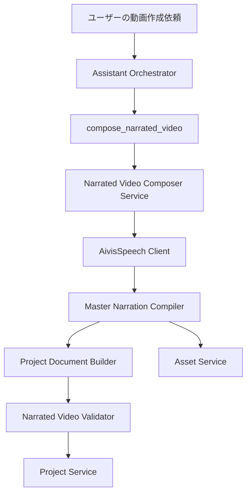

# AIナレーション付き動画一括作成仕様書

## 1. 文書情報

| 項目 | 内容 |
| --- | --- |
| 文書状態 | 第1版・実装前仕様 |
| 作成日 | 2026-07-19 |
| 対象 | 編集画面AIアシスタント、Assistant REST API、AivisSpeech連携、プレビュー再生 |
| 関連文書 | [AI動画制作アシスタント設計](ai-video-assistant-design.md)、[機能設計書](functional-design.md)、[Codex連携API設計](codex-integration-api-design.md)、[AivisSpeech連携](aivis-speech.md) |

## 2. 目的

AIチャットからナレーション付き動画を作成した場合でも、決定的なマニフェストから
作成した場合と同じ品質で、画像、ナレーション、テロップの開始・終了時刻が一致する
編集可能なプロジェクトを生成できるようにする。

現行のAIアシスタントは、画像、音声、テロップ、時刻変更を小さな編集ツールへ分解し、
モデルが多数回呼び出して動画を組み立てる。長尺または複数セクションの動画では、
音声再生成による尺変更を後続クリップへ反映するために大量の個別更新が必要となる。

本仕様では、AIは動画の意味構造と読み上げ内容を指定し、バックエンドのコンパイラが
音声フレームを基準に全タイムコードを決定する。成功時は動画全体を1回のProject Revision
として保存する。

## 3. 背景と確認された問題

### 3.1 現行方式の実測

AIチャットで作成した検証プロジェクトでは、次の実行が確認された。

| 項目 | 実測値 |
| --- | ---: |
| Assistant Tool Call | 403回 |
| `update_clip_timing` | 185回 |
| Project Revision | 265 |
| 最終ナレーションクリップ | 8本 |
| 最終テロップ | 29件 |
| ナレーション同期作成 | 6回 |
| ナレーション同期検証 | 16回 |

同期検証は最終的に成功していたが、ブラウザプレビューでは複数音声クリップの切替、
再生開始、バッファリングにより体感上のずれが発生し得る。また同じ本文を再合成しても
WAV尺は完全には固定されないため、再生成のたびに後続クリップの時刻を再計算する必要がある。

### 3.2 根本原因

1. 動画全体を一括で構成するドメインツールがない。
2. テロップ単位の音声を、動画全体で1本のマスター音声へ連結していない。
3. 音声尺変更時に後続クリップを自動再配置する処理がない。
4. 1ツール呼び出しごとにProject Revisionを保存している。
5. 同期検証が保存値同士の一致を確認するだけで、複数音声の再生切替を検証しない。
6. 表示文字と音声合成へ渡す読み文字が分離されていない。
7. プレビューが複数のHTML Audio要素を映像クロックへ追従させている。

### 3.3 プロンプトだけでは解決しない理由

現行のシステム指示には、文字数から時刻を推測せず、実測WAV尺を使用し、同期検証を
実行する旨が既に含まれている。モデルも同期ツールを実行しているため、プロンプト改善だけで
大量の個別更新、複数音声切替、非原子的な保存を解消することはできない。

プロンプトは新しい一括ツールの選択を促す目的で更新するが、品質条件はバックエンドで
強制する。

## 4. スコープ

### 4.1 対象

- AI会話からの新規動画ドラフト作成
- 既存プロジェクトのナレーション・テロップ再構築
- AivisSpeechによる日本語ナレーション生成
- 表示テロップと読み上げ文の分離
- テロップ単位のWAV生成と動画全体のマスターWAV連結
- 音声フレーム基準のテロップ・画像区間算出
- 1回のProject Revisionによる原子的保存
- プレビュー再生時の音声基準同期
- 編集画面とPersonal API Token経由のAssistant REST APIでの共通利用

### 4.2 対象外

- アップロード音声の自動文字起こし
- 人間の収録音声に対する単語単位の強制アラインメント
- 複数話者の同時発話
- リップシンク
- BGMのビート検出
- 完成動画の自動公開

## 5. 用語

| 用語 | 定義 |
| --- | --- |
| ナレーションキュー | 1つのテロップ表示と対応する読み上げ単位 |
| 表示文 | 動画内のテロップとして表示する文字列 |
| 読み上げ文 | 音声合成Engineへ渡す文字列。読み指定のため表示文と異なってよい |
| 一時音声セグメント | キュー単位で生成するWAV。Project Timelineへ直接登録しない |
| マスターナレーション | 全キューを順番に連結した、動画全体で1本のWAV |
| フレーム境界 | WAVの累積サンプルフレーム数から算出したキュー開始・終了位置 |
| セクション | 同一画像または同一視覚テーマが継続する企画上の区間 |
| コンパイル | 意味構造から音声、時刻、Project Documentを決定的に生成する処理 |

## 6. 設計原則

1. AIモデルにミリ秒単位の時刻を計算させない。
2. 音声はキュー単位で生成し、最終Projectには1本のマスター音声を登録する。
3. テロップ時刻は文字数ではなくWAVの実測フレーム数から算出する。
4. 表示文と読み上げ文を別フィールドとして保持する。
5. 画像区間は、そのセクションに属する最初と最後のキュー境界から算出する。
6. Project Document全体をメモリ上で構築・検証してから1 Revisionで保存する。
7. 検証失敗時はProjectを変更しない。
8. 手動編集と競合した場合は上書きせず`lock_version`競合で停止する。
9. 一時音声は成功・失敗を問わずクリーンアップし、マスター音声だけを素材へ残す。
10. 編集画面とAssistant REST APIで同じServiceとToolを使用する。

## 7. システム構成



### 7.1 責務

| コンポーネント | 責務 |
| --- | --- |
| Assistant Orchestrator | 会話から構成入力を作り、一括ツールを選択する |
| Tool Handler | JSON Schema検証、承認ポリシー、Service呼び出し、結果整形 |
| Composer Service | 所有権、トランザクション境界、コンパイル全体の制御 |
| Speech Segment Service | キューごとの音声生成 |
| Master Narration Compiler | WAV形式検証、フレーム連結、キュー境界生成 |
| Project Document Builder | 画像、テロップ、音声、タイトルを一括構築 |
| Narrated Video Validator | 音声・テロップ・画像・動画尺の不変条件検証 |
| Project Service | 楽観ロック付きRevision保存 |
| Asset Service | マスターWAVのユーザー所有素材登録と一時素材整理 |

## 8. AIツール仕様

### 8.1 `compose_narrated_video`

動画全体または空のプロジェクトへ、ナレーション付きドラフトを一括構成する。

#### 入力

```json
{
  "replace_scope": "generated_draft",
  "voice": {
    "style_id": 417974880,
    "speed_scale": 1.08,
    "intonation_scale": 1.05,
    "tempo_dynamics_scale": 1.05,
    "volume_scale": 1.0
  },
  "sections": [
    {
      "id": "section-annuum",
      "title": "アンヌウム種",
      "image_asset_id": "00000000-0000-0000-0000-000000000000",
      "animation": "slow_zoom_in",
      "cues": [
        {
          "id": "cue-annuum-1",
          "display_text": "甘いものから辛いものまで、最も多彩です。",
          "speech_text": "甘いものから、カライものまで、最も多彩です。"
        }
      ]
    }
  ],
  "caption_style": {
    "preset": "bottom_box"
  }
}
```

#### 入力制約

- `sections`: 1～100件
- `cues`: 動画全体で1～500件
- `id`: Run内で一意な安定ID
- `display_text`: 1～10,000文字
- `speech_text`: 省略時は`display_text`を使用する
- `image_asset_id`: 認証ユーザーが所有する`ready`状態の画像のみ
- `style_id`: `list_speech_voices`で取得した値のみ
- `replace_scope`:
  - `empty_only`: 空のProjectだけを対象とする
  - `generated_draft`: AI生成ナレーション、同期テロップ、AI構成レイヤーだけを置換する
  - `entire_timeline`: Timeline全体を置換する。実行前承認を必須とする
- AIは`start_ms`、`end_ms`、`duration_ms`を入力しない

#### 出力

```json
{
  "project_id": "...",
  "revision_number": 12,
  "master_audio_asset_id": "...",
  "duration_ms": 70649,
  "section_count": 8,
  "cue_count": 23,
  "narration_track_count": 1,
  "validation": {
    "valid": true,
    "issues": []
  }
}
```

### 8.2 `rebuild_narration_master`

既存の台本または指定キューからマスターナレーションと同期テロップを再生成する。

#### 主な用途

- 誤読修正
- 話者・話速・感情設定の変更
- 台本修正
- テロップ分割変更
- 複数ナレーションクリップの1本化

#### 入力方針

- キュー順、`display_text`、`speech_text`、話者設定を受け取る。
- `ripple_visuals=true`の場合、セクションに関連付く画像・タイトル・図形を新しい
  キュー境界へ自動追従させる。
- BGMと効果音は既定で維持する。
- 手動作成レイヤーは`generated_draft`置換対象に含めない。
- AIは個別の`update_clip_timing`を併用しない。

### 8.3 `validate_narrated_video`

保存済みProjectまたは保存前Documentに対し、ナレーション付き動画専用の検証を行う。
`compose_narrated_video`と`rebuild_narration_master`は内部で必ず本検証を実行する。

単独ツールとして公開する場合も、検証結果を変更成功の代わりには使用しない。

## 9. コンパイル処理

### 9.1 正常フロー

1. Assistant Runの基準Revisionと最新`lock_version`を取得する。
2. Projectと全画像Assetの所有権・状態・種別を検証する。
3. `sections`と`cues`の順序、一意ID、文字列、上限を検証する。
4. 各キューの`speech_text`をAivisSpeechへ渡し、一時WAVを生成する。
5. すべてのWAVについてチャンネル数、サンプル幅、サンプルレート、圧縮形式を検証する。
6. WAVフレームを順番に連結し、1本のマスターWAVを生成する。
7. 累積フレーム数から各キューの開始・終了時刻を算出する。
8. マスターWAVをユーザー所有Audio Assetとして登録する。
9. セクションごとに最初のキュー開始と最後のキュー終了を求める。
10. 画像、タイトル、図形、テロップ、マスター音声を含むProject Documentを構築する。
11. Project Schema検証とナレーション専用検証を実行する。
12. 最新`lock_version`が開始時と一致することを確認する。
13. 1回のProject Revisionとして保存する。
14. 成功イベントを記録し、一時音声を削除する。

### 9.2 フレームから時刻への変換

時刻は各セグメントのミリ秒を加算せず、累積フレーム数から毎回算出する。

```text
start_ms = round(cumulative_start_frames * 1000 / sample_rate)
end_ms   = round(cumulative_end_frames   * 1000 / sample_rate)
```

これにより、セグメントごとの丸め誤差が動画後半へ累積することを防ぐ。

### 9.3 音声形式

初期実装では次を必須とする。

- WAV PCM
- 全セグメントで同一チャンネル数
- 全セグメントで同一サンプル幅
- 全セグメントで同一サンプルレート
- 全セグメントで同一圧縮形式

不一致時に暗黙の変換は行わず、`NARRATION_FORMAT_MISMATCH`として失敗させる。
将来、FFmpegによる安全な引数配列を使用した正規化処理を追加できる。

### 9.4 無音区間

第1版ではAivisSpeechが生成した各キューのWAV全体を実測区間として使用する。
文字数から発話開始位置を推測しない。

将来拡張では、Voice Activity Detectionまたは振幅閾値により先頭・末尾無音を計測し、
実発話区間と自然な句読点間隔を別に管理する。無音除去を行う場合も元WAVを非破壊で保持し、
固定値で無条件に切り落とさない。

## 10. Project Document生成規則

### 10.1 音声

- AI生成ナレーションは原則1本の`audio_track`とする。
- `role`は`narration`とする。
- `start_ms`は`0`とする。
- `duration_ms`はマスターWAVの実測尺とする。
- `trim_start_ms`は`0`とする。
- BGMと効果音は別Trackとして維持する。
- 元の一時音声セグメントはTimelineへ追加しない。

### 10.2 テロップ

- 1キューにつき1ダイアログを作成する。
- 本文は`display_text`を使用する。
- 開始・終了はマスター音声のキュー境界を使用する。
- `duration_mode`は`narration`とする。
- `display_effect`の既定値は`instant`とする。
- Project全体の`caption_style`を使用する。
- `speech_text`を表示しない。

### 10.3 画像とセクション

- セクション画像の開始は最初のキュー開始とする。
- セクション画像の終了は最後のキュー終了とする。
- 隣接セクションは同じ境界時刻を共有する。
- 動画の`0ms`から最終時刻まで画像区間に空白を作らない。
- 画像が未指定の場合は明示的な背景色または既存画像継続を指定し、暗黙の空白にしない。
- アニメーションKeyframeの開始・終了もセクション境界から再計算する。

### 10.4 動画尺

- 動画尺は最後の音声、テロップ、画像の最大終了時刻とする。
- 通常の一括作成では3者を同一時刻にする。
- 意図的なエンドカードがある場合だけ、明示された保持区間を動画尺へ追加する。
- 意図しない末尾余白を追加しない。

## 11. 読み指定

### 11.1 表示と読みの分離

```json
{
  "display_text": "世界一辛い唐辛子です。",
  "speech_text": "世界一カライ唐辛子です。"
}
```

表示テロップは`display_text`、AivisSpeech入力は`speech_text`を使用する。
「直して」などの固定命令語による分岐は行わない。

### 11.2 読み辞書

将来、Projectまたはユーザー設定として読み辞書を持てるようにする。

```json
{
  "entries": [
    { "surface": "辛い", "reading": "カライ" },
    { "surface": "シネンセ種", "reading": "シネンセしゅ" }
  ]
}
```

辞書適用後の文字列を`resolved_speech_text`として生成メタデータへ保存する。
置換は最長一致、対象ロケール、単語境界を考慮し、意図しない部分一致を避ける。

## 12. 原子的保存とUndo

- 一括作成中はProject Revisionを保存しない。
- 生成した画像や音声AssetはProject保存前でも存在し得るため、Run IDと関連付ける。
- 全検証成功後にProject Revisionを1件だけ保存する。
- 保存直前に`lock_version`を再確認する。
- 競合時は`ASSISTANT_PROJECT_CONFLICT`で停止し、自動上書きしない。
- Run単位Undoでは一括作成前の基準Revisionを復元する。
- 失敗時は一時音声を削除し、マスター音声が未参照なら孤立素材として整理する。
- 監査ログには各内部工程を記録してよいが、Project Revisionは工程ごとに作成しない。

## 13. 検証仕様

### 13.1 必須不変条件

1. AI生成マスターナレーションがちょうど1本存在する。
2. 全キューの開始・終了が昇順である。
3. 先行キュー終了と次キュー開始が同じフレーム境界である。
4. テロップ本文が対応する`display_text`と一致する。
5. テロップ開始・終了が対応キュー境界と一致する。
6. マスター音声尺が最後のキュー終了と一致する。
7. 画像セクションが動画全体を隙間なく覆う。
8. セクション境界が対応キュー境界と一致する。
9. 通常構成では音声、最終テロップ、最終画像、動画尺が一致する。
10. 全参照Assetが認証ユーザー所有かつ`ready`である。
11. Project Schema検証に成功する。
12. Keyframeが対象クリップ外へ出ない。

### 13.2 許容差

| 対象 | 許容差 |
| --- | --- |
| WAV内部キュー境界 | 0サンプルフレーム |
| Project Documentの整数ms変換 | 丸め後0ms |
| ブラウザプレビュー | 80ms以内 |
| 動画フレームとの表示差 | 1動画フレーム以内 |

### 13.3 完了ゲート

Orchestratorは、ナレーション付き動画の作成または再構築後に次を満たさない限り
「完成」「同期済み」と回答してはならない。

- 一括ツール結果が成功
- `validation.valid=true`
- `issues=[]`
- 保存済みRevision番号が返却済み
- マスターナレーションが1本

この条件はプロンプトだけでなく、Tool HandlerまたはOrchestratorの状態機械で強制する。

## 14. プレビュー再生仕様

### 14.1 初期対応

- AI生成ナレーションを1本へ統合し、音声切替を発生させない。
- 再生前にマスター音声を`preload`する。
- 音声がバッファリング中は映像クロックも停止する。
- シーク後は音声の`currentTime`へ映像時刻を再同期する。
- Project Revision変更後は、旧Audio要素を破棄して新しいAsset URLを読み込む。

### 14.2 将来対応

- Web Audio APIで音声を事前デコードする。
- `AudioContext.currentTime`をマスタークロックとする。
- 映像を音声クロックへ追従させる。
- BGM、効果音、ダッキングをAudio Graphで処理する。

## 15. Orchestrator仕様

### 15.1 ツール選択

ナレーション付き動画全体を作る要求では、`compose_narrated_video`を優先する。
既存動画の音声・テロップ全体を直す要求では、`rebuild_narration_master`を優先する。

次のツールは一括作成後の局所的な手動修正に限定する。

- `generate_narration`
- `add_audio_clip`
- `add_caption_clip`
- `update_clip_timing`
- `create_synced_captions_from_narration`

### 15.2 システム指示

```text
ナレーション付き動画全体を作成する場合、AIはミリ秒を推定せず、
compose_narrated_videoを使用する。セクションごとの音声を最終Timelineへ
個別配置しない。音声・テロップ全体を修正する場合は
rebuild_narration_masterを使用する。検証成功前に完成を報告しない。
```

### 15.3 実行回数

- 一括作成Runの目標Tool Call数は5回以内とする。
- 最大Tool Call数を増やして品質を補わない。
- 内部のキュー合成回数はAssistant Tool Call数へ数えず、進捗イベントとして記録する。
- 引数不正の連続再試行上限は既存方針を維持する。

## 16. 進捗イベント

| phase | 内容 | 進捗目安 |
| --- | --- | ---: |
| `validate_input` | 入力・所有権検証 | 1～5% |
| `synthesize_narration` | キュー音声生成 | 5～65% |
| `compile_master_audio` | WAV連結・境界算出 | 65～75% |
| `build_document` | Project Document構築 | 75～85% |
| `validate_document` | Schema・同期検証 | 85～95% |
| `save_revision` | 原子的保存 | 95～99% |
| `completed` | クリーンアップ・完了 | 100% |

進捗率は0～100の整数で返し、UI側でさらに100倍しない。

## 17. エラー仕様

| error_code | 条件 |
| --- | --- |
| `NARRATED_VIDEO_INPUT_INVALID` | セクション、キュー、表示文、読み上げ文が不正 |
| `NARRATION_VOICE_INVALID` | 話者・スタイルが利用できない |
| `NARRATION_SYNTHESIS_FAILED` | AivisSpeech生成失敗 |
| `NARRATION_FORMAT_MISMATCH` | WAV形式がセグメント間で不一致 |
| `NARRATION_COMPILE_FAILED` | マスターWAV生成失敗 |
| `NARRATED_VIDEO_VALIDATION_FAILED` | 保存前不変条件違反 |
| `ASSISTANT_PROJECT_CONFLICT` | `lock_version`競合 |
| `ASSET_NOT_FOUND` | 所有画像・音声が存在しない、または他ユーザー所有 |
| `ASSISTANT_TOOL_LIMIT_EXCEEDED` | Runのツール上限超過 |

エラーには安全な`request_id`と構造化`details`を付与できるが、本文、読み上げ文、
APIキー、Authorization Header、ローカルパス、WAV内容は通常ログへ出さない。

## 18. セキュリティ・認可

- Project、画像Asset、生成音声Assetを認証済み`user_id`で必ず絞り込む。
- クライアントから`user_id`を受け取らない。
- 他ユーザーのIDは存在を漏らさず`404`とする。
- Personal API Tokenでは既存の`assistant:read`、`assistant:write`を使用する。
- `entire_timeline`置換は破壊的操作として承認対象にする。
- AivisSpeechおよびFFmpegへ渡す値をSchema検証する。
- FFmpegを使用する場合はシェル文字列を組み立てず、検証済み引数配列を渡す。
- 音声、原稿、読み辞書を監査ログへ無制限に複製しない。

## 19. データ保存

第1版では新規テーブルを必須としない。マスターAudio Assetの`asset_metadata`へ、
再構築に必要な次の情報を保存する。

```json
{
  "provider": "aivis_speech",
  "alignment_method": "master_segmented_synthesis_v1",
  "sample_rate": 44100,
  "voice": {
    "style_id": 417974880,
    "speed_scale": 1.08
  },
  "cues": [
    {
      "id": "cue-annuum-1",
      "section_id": "section-annuum",
      "display_text": "甘いものから辛いものまで、最も多彩です。",
      "resolved_speech_text": "甘いものから、カライものまで、最も多彩です。",
      "start_frame": 0,
      "end_frame": 132300,
      "start_ms": 0,
      "end_ms": 3000
    }
  ]
}
```

本文保存の必要性と保持期間は既存のAsset metadata方針へ従う。監査ログには本文ではなく、
キュー数、総尺、話者ID、Project ID、Revision番号、入力ハッシュを保存する。

## 20. フォルダ構成

```text
apps/backend/src/douga/modules/video_composition/
├── service.py
├── schemas.py
├── audio_compiler.py
├── document_builder.py
├── validator.py
├── pronunciation.py
├── narration_pipeline.py
├── artifact_preparer.py
├── metadata.py
├── visual_factory.py
└── common.py

apps/backend/src/douga/modules/assistant/tools/
└── narrated_video_tools.py
```

- Controllerは追加せず、初期実装ではAssistant ToolからServiceを呼ぶ。
- 将来、直接REST Endpointを追加する場合もControllerはHTTP責務だけを持つ。
- トランザクション境界と認可は`video_composition/service.py`に置く。
- SQLAlchemyアクセスが必要になった場合は同Feature内Repositoryへ分離し、Repositoryはcommitしない。
- AivisSpeech固有処理は既存Integrationを再利用する。

## 21. テスト仕様

### 21.1 Unit Test

- `display_text`と`speech_text`が正しく分離される。
- `speech_text`省略時に`display_text`を使用する。
- 読み辞書が最長一致とロケール条件で適用される。
- WAV形式不一致を拒否する。
- 累積フレームから時刻を算出し、丸め誤差が累積しない。
- 23キューを連結して1本のWAVと23境界を生成する。
- セクション境界が最初・最後のキュー境界と一致する。
- 音声尺変更時に後続セクションが自動で移動する。
- 検証失敗時にRevisionを保存しない。
- 一時音声が成功時・失敗時に整理される。

### 21.2 Service・Integration Test

- 所有ユーザーが一括作成できる。
- 他ユーザーのProjectまたはAssetを指定すると`404`になる。
- `lock_version`競合時に既存編集を上書きしない。
- 成功時のProject Revision増加が1回だけである。
- 最終ProjectにAI生成ナレーションが1本だけ存在する。
- テロップ、画像、音声、動画尺の最終時刻が一致する。
- Run Undoで作成前Revisionへ戻せる。
- Personal API TokenとCookie認証で同じ結果になる。
- `entire_timeline`置換で承認が必要になる。

### 21.3 Frontend Test

- Revision更新後に新しいAudio Assetを読み直す。
- バッファリング中に映像だけ進まない。
- シーク後に音声と映像が80ms以内へ再同期する。
- 連続再生でナレーション切替が発生しない。
- 進捗率を0～100%で正しく表示する。

### 21.4 回帰シナリオ

「唐辛子」動画を回帰fixtureとして、次を検証する。

- 8セクション
- 23テロップ
- 7画像の再利用
- 最終ナレーション1本
- `display_text="辛い"`と`speech_text="カライ"`の分離
- 画像区間、テロップ、音声に隙間・重複がない
- 検証エラー・警告が0件
- AIの個別`update_clip_timing`呼び出しが不要

## 22. 受け入れ条件

- ユーザーがチャットで動画構成を依頼すると、一括ツールで編集可能なドラフトが作成される。
- AIは動画全体のミリ秒を手計算しない。
- テロップ単位で生成した音声は、最終Timelineでは1本のマスター音声になる。
- 音声再生成で尺が変わっても、後続画像・テロップが自動再配置される。
- 表示文字を変えずに読みだけを修正できる。
- Project保存前に音声、テロップ、画像、動画尺の整合性が検証される。
- 成功時のProject Revisionは1件である。
- 失敗時にProjectが部分更新されない。
- ブラウザプレビューの音声・テロップ差が80ms以内である。
- Assistant Tool Callを大量に増やさなくても完成する。
- 編集画面とAssistant REST APIで結果が一致する。

## 23. 実装順序

1. `MasterNarrationCompiler`とフレーム境界Unit Test
2. `display_text`、`speech_text`、読み辞書Schema
3. `NarratedVideoDocumentBuilder`と専用Validator
4. `VideoCompositionService`の原子的保存・クリーンアップ
5. `compose_narrated_video`ツール
6. `rebuild_narration_master`ツールと自動リップル
7. Orchestratorのルーティングと完了ゲート
8. 単一マスターナレーション前提のプレビュー回帰テスト
9. Assistant REST APIマニュアル更新
10. 「唐辛子」回帰fixtureによるE2E・Agent Evaluation

## 24. 将来拡張

- Voice Activity Detectionによる実発話区間検出
- Whisper等による完成音声の再認識と照合
- 複数話者を内部でミックスした1本のマスター音声
- 読み辞書のユーザー設定UI
- キュー単位の音声プレビューと部分再生成
- Web Audio APIによるBGM・効果音を含むAudio Graph
- 非同期Composition Jobと再開可能な中間状態
