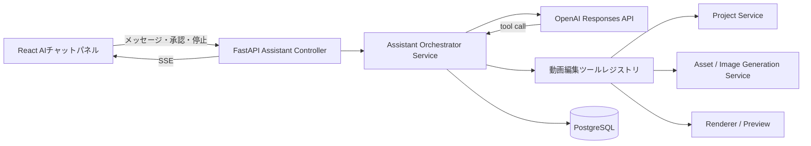

# AI動画制作アシスタント 機能・技術設計書

## 1. 文書情報

| 項目 | 内容 |
| --- | --- |
| 文書名 | AI動画制作アシスタント 機能・技術設計書 |
| 対象 | Douga Webアプリケーション |
| 作成日 | 2026-07-12 |
| ステータス | Phase A〜E完了 |
| 関連機能 | プロジェクト編集、タイムライン、素材管理、画像生成、リビジョン、動画書き出し |

## 2. 目的

動画編集画面の右側に、VS Code上のCodexに近いチャット型のAIアシスタントを追加する。

アシスタントは単純な「動画生成ボタン」ではなく、利用者との会話から目的を理解し、必要に応じて企画相談、プロット作成、台本作成、画像生成、素材登録、タイムライン編集、アニメーション設定、プレビュー確認を自律的に組み合わせる。

利用者が「プロットを一緒に考えて」と依頼した場合は対話を優先し、明確な合意なしにタイムライン編集を開始しない。一方、「この案でドラフトを作って」と依頼された場合は、利用可能な動画編集ツールを選択してドラフトを作成する。

## 3. 基本方針

### 3.1 汎用エージェントとして実装する

- 「会社紹介動画」「映画紹介動画」など、用途ごとの固定生成APIは作らない。
- AIへ小さく明確な動画編集ツールを提供し、目的に応じて組み合わせてもらう。
- 用途別テンプレートは思考や構成を補助する参考情報として扱い、実行ロジックをテンプレートへ固定しない。
- 「動画を作って」という文字列を検出して一括生成処理を呼ぶ実装にはしない。
- AIは不足情報、既存プロジェクト、現在位置、素材、利用者の指示を踏まえて次の行動を判断する。

### 3.2 思考とアプリ操作を分離する

- プロット、台本、編集方針を考える責務はAIが持つ。
- データの保存、素材生成、タイムライン編集はアプリが提供するツールを経由する。
- AIへProject Documentやデータベースを直接更新させない。
- すべての更新ツールはサービス層の認可、入力検証、リビジョン管理を通す。

### 3.3 利用者が主導権を持つ

- 相談中は会話と案の提示を優先する。
- 通常編集は即時反映できるが、必ず取り消し可能にする。
- 高コスト処理、破壊的処理、外部公開につながる処理は実行前に確認する。
- AIが行った変更と理由をチャット上で確認できるようにする。

## 4. 対象範囲

### 4.1 初期実装に含める

- 編集画面右側の開閉・幅変更可能なチャットパネル
- プロジェクト単位の会話履歴
- 応答とツール実行状況のストリーミング表示
- プロジェクト、タイムライン、素材の参照
- 企画概要、プロット、台本、絵コンテの作成と保存
- テキスト、テロップ、図形、画像、音声クリップの追加と変更
- 既存のGPT Image 2画像生成処理との連携
- アニメーション、エフェクト、カメラワークの設定
- AI操作単位のUndo
- 実行前確認、キャンセル、エラー表示

### 4.2 初期実装に含めない

- インターネット上への自動投稿
- ユーザー確認なしのMP4書き出し
- 任意コードや任意シェルコマンドの実行
- 他ユーザーのプロジェクトや素材へのアクセス
- AIによる料金プラン変更やアカウント設定変更
- 複数の専門エージェントによる分散処理
- 音声会話UI

## 5. 代表的な利用シナリオ

### 5.1 プロットを一緒に考える

1. 利用者が「零細企業がAI導入で立ち直る話のプロットを一緒に考えて」と入力する。
2. AIは目的、対象視聴者、尺、雰囲気など、不足している重要情報を確認する。
3. AIは複数の方向性を提示する。
4. 利用者が採用案と修正点を伝える。
5. AIは構造化されたプロットを保存し、チャット内にプロットカードを表示する。
6. 利用者が明示的に依頼するまでタイムラインは変更しない。

### 5.2 プロットからドラフトを作る

1. 利用者が「このプロットで30秒のドラフトを作って」と入力する。
2. AIは現在のプロット、素材、タイムラインを確認する。
3. AIは台本とショット構成を作成する。
4. 不足している画像を生成し、ユーザー所有素材として登録する。
5. 画像、テロップ、図形をタイムラインへ配置する。
6. フェード、移動、カメラワークを設定する。
7. プレビューを確認し、明らかな時間外配置や空白を修正する。
8. 実行内容と未確定事項をチャットへ報告する。

### 5.3 既存動画を部分修正する

1. 利用者が「冒頭5秒をもっと印象的にして」と入力する。
2. AIは現在のタイムラインと0〜5秒の表示内容を参照する。
3. AIは変更案を説明するか、指示が十分なら可逆的な編集を実行する。
4. 変更前リビジョンと変更後リビジョンを関連付ける。
5. 利用者はチャットから一括で変更を取り消せる。

### 5.4 画像生成を伴う編集

1. 利用者が「この背景を夜のオフィスに変えて」と入力する。
2. AIは対象クリップと現在の画像を特定する。
3. 必要なら曖昧な対象だけを確認する。
4. 既存の画像生成サービスを使用して画像を生成する。
5. 生成結果を素材として登録する。
6. 元クリップを置換するか、新しい候補として提示する。

画像編集では元Assetを上書きせず、GPT Image 2のImage Edit APIで編集済みAssetを新規作成する。素材名で指定された場合は`list_assets`で所有素材を解決する。現在画面に表示されている画像を編集する場合は、先に`inspect_frame`で現在時刻の画像レイヤーを確認する。複数の画像レイヤーが表示され、利用者が対象を指定していない場合は処理を開始せず、レイヤー名を質問する。対象が確定したら、新規Assetを作成して指定レイヤーの参照だけを差し替える。

チャット入力欄へクリップボード画像を貼り付けた場合は、先に通常のAssetアップロードとして所有ユーザー内へ保存し、ユーザーメッセージへ`attachment_asset_ids`を構造化データとして関連付ける。AIは添付の有無と会話の意味から画像編集の要否を判断し、特定語句の部分一致で画像編集ツールを選択しない。複数画像のうち対象が曖昧な場合だけ、どの添付画像を使うか質問する。

## 6. 会話時の行動モード

モード選択用の必須ボタンは設けず、発言と現在状態からAIが判断する。UIには現在の状態を補助表示する。

| モード | 主な振る舞い | タイムライン更新 |
| --- | --- | --- |
| 相談 | 質問、アイデア出し、方向性比較 | 行わない |
| プロット | 構成の作成、修正、保存 | 行わない |
| 台本 | ナレーション、テロップ、尺の作成 | 原則行わない |
| 絵コンテ | ショット、画面内容、素材要件の作成 | 原則行わない |
| ドラフト編集 | 素材生成とタイムライン反映 | 行う |
| 部分編集 | 指定範囲または選択対象の変更 | 行う |
| 確認 | プレビュー、問題検出、改善提案 | 明示許可範囲のみ |

「考えて」「相談したい」「案を出して」は相談として扱う。「反映して」「作って」「配置して」「この案で進めて」は編集実行の意思として扱う。ただし対象や結果が大きく変わる場合は確認する。

## 7. 画面設計

### 7.1 配置

- 編集画面右側にAIチャットパネルを配置する。
- 初期幅は400px程度とする。
- 左端をドラッグして幅を変更できる。
- パネルは開閉でき、閉じた状態でも会話と実行状態を保持する。
- 狭い画面ではオーバーレイ表示へ切り替える。
- チャットパネル表示中もキャンバスとタイムラインを操作できる。

### 7.2 構成

```text
┌──────────────────────────────┐
│ AIアシスタント      [履歴] [×] │
│ プロット作成中                 │
├──────────────────────────────┤
│ 利用者: プロットを一緒に…      │
│                              │
│ AI: 方向性を3案考えました。    │
│ ┌──────────────────────────┐ │
│ │ プロット案A               │ │
│ │ 1. 問題提起  0〜8秒       │ │
│ │ 2. 転機      8〜18秒      │ │
│ │ [採用] [修正] [別案]      │ │
│ └──────────────────────────┘ │
│                              │
│ ✓ 背景画像を生成しました       │
│ [画像候補] [タイムラインへ追加] │
├──────────────────────────────┤
│ メッセージを入力…        [送信] │
└──────────────────────────────┘
```

### 7.3 メッセージ種別

- 利用者メッセージ
- AIテキストメッセージ
- 質問・選択肢
- プロットカード
- 台本カード
- 絵コンテカード
- 生成画像カード
- ツール実行中表示
- 編集結果サマリー
- 承認要求
- エラーと再試行

### 7.4 操作

- `Enter`: 送信
- `Shift + Enter`: 改行
- 実行中は停止ボタンを表示する。
- AIによる編集完了後に「変更を取り消す」を表示する。
- 生成画像は候補表示と即時配置の両方に対応する。
- 企画概要、プロット、台本、絵コンテは種類ごとに最新版を表示し、個別の採用操作は設けない。

## 8. クリエイティブデータ設計

チャット本文だけを正本にせず、AIが更新した最新の企画情報を構造化データとして保存する。
ユーザーがAIへ制作・変更を依頼した時点で、その結果を種類ごとの最新版として直接利用する。
旧版は履歴として保持するが、「この案を採用」のような中間承認は要求しない。

### 8.1 企画概要

```json
{
  "purpose": "中小企業向けサービス紹介",
  "target_audience": "AI導入に不安を持つ経営者",
  "core_message": "小さな会社でもAIを活用できる",
  "tone": "現実的で前向き",
  "target_duration_ms": 30000,
  "aspect_ratio": "16:9",
  "constraints": ["青系", "過度に未来的にしない"]
}
```

### 8.2 プロット

```json
{
  "title": "AIで立ち直る町工場",
  "logline": "受注減少に悩む町工場がAI導入をきっかけに再生する",
  "status": "approved",
  "sections": [
    {
      "id": "plot-section-1",
      "title": "問題提起",
      "summary": "受注と利益が減少し、現場が疲弊している",
      "purpose": "視聴者に課題を自分事として感じてもらう",
      "duration_ms": 6000
    }
  ]
}
```

### 8.3 台本

台本は時間順のブロックとして管理し、ナレーション、テロップ、意図を分離する。

```json
{
  "blocks": [
    {
      "id": "script-block-1",
      "start_ms": 0,
      "end_ms": 6000,
      "narration": "受注は減り、現場には焦りが広がっていました。",
      "caption": "売上減少。迫る決断の時。",
      "visual_direction": "薄暗い町工場。止まった機械。",
      "plot_section_id": "plot-section-1"
    }
  ]
}
```

### 8.4 絵コンテ

絵コンテはショット単位で管理する。「シーン」という編集概念はUIへ復活させず、企画上の区切りには「セクション」、映像上の単位には「ショット」を使用する。

```json
{
  "shots": [
    {
      "id": "shot-1",
      "start_ms": 0,
      "end_ms": 3000,
      "description": "夜の町工場をゆっくりズームイン",
      "asset_requirements": ["町工場外観", "夜", "16:9"],
      "camera": { "preset": "slow_zoom_in", "intensity": 0.4 },
      "script_block_ids": ["script-block-1"]
    }
  ]
}
```

## 9. システム構成



### 9.1 フロントエンド責務

- チャット表示と入力
- ストリーミングイベントの描画
- 承認、キャンセル、Undoの操作
- プロット、画像、実行結果カードの表示
- AI更新後のプロジェクト再取得
- 選択中レイヤー、再生位置、表示範囲などのUIコンテキスト送信

### 9.2 Controller責務

- 認証、CSRF、HTTP入力検証
- SSEレスポンスまたは通常レスポンスの構築
- Service呼び出し
- HTTPエラーへの変換

### 9.3 Assistant Orchestrator Service責務

- 会話ターンとエージェント実行の開始
- モデルへ渡すコンテキストとツールの選択
- ツール呼び出しループ
- 承認待ち、キャンセル、上限管理
- ツール実行結果のモデルへの返却
- 実行イベント、監査情報、使用量の記録
- 実行終了時のサマリー作成

### 9.4 Tool Service責務

- JSON Schemaによる引数検証
- ユーザーとプロジェクトの所有権検証
- 対象リビジョンと`lock_version`の検証
- 既存のProject、Asset、Image Generation、Export Serviceの呼び出し
- ドメインエラーを安全なツール結果へ変換

### 9.5 Repository責務

- アシスタント用テーブルの読み書き
- すべてのクエリを認証済み`user_id`で制限
- commitは行わない

## 10. エージェント実行フロー

1. 利用者がメッセージを送信する。
2. Serviceがプロジェクト所有権を検証する。
3. 会話、採用済みクリエイティブデータ、プロジェクト要約、現在のUIコンテキストを取得する。
4. モデルへシステム指示、会話、利用可能ツールを送る。
5. モデルが回答またはツール呼び出しを返す。
6. ツール呼び出しの場合、Serviceが認可、承認要否、回数上限を確認する。
7. ツールを実行し、結果を保存してモデルへ返す。
8. モデルが追加ツールを必要とする間、上限内で繰り返す。
9. 最終メッセージと変更サマリーを保存する。
10. UIへ完了イベントと最新リビジョンを通知する。

### 10.1 会話から動画ドラフトへ進む条件

- 会話は単発の質問応答ではなく、動画の目的、視聴者、尺、比率、トーン、採用案、
  制約を積み上げる制作仕様として扱う。
- 相談・比較・アイデア出しだけを求められている間は、プロジェクトを変更しない。
- 利用者が会話内容を動画またはドラフトにする意図を示したら、特定の固定文言や、
  事前に`approved`へ変更された文書を必須条件にしない。
- 最新の採用方針を基に、不足する企画概要、プロット、台本、絵コンテを補い、素材、
  ナレーション、テロップ、タイムライン、カメラワーク、検証まで連続して進める。
- 結果を大きく変える未決事項だけを質問し、利用者が確認工程を指定していない限り、
  中間成果物の承認待ちだけを理由に停止しない。

### 10.2 コンテキスト圧縮

長い会話は次の3層でモデルへ渡す。

1. 古い会話から作成した永続的な「制作メモ」
2. 要約していない直近のユーザー・アシスタント発言
3. 現在のプロジェクト、選択レイヤー、再生位置などの実状態

制作メモは`assistant_messages.role=system_summary`として保存し、目的、視聴者、尺、
比率、トーン、採用済みの構成、素材・レイヤー参照、却下案、未決事項、制作状況、
次の作業を保持する。内部メモは通常のチャット履歴には表示しない。要約済み境界は
`content_json.through_message_id`で記録し、同じ発言を重複して要約しない。

Responses APIの1回のツール実行ループでは`context_management`のcompactionを有効にし、
設定した閾値でサーバー側圧縮を行う。最新のcompaction itemより前の継続入力は破棄し、
再送ペイロードを増やさない。制作メモ化とサーバー側compactionは併用する。

コンテキスト上限回避と費用上限は別に扱う。自動圧縮後も、ユーザー単位の1 Run・
1時間あたりの利用量上限は維持し、監査用の`usage_json`へ集計する。
Responses APIのツールループでは同じシステム指示とツール定義が繰り返し入力されるため、
上限判定には未キャッシュ入力、出力、キャッシュ済み入力の重み付き量を使用する。
生の`total_tokens`と`cached_input_tokens`は監査用に保持し、キャッシュ済み入力を未キャッシュ
入力と同額として数えて長い制作処理を不必要に停止しない。重みは環境設定で変更可能とする。

1回のRunに以下の上限を設ける。

- 最大ツール呼び出し回数
- 最大生成画像数
- 最大実行時間
- 最大失敗・再試行回数
- 最大トークンまたは利用金額相当量

上限到達時は勝手に継続せず、現状と続行に必要な確認を提示する。

動画ドラフト生成はテロップ、テキスト、素材、アニメーションを細かな編集ツールへ
分解するため、1 Runのツール呼び出し上限は1,000回とする。引数エラーの連続停止、
トークン・時間・外部API費用の上限は別に維持する。

## 11. ツール設計

### 11.1 設計規則

- ツール名は目的が明確な動詞から始める。
- 1ツールの責務を小さく保つ。
- 不正状態を作れる引数の組み合わせを避ける。
- 列挙値、必須項目、最小値、最大値をJSON Schemaで定義する。
- すべての更新結果に変更対象と新しいリビジョン番号を含める。
- 生の例外、SQL、ストレージパス、署名付きURLをモデルへ返さない。
- ツール結果は必要最小限の構造化JSONにする。

### 11.2 参照ツール

| ツール | 用途 |
| --- | --- |
| `get_project_context` | 尺、解像度、選択対象、現在時刻、最新の企画情報を取得 |
| `get_timeline_summary` | トラック、クリップ、空白、時間範囲を取得 |
| `get_clip_details` | 指定クリップの詳細を取得 |
| `list_assets` | 利用可能なユーザー素材を検索 |
| `inspect_frame` | 指定時刻のプレビュー画像または要約を取得 |
| `get_creative_document` | 企画概要、プロット、台本、絵コンテを取得 |

### 11.3 企画ツール

| ツール | 用途 |
| --- | --- |
| `save_project_brief` | 採用された目的、対象視聴者、トーン、制約を保存 |
| `save_plot` | 採用または下書きのプロットを保存 |
| `save_script` | 台本を保存 |
| `save_storyboard` | 絵コンテを保存 |
| `update_creative_status` | draft、proposed、approved、supersededを変更 |

`create_plot`のような「AIにプロットを考えさせるツール」は原則作らない。AIが会話からプロットを考え、`save_plot`でアプリへ保存する。

### 11.4 素材ツール

| ツール | 用途 | 承認 |
| --- | --- | --- |
| `generate_image` | 既存画像生成Serviceで画像を生成 | 品質・枚数による |
| `edit_image_asset` | アップロード済み・生成済みの所有画像から編集済みAssetを作成 | 品質による |
| `edit_visible_image` | 現在表示中の画像をレイヤー名で特定し、編集済みAssetへ差し替え | 品質による |
| `list_generation_status` | 非同期生成の状態を取得 | 不要 |
| `add_asset_to_timeline` | 素材を指定時間・トラックへ配置 | 通常不要 |
| `replace_clip_asset` | クリップの素材を差し替え | 通常不要 |

画像生成・編集結果は必ず既存のAssetおよびImage Generation Requestとしてユーザー単位で保存する。画像編集では`parent_asset_id`で元画像を記録し、元Assetを保持する。

### 11.5 タイムライン編集ツール

| ツール | 用途 |
| --- | --- |
| `add_text_clip` | テキストクリップを追加 |
| `add_caption_clip` | テロップを追加 |
| `add_shape_clip` | 図形を追加 |
| `add_audio_clip` | 音声を追加 |
| `duplicate_audio_clip` | 既存音声クリップを指定区間へ連続複製し、最後のクリップを区間末尾でトリム |
| `list_speech_voices` | AivisSpeechの話者とスタイルIDを取得 |
| `generate_narration` | 読み上げ音声を生成してユーザー専用音声素材へ登録 |
| `create_synced_captions_from_narration` | ナレーションをテロップ単位で再合成し、実測尺で同期テロップを作成 |
| `validate_narration_caption_sync` | 合成時の実測区間とテロップ本文・開始終了時刻を照合 |
| `update_clip_timing` | 開始、終了、トラックを変更 |
| `update_clip_transform` | 位置、サイズ、回転、反転、不透明度を変更 |
| `update_clip_content` | テキスト、色、画像などを変更 |
| `delete_clip` | 指定クリップを削除 |
| `apply_animation` | キーフレームアニメーションを適用 |
| `apply_effect` | フェードなどの効果を適用 |
| `apply_camera_effect` | 画面全体のカメラワークを適用 |
| `extend_timeline` | 動画全体の尺を延長 |

ナレーション生成では、既知の正確なスタイルIDがない限り`list_speech_voices`を先に呼ぶ。
`generate_narration`が返す音声素材IDと実測時間を使い、続けて`add_audio_clip`で
`narration`トラックへ配置する。話者IDを推測して生成しない。

AivisSpeech Engineはモデルの特性上、`Mora.consonant_length`と`vowel_length`から
発話時刻を取得できない。テロップとの厳密な同期が必要な場合は、読み上げ文を
テロップ単位へ分割して個別に音声合成し、各WAVの実測フレーム長をキューとして
保存した後に連結する。AIは文字数から区間を推測してはならず、
`create_synced_captions_from_narration`の後に`validate_narration_caption_sync`を実行する。
`inspect_frame`と`validate_timeline`は音声内容の同期を検証しない。

動画全体またはナレーション・テロップ全体を作成する場合は、個別編集ツールの反復ではなく、
[AIナレーション付き動画一括作成仕様](ai-narrated-video-composition-design.md)に従って
`compose_narrated_video`または`rebuild_narration_master`を使用する。テロップ単位の音声は
一時セグメントとして生成し、最終Timelineには動画全体で1本のマスターナレーションを配置する。

### 11.6 確認・出力ツール

| ツール | 用途 | 承認 |
| --- | --- | --- |
| `render_preview` | 指定範囲の確認用プレビューを作成 | 通常不要 |
| `validate_timeline` | 空白、時間外、欠損素材などを検査 | 不要 |
| `export_video` | MP4書き出しを開始 | 必須 |
| `undo_assistant_run` | AIの1回分の変更を戻す | 利用者操作 |

## 12. 実行と承認ポリシー

| 操作分類 | 例 | 初期ポリシー |
| --- | --- | --- |
| 読み取り | タイムライン参照、素材検索 | 自動実行 |
| 企画保存 | プロット下書き保存 | 自動実行 |
| 可逆的編集 | クリップ追加、位置変更 | 自動実行しUndoを提示 |
| 高コスト | 高品質画像の複数生成 | 実行前確認 |
| 破壊的 | 大量削除、全体置換 | 実行前確認 |
| 外部成果物 | MP4書き出し | 実行前確認 |

承認時には、実行内容、対象、想定コスト区分、変更範囲を表示する。承認トークンは対象RunとTool Callに限定し、別操作へ流用できないようにする。

## 13. リビジョンとUndo

- AIが更新を開始する直前のProject Revisionを基準リビジョンとして記録する。
- 1回の利用者メッセージから始まる一連の更新を1つのAssistant Runとして扱う。
- 各ツール呼び出しは個別に監査するが、UndoはRun単位を基本とする。
- Undoでは基準リビジョンを新しいリビジョンとして復元し、履歴を削除しない。
- ユーザーが途中で手動編集した場合は`lock_version`競合として自動上書きしない。
- 競合時は最新状態を再取得し、再計画するか利用者へ確認する。
- 画像などの生成素材はUndoで物理削除せず、タイムラインから除外する。孤立素材は既存の削除・クリーンアップ方針に従う。

## 14. データベース設計案

### 14.1 `assistant_threads`

| カラム | 型 | 内容 |
| --- | --- | --- |
| `id` | UUID | 主キー |
| `user_id` | UUID | 所有ユーザー |
| `project_id` | UUID | 対象プロジェクト |
| `title` | VARCHAR | 会話タイトル |
| `provider_conversation_id` | VARCHAR NULL | OpenAI側会話識別子 |
| `status` | VARCHAR | active、archived |
| `created_at` | TIMESTAMP | 作成日時 |
| `updated_at` | TIMESTAMP | 更新日時 |

### 14.2 `assistant_messages`

| カラム | 型 | 内容 |
| --- | --- | --- |
| `id` | UUID | 主キー |
| `thread_id` | UUID | 会話 |
| `user_id` | UUID | 所有ユーザー |
| `role` | VARCHAR | user、assistant、system_summary |
| `content` | TEXT | 本文 |
| `content_json` | JSONB NULL | カードなどの構造化内容 |
| `provider_item_id` | VARCHAR NULL | OpenAI側項目識別子 |
| `created_at` | TIMESTAMP | 作成日時 |

`system_summary`は内部の制作メモであり、`content_json.through_message_id`に要約済みの
最後の通常メッセージIDを保持する。通常の会話APIレスポンスでは`user`と`assistant`
だけを返す。

### 14.3 `assistant_runs`

| カラム | 型 | 内容 |
| --- | --- | --- |
| `id` | UUID | 主キー |
| `thread_id` | UUID | 会話 |
| `user_id` | UUID | 所有ユーザー |
| `project_id` | UUID | 対象プロジェクト |
| `status` | VARCHAR | queued、running、waiting_approval、completed、failed、cancelled |
| `model` | VARCHAR | 使用モデル |
| `base_revision_number` | INTEGER | 開始時リビジョン |
| `context_json` | JSONB | 再生位置、選択対象、表示範囲 |
| `continuation_json` | JSONB | 承認待ちから再開するResponses入力 |
| `result_revision_number` | INTEGER NULL | 完了時リビジョン |
| `undo_revision_number` | INTEGER NULL | Run Undoで作成した復元リビジョン |
| `provider_response_id` | VARCHAR NULL | 最終Response識別子 |
| `usage_json` | JSONB | トークン、画像枚数など |
| `error_code` | VARCHAR NULL | 安全なエラーコード |
| `created_at` | TIMESTAMP | 作成日時 |
| `started_at` | TIMESTAMP NULL | 開始日時 |
| `finished_at` | TIMESTAMP NULL | 完了日時 |

### 14.4 `assistant_tool_calls`

| カラム | 型 | 内容 |
| --- | --- | --- |
| `id` | UUID | 主キー |
| `run_id` | UUID | 実行 |
| `user_id` | UUID | 所有ユーザー |
| `provider_call_id` | VARCHAR | Responses APIのFunction Call ID |
| `tool_name` | VARCHAR | ツール名 |
| `arguments_json` | JSONB | 検証済み引数 |
| `result_json` | JSONB NULL | 安全に要約した結果 |
| `status` | VARCHAR | requested、waiting_approval、running、completed、failed、cancelled |
| `approval_required` | BOOLEAN | 承認要否 |
| `approved_at` | TIMESTAMP NULL | 承認日時 |
| `created_at` | TIMESTAMP | 作成日時 |
| `finished_at` | TIMESTAMP NULL | 完了日時 |

### 14.5 `creative_documents`

| カラム | 型 | 内容 |
| --- | --- | --- |
| `id` | UUID | 主キー |
| `user_id` | UUID | 所有ユーザー |
| `project_id` | UUID | 対象プロジェクト |
| `kind` | VARCHAR | brief、plot、script、storyboard |
| `status` | VARCHAR | draft、proposed、approved、superseded |
| `version` | INTEGER | 種別内バージョン |
| `content` | JSONB | 構造化内容 |
| `source_run_id` | UUID NULL | 作成したAI Run |
| `created_at` | TIMESTAMP | 作成日時 |
| `updated_at` | TIMESTAMP | 更新日時 |

全テーブルでユーザー所有権を持ち、Repositoryの取得条件に`user_id`を必須とする。外部キー、状態値Check Constraint、主要な一覧用複合IndexをAlembicで作成する。

## 15. API設計案

| Method | Path | 用途 |
| --- | --- | --- |
| `GET` | `/api/v1/projects/{project_id}/assistant/threads` | 会話一覧 |
| `POST` | `/api/v1/projects/{project_id}/assistant/threads` | 会話作成 |
| `GET` | `/api/v1/projects/{project_id}/assistant/threads/{thread_id}` | 会話詳細 |
| `GET` | `/api/v1/projects/{project_id}/assistant/metrics` | ユーザー所有プロジェクトの運用メトリクス |
| `GET` | `/api/v1/projects/{project_id}/assistant/audit` | ツール監査履歴 |
| `POST` | `/api/v1/projects/{project_id}/assistant/threads/{thread_id}/messages` | メッセージ送信、Run開始 |
| `GET` | `/api/v1/projects/{project_id}/assistant/runs/{run_id}/events` | SSEイベント購読 |
| `POST` | `/api/v1/projects/{project_id}/assistant/runs/{run_id}/cancel` | 実行停止 |
| `POST` | `/api/v1/projects/{project_id}/assistant/tool-calls/{call_id}/approve` | ツール承認 |
| `POST` | `/api/v1/projects/{project_id}/assistant/tool-calls/{call_id}/reject` | ツール拒否 |
| `POST` | `/api/v1/projects/{project_id}/assistant/runs/{run_id}/undo` | Run単位Undo |
| `GET` | `/api/v1/projects/{project_id}/creative-documents` | 企画データ一覧 |
| `GET` | `/api/v1/projects/{project_id}/creative-documents/{kind}` | 採用版取得 |

メッセージ送信APIはRun IDを早期に返す。文章、ツール開始、進捗、承認待ち、プロジェクト更新、完了をSSEで通知する。初期実装はSSEと通常のPOSTを使用し、双方向WebSocketは必要性が生じた段階で再評価する。

## 16. ストリーミングイベント

| イベント | 内容 |
| --- | --- |
| `run.started` | Run開始 |
| `message.delta` | AI文章の差分 |
| `tool.requested` | ツール呼び出し要求 |
| `tool.waiting_approval` | 承認待ち |
| `tool.started` | ツール開始 |
| `tool.progress` | 画像生成などの進捗 |
| `tool.completed` | ツール完了 |
| `project.revision_created` | 新しいプロジェクトリビジョン |
| `artifact.created` | プロット、画像などの生成 |
| `run.completed` | Run正常終了 |
| `run.failed` | Run失敗 |
| `run.cancelled` | Run停止 |

イベントには連番を持たせ、再接続時に未受信イベントを取得できるようにする。

## 17. OpenAI連携方針

- 会話とツール利用にはResponses APIを使用する。
- 動画編集操作はFunction Callingの独自ツールとして定義する。
- 会話継続にはOpenAI側の会話識別子または直前Response IDを使用できるが、アプリDBを会話と監査の正本とする。
- `store=false`で推論モデルの出力を手動継続する場合は、`reasoning.encrypted_content`を取得し、Function Call出力とともに後続リクエストへ渡す。
- 長いツール実行ではResponses APIのserver-side compactionを有効にし、会話をまたぐ長期記憶はアプリDBの制作メモで補う。
- モデルIDは環境設定とし、コードへ固定しない。
- ツール引数はstrictなJSON Schemaを使用する。
- 大量のツール定義を常時渡さず、現在の状態に必要なツール群へ絞る。
- 既存のGPT Image 2連携は独自`generate_image`ツールから呼び出す。
- 単一プロンプトによる画像編集はGPT Image 2のImage Edit APIを`edit_image_asset`または`edit_visible_image`から呼び出す。
- 将来、同一画像を複数ターンで連続編集する体験が必要になった場合はResponses API組み込み画像生成ツールも比較検討する。

## 18. システムプロンプト方針

システムプロンプトには固定の動画テンプレートではなく、役割、行動原則、ツール使用規則を記述する。

主な原則:

- 利用者と共同で動画を企画・編集するアシスタントである。
- 相談を求められた場合は、合意前に編集を開始しない。
- 指示が十分で可逆的な編集の場合は、過剰に確認せず作業を進める。
- 曖昧さが結果を大きく変える場合だけ、簡潔に確認する。
- 既存の素材、プロット、選択対象を確認してから変更する。
- 実行していない操作を実行済みと報告しない。
- プレビューや検証を行っていない場合、完成を断定しない。
- ツールエラーを隠さず、利用者が次に取れる行動を示す。
- 高コスト、破壊的、外部出力の操作は承認を得る。

## 19. セキュリティ

### 19.1 認可

- Assistant Controller、Service、Repositoryの各境界でユーザー所有権を維持する。
- モデルが送った`user_id`を信用しない。認証セッションのユーザーIDを使用する。
- Tool引数で任意のプロジェクトIDやAsset IDを受け取る場合も所有権を再検証する。
- 他ユーザーの会話、プロンプト、生成結果を検索対象へ含めない。

### 19.2 プロンプトインジェクション対策

- 素材名、アップロード文書、外部取得内容をシステム指示として扱わない。
- データ由来の文字列とアプリ指示を明確に分離する。
- モデルの文章だけで認可や承認を完了させない。
- Tool Service側で許可ツール、引数、対象、件数を強制する。
- 任意URL取得、任意コード実行、任意ファイルパス参照ツールを提供しない。

### 19.3 秘密情報とログ

- OpenAI APIキーはバックエンド環境変数からのみ取得する。
- APIキー、Cookie、Authorization Header、署名付きURLをモデル、DB、ログへ出力しない。
- メッセージ本文を通常のアプリログへ全文出力しない。
- Tool引数に個人情報が含まれる可能性を考慮し、監査ログと運用ログを分離する。
- Provider例外はRun ID、Provider種別、モデルIDとともにサーバーログへ記録する。例外メッセージとトレースはAPIキー、認証情報、署名値をマスクし、DBや画面には汎用エラーコードだけを保存・表示する。

### 19.4 コスト・濫用対策

- ユーザー単位、時間単位のRun、トークン、画像生成枚数上限を設ける。
- 同一Runでの再帰的ツール呼び出し回数を制限する。
- 生成失敗時の無制限再試行を禁止する。
- Runキャンセル時に未開始ジョブを停止し、実行中ジョブはキャンセル可能な範囲で停止する。

## 20. エラー処理

| 状況 | 振る舞い |
| --- | --- |
| OpenAI API一時障害 | 制限回数内で再試行し、失敗時は会話とRunを保持 |
| Tool入力不正 | モデルへ安全な検証エラーを返し、1回だけ自己修正を許可 |
| 所有権エラー | ツール失敗として終了し、詳細をモデルへ公開しない |
| リビジョン競合 | 最新状態を取得し、再計画または利用者確認 |
| 画像生成失敗 | 既存素材の利用、再試行、プロンプト修正を提案 |
| SSE切断 | イベント連番から再接続 |
| Run上限到達 | 現在までの結果と続行条件を表示 |
| 利用者キャンセル | 新規ツール開始を止め、完了済み変更とUndoを案内 |

## 21. 可観測性と監査

- Run ID、Thread ID、Tool Call IDを相関IDとして使用する。
- モデル応答時間、初回文字表示時間、ツール実行時間、Run成功率を計測する。
- ツール別失敗率、承認率、Undo率、画像採用率を計測する。
- トークン使用量と画像生成枚数をユーザー単位で集計する。
- プロンプト本文や生成内容を含めずに障害調査できるメタデータを残す。
- 開発環境ではトレースを利用できるようにするが、本番では保存範囲と保持期間を明示する。

## 22. テスト方針

### 22.1 Unit Test

- 各Toolの入力検証
- 承認要否の判定
- Run状態遷移
- ツール呼び出し回数・コスト上限
- プロット、台本、絵コンテSchema
- Run単位Undo
- リビジョン競合
- プロンプトコンテキスト組み立て

### 22.2 Integration Test

- FastAPI、Service、Repository、PostgreSQLの連携
- OpenAI fake adapterによる複数Tool Callループ
- 画像生成ジョブとAsset登録
- プロジェクト更新とリビジョン生成
- 承認待ち、承認、拒否、キャンセル
- 他ユーザーのThread、Run、Tool Call、Creative Documentへのアクセス拒否

### 22.3 E2E

- チャットパネルの開閉とリサイズ
- プロット相談ではタイムラインが変更されない
- 「この案でドラフトを作って」でタイムラインが更新される
- 生成画像が素材とタイムラインへ反映される
- 実行中の進捗が表示される
- AI編集を一括Undoできる
- 高コスト画像生成とMP4書き出しで承認が要求される
- ページ再読込後も会話と実行履歴を確認できる
- 日本語、英語UIの両方で操作できる

### 22.4 Agent Evaluation

代表的な依頼を固定評価セットとして管理する。

- 会社紹介動画のプロット相談
- 映画紹介動画の3案提示
- 採用プロットから30秒ドラフト作成
- 冒頭5秒のみの改善
- 既存素材だけを使う制約
- 画像生成枚数上限があるケース
- 曖昧な対象を勝手に変更しないケース
- 悪意ある素材名やプロンプトインジェクションを無視するケース

評価項目は、目的達成、ツール選択、不要な確認の少なさ、無断編集の有無、タイムライン妥当性、コスト、説明の正確性とする。

## 23. フォルダ構成案

```text
apps/backend/src/douga/modules/assistant/
├── controller.py
├── service.py
├── orchestrator.py
├── repository.py
├── models.py
├── schemas.py
├── prompts.py
├── policies.py
├── events.py
└── tools/
    ├── registry.py
    ├── project_tools.py
    ├── creative_tools.py
    ├── asset_tools.py
    ├── timeline_tools.py
    └── preview_tools.py

apps/backend/src/douga/integrations/
└── openai_responses.py

apps/web/src/features/assistant/
├── api/
├── components/
│   ├── AssistantPanel.tsx
│   ├── MessageList.tsx
│   ├── Composer.tsx
│   ├── PlotCard.tsx
│   ├── ImageArtifactCard.tsx
│   ├── ToolActivity.tsx
│   └── ApprovalCard.tsx
├── hooks/
├── pages/
└── types/
```

ControllerとServiceを分離し、OpenAI SDK固有処理をIntegrationへ隔離する。ツールはControllerを経由せず、既存のドメインServiceを呼び出す。

## 24. 実装フェーズ

### Phase A: 会話基盤

- DB migration
- Thread、Message、Run API
- 右側チャットパネル
- SSEストリーミング
- OpenAI Responses adapterとfake adapter
- テキスト会話のみ

### Phase B: 企画共同作成

- Creative Document Schemaとテーブル
- 企画概要、プロット、台本、絵コンテカード
- 保存・採用・差し替えツール
- 「相談中は編集しない」ポリシー

### Phase C: 読み取り・基本編集

- プロジェクト、素材、タイムライン参照ツール
- テキスト、テロップ、図形、画像配置ツール
- Run単位リビジョンとUndo
- 競合処理

### Phase D: 画像生成・アニメーション

- 既存画像生成Serviceのツール化
- 非同期進捗イベント
- アニメーション、エフェクト、カメラツール
- コスト承認

### Phase E: 自律ドラフトと品質確認

- 台本・絵コンテからタイムラインを組み立てる複数ツール実行
- フレーム検査、タイムライン検証
- プレビュー生成
- Agent Evaluationと回帰テスト
- 利用上限、監査、運用メトリクス

## 25. 完了条件

- 利用者がAIとプロットを相談し、採用案を構造化データとして保存できる。
- 相談中は利用者の明示指示なしにタイムラインが変更されない。
- 採用したプロットからAIが複数の動画編集ツールを使ってドラフトを作成できる。
- 生成画像がユーザー所有素材として保存され、タイムラインへ反映される。
- AIが行った編集をRun単位で取り消せる。
- 高コスト、破壊的、書き出し操作で承認が要求される。
- 他ユーザーの会話、素材、プロジェクトへアクセスできない。
- APIキー、セッション、署名付きURLが画面、DB、ログへ露出しない。
- ja/enのUI文言が揃っている。
- Unit、Integration、E2E、Agent Evaluationが成功する。

## 26. 未決事項

- 初期リリースで使用するメインモデルとコスト上限
- OpenAI側Conversationを使用するか、Response連鎖とアプリDBだけで開始するか
- プレビュー確認を静止フレーム中心にするか、短い動画プレビューまで含めるか
- 通常の画像生成で承認を要求する品質・枚数の閾値
- Creative DocumentをProject Document内にもスナップショットするか
- チャット履歴の保持期間と利用者による削除方法
- 将来のWeb検索、外部資料参照をどの権限モデルで提供するか

## 27. 参考資料

- [OpenAI Function Calling](https://developers.openai.com/api/docs/guides/function-calling)
- [OpenAI Conversation State](https://developers.openai.com/api/docs/guides/conversation-state)
- [OpenAI Image Generation](https://developers.openai.com/api/docs/guides/image-generation)
- [機能設計書](functional-design.md)
- [データベース設計書](database-design.md)
- [フォルダ構成設計書](folder-structure.md)
- [セキュリティ脅威モデル](threat-model.md)

## 28. 実装状況

### 2026-07-12: Phase A 完了

実装済み:

- `assistant_threads`、`assistant_messages`、`assistant_runs`テーブル
- `assistant_run_events`テーブルと連番イベント
- Alembic upgrade/downgrade migration
- Controller、Service、Repositoryを分離したプロジェクト単位の会話API
- ユーザー所有権による会話分離
- OpenAI Responses API adapterと開発・テスト用Fake adapter
- APIキーの有無に応じたprovider自動選択
- 右側の開閉・幅変更可能なAIチャットパネル
- 会話履歴の再読込
- 会話履歴一覧、切り替え、新規会話作成
- Responses APIの逐次ストリーミングとSSE再接続
- Run停止と停止イベント
- 安全なMarkdown表示
- 日本語・英語UI
- Unit、Integrationテスト

次の作業:

- Phase Cのプロジェクト・素材・タイムライン参照および基本編集ツール
- Run単位リビジョン、Undo、競合処理

### 2026-07-12: Phase B 完了

実装済み:

- `assistant_tool_calls`、`creative_documents`テーブルとAlembic migration
- 企画概要、プロット、台本、絵コンテのstrict JSON Schema検証
- Creative Documentの版管理、提案、差し替え、採用API
- Responses API Function Callingの複数ターン実行ループ
- ツール要求、開始、完了、失敗、成果物イベントの永続化
- 相談中は変更ツールを使用しないシステムポリシー
- 構造化カードの表示と利用者による採用操作
- ユーザー・プロジェクト所有権、CSRF、無効SchemaのIntegration Test

### 2026-07-12: Phase C 完了

実装済み:

- `get_project_context`、`get_timeline_summary`、`get_clip_details`参照ツール
- ユーザー所有素材の検索と他ユーザー素材の配置拒否
- テキスト、テロップ、図形、画像、音声クリップの追加ツール
- クリップの時間、トラック、重なり順、変形、内容、素材差し替え、削除ツール
- 動画全体尺の延長ツール
- 編集画面の再生位置・選択レイヤーをRunコンテキストとして保存
- AI編集ごとの楽観ロック、Project Revision作成、競合エラー
- Run開始リビジョンへの一括Undoと二重Undo・後続編集競合の防止
- AI編集後のエディタ自動再読込とUndo UI
- ページ再読込後も確認できるRun履歴
- 参照、編集、所有権、Revision、UndoのIntegration Test

次の作業:

- Phase Eの自律ドラフト、品質確認、プレビュー、運用制御

### 2026-07-12: Phase D 完了

実装済み:

- 既存GPT Image生成Serviceを再利用する`generate_image`、`list_generation_status`ツール
- 画像生成の進捗イベントと生成画像カード
- 15種類のレイヤーアニメーション、フェード等のエフェクト、8種類のカメラ効果
- 高品質画像生成およびクリップ削除の実行前承認ポリシー
- 承認・却下API、承認待ちRunの永続化、プロセス再開
- 承認待ちカードと承認後のSSE再接続
- 会話単位の多重Run防止と停止時の承認状態破棄
- 承認、拒否、ユーザー分離、進捗、成果物、全プリセットのUnit・Integration Test

### 2026-07-13: Image-to-Image編集

実装済み:

- GPT Image 2 Image Edit APIを利用した所有画像の編集
- アップロード済み・生成済みAssetから編集済みAssetを新規作成する`edit_image_asset`
- 現在時刻の表示画像をレイヤー名で特定し、編集後のAssetへ差し替える`edit_visible_image`
- 複数画像が表示中で対象名が未指定の場合に、レイヤー名を質問して推測を禁止するシステムポリシー
- 編集元Assetの所有権検証、`parent_asset_id`による派生元記録、元画像の保持
- 高品質編集の承認ポリシー、Tool Schema・選択・所有権・Provider adapterの回帰テスト
- チャット入力欄へのCtrl+V画像添付、添付Asset IDのメッセージ保存、所有権検証
- 添付画像がある場合の`edit_image_asset`公開と、会話の意味に基づく汎用的なツール選択指示

次の作業:

- Phase Eの台本・絵コンテからの自律ドラフト
- フレーム検査、タイムライン検証、プレビュー、書き出し
- 利用上限、監査、メトリクス、Agent Evaluation

### 2026-07-12: Phase E 完了

実装済み:

- 最新の台本・絵コンテを読み、複数の粒度の細かい編集ツールでドラフトを組み立てる実行ループ
- 依頼内容に応じて参照、企画、画像、編集、アニメーション、出力ツール群を絞るTool Routing
- `inspect_frame`による指定時刻の画面・テロップ・音声・カメラ状態検査
- `validate_timeline`による時間外クリップ、欠損素材、空白区間、空テロップ検査
- 指定範囲15秒以内のMP4プレビュー生成とチャット内プレイヤー
- 完成MP4書き出しツールと必須承認
- 生成画像の素材保存からタイムライン配置までの複数ツール連鎖
- 1時間あたりのRun・トークン・画像生成・書き出し上限と1Runのトークン・ツール回数上限
- Run停止と画像生成・プレビュー・書き出しジョブの連動キャンセル
- ユーザー・プロジェクト分離された監査APIと運用メトリクスAPI
- Run成功率、初回表示時間、モデル応答時間、ツール失敗、承認、Undo、画像採用率の集計
- OpenAI一時障害の再試行回数・タイムアウト設定
- 会社紹介、映画紹介3案、30秒ドラフト、冒頭改善、既存素材限定、生成上限、曖昧対象、プロンプトインジェクションの固定Agent Evaluation
- 日本語・英語のチャット、編集、Undo、画像配置、承認、履歴再読込を含むPlaywright E2E

検証結果:

- Backend Unit / Integration: 70件成功（Phase E追加後の対象回帰43件も成功）
- Frontend / shared packages Unit: 45件成功
- Playwright E2E: 7件成功
- Ruff、Mypy、ESLint、TypeScript、Prettier、i18n、production build成功
- Alembic downgrade / upgrade / autogenerate check成功
