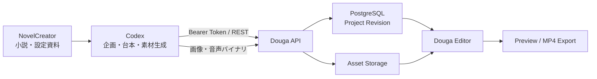

# Codex連携API設計書

## 1. 文書情報

| 項目 | 内容 |
| --- | --- |
| 文書名 | Codex連携API設計書 |
| 対象 | Douga Webアプリケーション |
| 状態 | 実装基準・確定版 |
| 確定日 | 2026-07-12 |
| APIバージョン | `/api/v1` |
| 関連文書 | `docs/ai-video-assistant-design.md`、`docs/functional-design.md`、`packages/project-schema/schema/project-v1.schema.json` |

改訂履歴:

| 日付 | 版 | 内容 |
| --- | --- | --- |
| 2026-07-12 | 1.0 | 認証、素材連携、Project Document、冪等性、監査、クライアント規約を確定 |
| 2026-07-12 | 1.1 | Bearer対応API、アップロード再開、操作結果、エラー、環境設定、受入確認を補完 |

## 2. 目的

CodexなどDougaの外部で動く自律エージェントが、小説、設定資料、台本、画像、音声などを基に、Dougaで再編集可能な動画プロジェクトを作成できるREST APIを提供する。

外部エージェントは完成MP4だけを生成するのではなく、素材、テロップ、音声、カメラワーク、アニメーションをDougaのタイムラインへ配置する。利用者は生成されたドラフトをDougaで開き、通常の編集操作で修正してから書き出せる。

主な利用例は次のとおり。

- 小説からYouTube向け紹介動画、朗読動画、ダイジェスト動画を作る。
- エピソードの設定資料から広告用ショート動画を作る。
- Codex側で生成した画像や音声をアップロードして配置する。
- Codexが作成したプロット、台本、絵コンテをDougaへ保存する。
- 自動生成後にプレビューを検証し、必要な箇所だけDougaで手作業により直す。

## 3. 基本方針

1. REST APIを正本とする。Codex用CLI、Skill、MCPサーバーはREST APIの薄いクライアントとして実装する。
2. 外部エージェントにもユーザー所有権を適用し、別ユーザーのプロジェクトや素材へアクセスさせない。
3. Codexが作るのは編集可能なProject Documentであり、MP4は任意の後続処理とする。
4. 素材のバイナリとタイムライン編集データを分離する。
5. 更新はプロジェクトリビジョンとして保存し、競合検出とUndoを可能にする。
6. 再試行でプロジェクトや素材が重複しないよう、更新APIを冪等にする。
7. APIはCodex固有のプロンプトや推論方法に依存させず、他の自動化クライアントからも利用できるようにする。
8. ファイルシステムの絶対パスをAPIへ渡さない。Codexがファイル内容をアップロードする。

## 4. スコープ

### 4.1 初期実装に含める

- 個人APIトークンの発行、一覧、失効
- Bearer TokenによるAPI認証
- プロジェクト作成、取得、リビジョン保存
- 画像、動画、音声素材のアップロード
- 企画概要、プロット、台本、絵コンテの保存
- タイムラインの事前検証
- プレビューおよびMP4書き出しの開始、状態取得
- 冪等性キーによる重複防止
- 外部操作の監査記録

### 4.2 初期実装に含めない

- Codexそのもののホスティング
- NovelCreatorのDBをDougaから直接読む処理
- Dougaサーバーからローカルファイルパスを読む処理
- 任意URLからの素材取得
- Codexのプロンプト管理
- 自動YouTube投稿
- Webhook配信
- 複数ユーザーで共有するサービスアカウント

## 5. 全体構成



### 5.1 責務分担

| コンポーネント | 責務 |
| --- | --- |
| NovelCreator | 小説本文、世界設定、キャラクター設定、参照画像の管理 |
| Codex | 構成案、ナレーション、テロップ、絵コンテ、素材生成、API操作 |
| Douga API | 認証、所有権確認、素材保存、Project Document検証、リビジョン管理 |
| Douga Editor | 人間によるプレビュー、修正、最終確認 |
| Render Worker | プレビューとMP4のレンダリング |

## 6. 代表的な処理フロー

### 6.1 YouTube動画ドラフト作成

1. Codexが小説、設定資料、キャラクター資料を読む。
2. Codexが動画構成、ナレーション、テロップ、必要素材一覧を作る。
3. `POST /api/v1/projects`で空のプロジェクトを作る。
4. 画像や音声ごとに素材アップロードを開始し、バイナリを送信して完了させる。
5. 返却された`asset_id`を使ってProject Documentを組み立てる。
6. `POST /api/v1/projects/{project_id}/validate`で保存前検証を行う。
7. `POST /api/v1/projects/{project_id}/revisions`でドラフトを保存する。
8. 必要に応じてプロット、台本、絵コンテをCreative Documentとして保存する。
9. 必要に応じて短い範囲のプレビューを書き出す。
10. Codexは利用者へDougaの編集画面URL、プロジェクトID、検証結果を返す。

### 6.2 再生成・修正

1. Codexが`GET /api/v1/projects/{project_id}`で最新文書と`lock_version`を取得する。
2. 既存の人手編集を保持したまま変更案を作る。
3. 変更後の文書を事前検証する。
4. 取得した`lock_version`を指定して新しいリビジョンを保存する。
5. 競合時は最新文書を再取得し、自動上書きしない。

## 7. 認証・認可

### 7.1 認証方式

ブラウザは既存のCookie SessionとCSRF検証を継続して使用する。Codexなどの非ブラウザクライアントはPersonal API Tokenを使用する。

```http
Authorization: Bearer dga_pat_<token>
```

- トークン平文は発行直後の1回だけ返す。
- DBにはサーバー側Pepperを使ったHMAC-SHA-256による検索用ハッシュを保存し、平文を保存しない。
- ログ、監査データ、エラーレスポンスへトークンを出力しない。
- Bearer認証ではCSRF検証を要求しない。Cookie認証では従来どおりCSRF検証を要求する。
- CookieとBearerが同時に送られた場合はリクエストを拒否し、認証主体を曖昧にしない。

### 7.2 トークンスコープ

| スコープ | 許可する操作 |
| --- | --- |
| `projects:read` | プロジェクトとリビジョンの参照 |
| `projects:write` | プロジェクト作成、更新、リビジョン保存 |
| `assets:read` | 素材一覧、メタデータ、内容取得 |
| `assets:write` | 素材アップロード、更新 |
| `creative:read` | 企画データ参照 |
| `creative:write` | 企画、プロット、台本、絵コンテ保存 |
| `assistant:read` | AI会話、実行状態、監査、イベント参照 |
| `assistant:write` | AI会話開始、ツール承認・却下、取消、Undo |
| `previews:read` | プレビュー状態、確認用動画取得 |
| `previews:write` | 範囲プレビュー開始 |
| `exports:read` | 書き出し状態、完成物取得 |
| `exports:write` | MP4書き出し開始 |
| `image-generations:read` | Douga側画像生成の状態取得 |
| `image-generations:write` | Douga側の画像生成APIを利用 |

Codex用の推奨初期スコープは次のとおり。

```text
projects:read projects:write assets:read assets:write
creative:read creative:write previews:read previews:write
assistant:read assistant:write
```

MP4書き出しやDouga側画像生成が必要な場合だけ、それぞれの書き込みスコープを追加する。

### 7.3 所有権

- API Tokenは発行したユーザーにひも付く。
- `projects`、`assets`、`creative_documents`、`exports`の全クエリを認証ユーザーIDで絞る。
- 他ユーザーのUUIDを指定した場合は、存在の有無を漏らさず`404`を返す。
- トークンのスコープ確認はControllerではなく認証DependencyとServiceで行う。

### 7.4 トークン管理API

トークン管理API自体はブラウザのCookie SessionとCSRFを必須とし、API Tokenから新しいAPI Tokenを発行させない。

| Method | Path | 用途 |
| --- | --- | --- |
| `GET` | `/api/v1/settings/api-tokens` | 発行済みトークン一覧。平文は返さない |
| `POST` | `/api/v1/settings/api-tokens` | トークン発行 |
| `DELETE` | `/api/v1/settings/api-tokens/{token_id}` | 即時失効 |

発行例:

```json
{
  "name": "NovelCreator Codex",
  "scopes": [
    "projects:read",
    "projects:write",
    "assets:read",
    "assets:write",
    "creative:read",
    "creative:write",
    "previews:read",
    "previews:write"
  ],
  "expires_at": "2026-10-12T00:00:00Z"
}
```

レスポンス例:

```json
{
  "id": "0190...",
  "name": "NovelCreator Codex",
  "token": "dga_pat_...",
  "token_prefix": "dga_pat_ab12",
  "scopes": [
    "projects:read",
    "projects:write",
    "assets:read",
    "assets:write",
    "creative:read",
    "creative:write",
    "previews:read",
    "previews:write"
  ],
  "expires_at": "2026-10-12T00:00:00Z",
  "created_at": "2026-07-12T00:00:00Z"
}
```

## 8. 共通API規約

### 8.1 ヘッダー

| ヘッダー | 必須 | 内容 |
| --- | --- | --- |
| `Authorization` | Codexでは必須 | Bearer Token |
| `Content-Type` | 本文がある場合 | 原則`application/json`。素材本体は実MIME Type |
| `Idempotency-Key` | POSTによる作成・実行 | 16～200文字の不透明な値。UUIDを推奨 |
| `X-Request-ID` | 任意 | 呼び出し追跡用ID |
| `X-Douga-Source` | 任意 | `codex`などの呼び出し元識別子 |

### 8.2 冪等性

- Bearer Tokenを使う外部クライアントのPOSTでは、検証APIを含めて`Idempotency-Key`を必須とする。ブラウザのCookie SessionからのPOSTには要求しない。
- 同じユーザー、HTTP Method、Path、Idempotency Key、リクエスト本文なら以前のレスポンスを返す。
- 同じキーで本文が異なる場合は`409 IDEMPOTENCY_CONFLICT`を返す。
- 記録は最低24時間保持する。
- PUTによる素材本体アップロードは同一Assetに対して再実行可能とする。ただし完了後の内容差し替えは拒否する。
- 再送レスポンスには`X-Idempotent-Replay: true`を付ける。
- 外部POSTの応答には、監査操作を参照できる`X-Automation-Operation-ID`を付ける。

### 8.3 日時・時間軸

- 日時はUTCのISO 8601形式を使用する。
- タイムライン上の時間は整数ミリ秒`*_ms`で統一する。
- 範囲は開始を含み終了を含まない`[start_ms, end_ms)`として扱う。
- 位置とサイズはProject Documentのキャンバス座標を使用する。

### 8.4 エラーレスポンス

既存APIの安全なエラー形式へ統一する。

```json
{
  "error": {
    "code": "PROJECT_CONFLICT",
    "message_key": "errors.projectConflict",
    "details": {
      "current_lock_version": 12
    },
    "request_id": "0190..."
  }
}
```

生の例外、SQL、ストレージパス、認証情報、プロンプト全文は返さない。

### 8.5 バージョニングと互換性

- HTTP APIの破壊的変更はURLのメジャーバージョンを上げる。
- Project Documentの互換性は`schema_version`で管理する。
- 未対応の`schema_version`は推測して処理せず、`422 PROJECT_SCHEMA_UNSUPPORTED`を返す。
- APIレスポンスへのフィールド追加は同一メジャーバージョン内で許可し、クライアントは未知フィールドを無視する。
- 列挙値の追加はクライアントへ影響し得るため、OpenAPIとProject Schemaの契約テストを行う。
- OpenAPI JSONとProject Schema JSONをCI成果物として公開し、NovelCreator側クライアントの契約テストに使用する。

## 9. API一覧

### 9.1 既存APIをBearer対応するもの

| Method | Path | 必要スコープ | 用途 |
| --- | --- | --- | --- |
| `GET` | `/api/v1/projects` | `projects:read` | プロジェクト検索 |
| `POST` | `/api/v1/projects` | `projects:write` | 空プロジェクト作成 |
| `GET` | `/api/v1/projects/{project_id}` | `projects:read` | 最新文書取得 |
| `PATCH` | `/api/v1/projects/{project_id}` | `projects:write` | 名前、状態更新 |
| `POST` | `/api/v1/projects/{project_id}/revisions` | `projects:write` | 編集可能なドラフト保存 |
| `POST` | `/api/v1/projects/{project_id}/duplicate` | `projects:write` | プロジェクト複製 |
| `DELETE` | `/api/v1/projects/{project_id}` | `projects:write` | プロジェクト削除 |
| `GET` | `/api/v1/assets` | `assets:read` | 素材検索 |
| `GET` | `/api/v1/assets/{asset_id}` | `assets:read` | 素材メタデータ取得、再開判定 |
| `GET` | `/api/v1/assets/{asset_id}/content` | `assets:read` | 素材本体取得 |
| `POST` | `/api/v1/assets/uploads` | `assets:write` | アップロード開始 |
| `PUT` | `/api/v1/assets/{asset_id}/content` | `assets:write` | 素材本体送信 |
| `POST` | `/api/v1/assets/{asset_id}/complete` | `assets:write` | 素材検証・確定 |
| `PATCH` | `/api/v1/assets/{asset_id}` | `assets:write` | 素材名、タグ更新 |
| `DELETE` | `/api/v1/assets/{asset_id}` | `assets:write` | 素材削除 |
| `GET` | `/api/v1/image-generations` | `image-generations:read` | Douga側画像生成の一覧取得 |
| `GET` | `/api/v1/image-generations/{request_id}` | `image-generations:read` | Douga側画像生成の状態取得 |
| `POST` | `/api/v1/image-generations` | `image-generations:write` | Douga側で画像生成 |
| `GET` | `/api/v1/projects/{project_id}/creative-documents` | `creative:read` | 企画データ一覧 |
| `GET` | `/api/v1/projects/{project_id}/creative-documents/{kind}` | `creative:read` | 種別ごとの企画データ取得 |
| `POST` | `/api/v1/projects/{project_id}/creative-documents` | `creative:write` | 企画データ保存 |
| `POST` | `/api/v1/projects/{project_id}/creative-documents/{document_id}/adopt` | `creative:write` | 企画データの採用 |
| `POST` | `/api/v1/exports` | `exports:write` | MP4書き出し開始 |
| `GET` | `/api/v1/exports` | `exports:read` | 書き出し一覧取得 |
| `GET` | `/api/v1/exports/{export_id}` | `exports:read` | 書き出し状態取得 |
| `GET` | `/api/v1/exports/{export_id}/content` | `exports:read` | 完成MP4取得 |
| `DELETE` | `/api/v1/exports/{export_id}` | `exports:write` | 書き出し取消 |
| `GET` | `/api/v1/projects/{project_id}/assistant/threads` | `assistant:read` | AI会話一覧 |
| `POST` | `/api/v1/projects/{project_id}/assistant/threads` | `assistant:write` | AI会話作成 |
| `GET` | `/api/v1/projects/{project_id}/assistant/threads/{thread_id}` | `assistant:read` | メッセージ・実行・ツール履歴取得 |
| `POST` | `/api/v1/projects/{project_id}/assistant/threads/{thread_id}/messages` | `assistant:write` | AIへメッセージ送信・実行開始 |
| `GET` | `/api/v1/projects/{project_id}/assistant/runs/{run_id}` | `assistant:read` | AI実行状態取得 |
| `GET` | `/api/v1/projects/{project_id}/assistant/runs/{run_id}/events` | `assistant:read` | AI実行イベントSSE |
| `POST` | `/api/v1/projects/{project_id}/assistant/tool-calls/{call_id}/approve` | `assistant:write` | 承認待ちツール実行 |
| `POST` | `/api/v1/projects/{project_id}/assistant/tool-calls/{call_id}/reject` | `assistant:write` | 承認待ちツール却下 |
| `POST` | `/api/v1/projects/{project_id}/assistant/runs/{run_id}/cancel` | `assistant:write` | AI実行取消 |
| `POST` | `/api/v1/projects/{project_id}/assistant/runs/{run_id}/undo` | `assistant:write` | AIによる変更をUndo |

### 9.2 新設API

| Method | Path | 必要スコープ | 用途 |
| --- | --- | --- | --- |
| `POST` | `/api/v1/projects/{project_id}/validate` | `projects:write` | Project Documentの保存前検証 |
| `POST` | `/api/v1/projects/{project_id}/previews` | `previews:write` | 指定範囲の確認用レンダリング |
| `GET` | `/api/v1/projects/{project_id}/previews/{preview_id}` | `previews:read` | プレビュー状態取得 |
| `GET` | `/api/v1/projects/{project_id}/previews/{preview_id}/content` | `previews:read` | 確認用動画取得 |
| `GET` | `/api/v1/automation/operations/{operation_id}` | 操作に対応するread scope | 外部操作の結果、関連ID、警告取得 |

## 10. 主要API詳細

### 10.1 プロジェクト作成

```http
POST /api/v1/projects
Authorization: Bearer dga_pat_...
Idempotency-Key: 83c0bcb8-ff72-4fc0-bc4d-2b339f5160af
Content-Type: application/json
```

```json
{
  "name": "ラプラスシティ 第12話 YouTube版",
  "content_locale": "ja",
  "aspect_ratio": "16:9"
}
```

`aspect_ratio`は`16:9`または`9:16`を指定できる。`16:9`は1920x1080、`9:16`は1080x1920で初期化し、テロップ枠の位置、寸法、文字サイズ、最大行数も向きに合う初期値へ切り替える。既存クライアントとの互換性のため省略可能で、省略時はユーザー設定の既定解像度とテロップ設定を使用する。

返却された`project.id`を、後続のProject Documentの`project_id`へ設定する。

### 10.2 素材アップロード

#### アップロード開始

```http
POST /api/v1/assets/uploads
Authorization: Bearer dga_pat_...
Idempotency-Key: episode-012-background-001
Content-Type: application/json
```

```json
{
  "name": "火星都市の夜景",
  "original_filename": "mars_city_night.png",
  "kind": "image",
  "content_type": "image/png",
  "size_bytes": 2450123,
  "sha256": "f5d..."
}
```

初期実装では既存リクエストへ`content_type`、`size_bytes`、`sha256`を追加する。サーバーは申告値だけを信頼せず、完了時に実体を検査する。

#### バイナリ送信

```http
PUT /api/v1/assets/{asset_id}/content
Authorization: Bearer dga_pat_...
Content-Type: image/png
Content-Length: 2450123
X-Content-SHA256: f5d...

<binary>
```

#### アップロード完了

```http
POST /api/v1/assets/{asset_id}/complete
Authorization: Bearer dga_pat_...
Idempotency-Key: episode-012-background-001-complete
```

完了レスポンスの`status`が`ready`になってからProject Documentで参照する。

アップロード再開時は`GET /api/v1/assets/{asset_id}`で状態を確認する。

| Asset status | クライアントの動作 |
| --- | --- |
| `pending` | 同じAssetへ本体を再送し、完了APIを呼ぶ |
| `processing` | 短時間待って状態を再取得する |
| `ready` | 再送せず、返された`asset_id`を再利用する |
| `failed` | 同じAssetへ再送せず、新しい冪等性キーでアップロードを開始する |

サーバーは失敗したAssetも診断と再開判断のため保持する。定期クリーンアップの対象期間は運用設定で管理する。

### 10.3 Project Document事前検証

```http
POST /api/v1/projects/{project_id}/validate
Authorization: Bearer dga_pat_...
Idempotency-Key: episode-012-validate-draft-v1
Content-Type: application/json
```

```json
{
  "document": {
    "schema_version": 1,
    "project_id": "...",
    "name": "ラプラスシティ 第12話 YouTube版",
    "content_locale": "ja",
    "video": {
      "width": 1920,
      "height": 1080,
      "fps": 30,
      "duration_ms": 90000
    },
    "caption_style": {
      "x": 140,
      "y": 760,
      "width": 1640,
      "height": 240,
      "padding": 24,
      "font_family": "Noto Sans JP",
      "font_size": 56,
      "font_weight": 700,
      "line_height": 1.4,
      "max_lines": 2,
      "text_color": "#ffffff",
      "background_color": "#000000",
      "background_opacity": 0.72,
      "border_radius": 20,
      "text_align": "left"
    },
    "scenes": [
      {
        "id": "timeline-root",
        "name": "Timeline",
        "background": { "type": "color", "color": "#000000" },
        "layers": [],
        "dialogues": []
      }
    ],
    "audio_tracks": [],
    "camera_effects": []
  }
}
```

レスポンス例:

```json
{
  "valid": false,
  "errors": [
    {
      "code": "ASSET_NOT_READY",
      "path": "/scenes/0/layers/2/asset_id",
      "message_key": "errors.assetNotReady"
    }
  ],
  "warnings": [
    {
      "code": "TIMELINE_GAP",
      "start_ms": 42000,
      "end_ms": 43500,
      "message_key": "warnings.timelineGap"
    }
  ],
  "estimated_duration_ms": 90000
}
```

検証項目:

- JSON Schema適合性
- `project_id`一致
- 全素材の所有権と`ready`状態
- `start_ms < end_ms`
- 動画尺外のクリップ
- 同一トラック内の意図しない重複
- 空テロップ、欠損音声、参照切れ
- フェード時間がクリップ尺を超えていないこと
- キーフレーム時刻がクリップ範囲内であること

### 10.4 リビジョン保存

```http
POST /api/v1/projects/{project_id}/revisions
Authorization: Bearer dga_pat_...
Idempotency-Key: episode-012-draft-v1
Content-Type: application/json
```

```json
{
  "lock_version": 0,
  "document": {
    "schema_version": 1,
    "project_id": "7ac0d40c-7cf4-43f2-88a0-18d59242e588",
    "name": "ラプラスシティ 第12話 YouTube版",
    "content_locale": "ja",
    "video": {
      "width": 1920,
      "height": 1080,
      "fps": 30,
      "duration_ms": 90000
    },
    "caption_style": {
      "x": 140,
      "y": 760,
      "width": 1640,
      "height": 240,
      "padding": 24,
      "font_family": "Noto Sans JP",
      "font_size": 56,
      "font_weight": 700,
      "line_height": 1.4,
      "max_lines": 2,
      "text_color": "#ffffff",
      "background_color": "#000000",
      "background_opacity": 0.72,
      "border_radius": 20,
      "text_align": "left"
    },
    "scenes": [
      {
        "id": "timeline-root",
        "name": "Timeline",
        "background": { "type": "color", "color": "#000000" },
        "layers": [],
        "dialogues": []
      }
    ],
    "audio_tracks": [],
    "camera_effects": []
  },
  "change_summary": "CodexがYouTube用ドラフトを作成"
}
```

- 成功時は新しい`current_revision_number`と`lock_version`を返す。
- `lock_version`が古い場合は`409 PROJECT_CONFLICT`を返す。
- 競合時にサーバー側で自動マージしない。

### 10.5 Creative Document保存

小説本文そのものを複製する必要はない。動画制作に必要な構造化成果物を保存する。

```json
{
  "kind": "storyboard",
  "status": "draft",
  "content": {
    "source": {
      "system": "NovelCreator",
      "work": "laplace_city",
      "episode": "episode_012_slug"
    },
    "target": {
      "platform": "youtube",
      "aspect_ratio": "16:9",
      "duration_ms": 90000
    },
    "shots": [
      {
        "start_ms": 0,
        "end_ms": 7000,
        "visual": "火星都市の夜景",
        "narration": "旧人類は、火星でも同じことで争った。",
        "caption": "火星でも争う旧人類"
      }
    ]
  }
}
```

### 10.6 プレビュー生成

```http
POST /api/v1/projects/{project_id}/previews
Authorization: Bearer dga_pat_...
Idempotency-Key: episode-012-preview-0-15000
Content-Type: application/json
```

```json
{
  "revision_number": 2,
  "range_start_ms": 0,
  "range_end_ms": 15000,
  "width": 960,
  "height": 540,
  "fps": 30
}
```

`202 Accepted`で`id`（プレビューID）、`job_id`、`status`を返す。クライアントは状態取得APIをポーリングする。初期実装ではWebhookを使用しない。指定範囲は15秒以内とし、`range_end_ms`は`range_start_ms`より大きくなければならない。

### 10.7 外部操作結果の取得

外部POSTの応答ヘッダー`X-Automation-Operation-ID`で得たIDを使い、再試行後や障害発生後に結果を確認する。

```http
GET /api/v1/automation/operations/{operation_id}
Authorization: Bearer dga_pat_...
```

```json
{
  "id": "0190...",
  "source": "codex",
  "operation_type": "project_create",
  "status": "completed",
  "project_id": "7ac0d40c-7cf4-43f2-88a0-18d59242e588",
  "resource_type": "project",
  "resource_id": "7ac0d40c-7cf4-43f2-88a0-18d59242e588",
  "summary": {},
  "error_code": null,
  "created_at": "2026-07-12T00:00:00Z",
  "finished_at": "2026-07-12T00:00:01Z"
}
```

- 操作の対象Endpointに対応するread scopeを1つ以上必要とする。
- 別ユーザーの操作IDは存在を漏らさず`404`にする。
- `summary`にはProject Document本文、プロンプト、Authorization Header、ファイル内容を保存しない。

## 11. Project Document変換規則

### 11.1 シーン概念の扱い

現行Project Schema v1は内部互換性のため`scenes`を必須としているが、Dougaの編集UIとCodex連携ではシーンを利用者概念として扱わない。

- Codex連携クライアントは`scenes`を直接設計対象にしない。
- v1変換Adapterが`timeline-root`という単一の内部Sceneを作る。
- 全画像、図形、テキストをそのSceneの`layers`へ時間付きで配置する。
- 背景も通常の画像クリップとして扱えるよう、Importerで背景Layerへ変換できる。
- 将来Project Schema v2で`tracks`と`clips`を第一級要素にした時点でAdapterだけを差し替える。

### 11.2 レイヤー順序

- `layers`配列の後方ほど前面とする現在のレンダリング規則に統一する。
- Codex側では`z_index`を使用して構成し、Adapterが安定ソートして配列順へ変換する。
- 同じ`z_index`の場合は入力順を維持する。

### 11.3 画像

- 画像は`asset_id`で参照する。
- デフォルト配置はアスペクト比を維持したcontainとする。
- 全画面背景を意図する場合はcoverを計算してキャンバス中央へ配置する。
- 生成プロンプトやローカルパスをProject Documentへ保存しない。必要な由来情報はAsset metadataまたはCreative Documentへ保存する。

### 11.4 テロップ

- ナレーション文をそのまま長い1クリップへせず、読みやすい単位へ分割する。
- 既定では動画全体の`caption_style`を利用する。
- 1クリップの文字数、最大行数、表示時間を検証する。
- テロップ本文はProject Documentへ保存し、外部ファイルへの参照にしない。

### 11.5 音声

- ナレーション、BGM、効果音を`role`で区別する。
- `start_ms`、`duration_ms`、`trim_start_ms`により再生範囲を指定する。
- BGMの音量、ループ、フェードイン、フェードアウト、ダッキングを保存する。
- ナレーション音声が未生成でも、台本とテロップだけの編集可能なドラフトを許可する。

### 11.6 アニメーションとカメラワーク

- オブジェクトの移動、拡縮、回転、不透明度は`keyframes`へ変換する。
- フェードイン、フェードアウトは不透明度キーフレームとして表現する。
- 画面全体の揺れ、ズーム、回転は`camera_effects`へ保存する。
- プリセット値はProject Schemaの列挙値だけを許可する。
- Codexが未知のアニメーション名を生成した場合は黙って置換せず、検証エラーにする。

## 12. 外部操作と由来情報

Codexによる一連のAPI操作を追跡するため、`automation_operations`を追加する。

| カラム | 型 | 内容 |
| --- | --- | --- |
| `id` | UUID | 操作ID |
| `user_id` | UUID | 所有ユーザー |
| `api_token_id` | UUID | 使用トークン |
| `source` | VARCHAR | `codex`など |
| `external_run_id` | VARCHAR NULL | Codex側の実行識別子 |
| `operation_type` | VARCHAR | project_create、asset_upload、revision_saveなど |
| `status` | VARCHAR | running、completed、failed |
| `project_id` | UUID NULL | 関連プロジェクト |
| `resource_type` | VARCHAR NULL | asset、revision、previewなど |
| `resource_id` | UUID NULL | 作成されたリソース |
| `summary_json` | JSONB | 機密情報を除いた結果要約 |
| `error_code` | VARCHAR NULL | 安全なエラーコード |
| `created_at` | TIMESTAMP | 開始日時 |
| `finished_at` | TIMESTAMP NULL | 完了日時 |

画像生成プロンプトや小説本文を監査ログへ無制限に複製しない。監査にはハッシュ、ファイル名、サイズ、関連ID、結果だけを原則保存する。

## 13. 追加テーブル

### 13.1 `api_tokens`

| カラム | 型 | 内容 |
| --- | --- | --- |
| `id` | UUID | 主キー |
| `user_id` | UUID | 所有ユーザー |
| `name` | VARCHAR(100) | 表示名 |
| `token_hash` | CHAR(64) | トークンハッシュ、Unique |
| `token_prefix` | VARCHAR(20) | 識別表示用 |
| `scopes` | JSONB | 許可スコープ |
| `last_used_at` | TIMESTAMP NULL | 最終利用日時 |
| `expires_at` | TIMESTAMP NULL | 有効期限 |
| `revoked_at` | TIMESTAMP NULL | 失効日時 |
| `created_at` | TIMESTAMP | 発行日時 |

### 13.2 `api_idempotency_records`

| カラム | 型 | 内容 |
| --- | --- | --- |
| `id` | UUID | 主キー |
| `user_id` | UUID | 所有ユーザー |
| `key` | VARCHAR(200) | 冪等性キー |
| `method` | VARCHAR(10) | HTTP Method |
| `path` | VARCHAR(500) | 正規化済みPath |
| `request_hash` | CHAR(64) | リクエストハッシュ |
| `state` | VARCHAR(20) | running、completed、failed |
| `status_code` | INTEGER | 保存したHTTP Status |
| `response_json` | JSONB | 再送するレスポンス |
| `expires_at` | TIMESTAMP | 保持期限 |
| `created_at` | TIMESTAMP | 作成日時 |

`user_id + method + path + key`にUnique Constraintを設ける。同じキーは異なるEndpointで再利用できるが、同一Endpointで異なる本文に使うと`409 IDEMPOTENCY_CONFLICT`になる。

## 14. セキュリティ要件

### 14.1 API Token

- 256 bitの暗号学的乱数を使用する。
- トークン文字列に種類を識別できる接頭辞を付ける。
- 有効期限と手動失効をサポートする。
- 最終利用日時は高頻度更新を避け、一定間隔で更新する。
- Rate Limitはユーザー単位とトークン単位の両方で適用する。

### 14.2 素材アップロード

- 拡張子ではなくMagic NumberとデコーダーでMIME Typeを検証する。
- 種別ごとにファイルサイズ、画素数、動画時間、音声時間の上限を設ける。
- SVG、HTML、実行ファイルなど初期スコープ外の形式を拒否する。
- ファイル名をストレージパスとして使用しない。
- 画像処理やFFmpegは検証済み引数配列で実行する。
- 任意URLインポートはSSRF対策が必要なため初期実装では提供しない。

### 14.3 データ保護

- 小説本文、プロンプト、画像をユーザー所有データとして扱う。
- APIログへAuthorization Header、Cookie、素材内容を記録しない。
- エラーログへProject Document全文を出力しない。
- トークンはNovelCreator側の`.env`またはOSの資格情報ストアへ保存し、Gitへコミットしない。

推奨環境変数:

```dotenv
DOUGA_API_URL=http://127.0.0.1:8000/api/v1
DOUGA_WEB_URL=http://127.0.0.1:5173
DOUGA_API_TOKEN=dga_pat_...
```

サーバー側の主要設定:

```dotenv
APP_SECRET_KEY=<32文字以上のランダム値>
API_TOKEN_RATE_LIMIT_PER_MINUTE=120
MAX_JSON_REQUEST_BYTES=5242880
MAX_IMAGE_UPLOAD_BYTES=26214400
MAX_AUDIO_UPLOAD_BYTES=209715200
MAX_VIDEO_UPLOAD_BYTES=1073741824
MAX_IMAGE_PIXELS=80000000
MAX_AUDIO_DURATION_MS=14400000
MAX_VIDEO_DURATION_MS=3600000
MAX_CONCURRENT_UPLOADS=4
MAX_CONCURRENT_PREVIEWS=2
MAX_CONCURRENT_EXPORTS=1
```

- `APP_SECRET_KEY`はSession署名だけでなくTokenハッシュのPepperにも使うため、DBとは別のSecret管理へ置く。
- 開発、テスト、本番でTokenと`APP_SECRET_KEY`を共有しない。
- `DOUGA_API_TOKEN`、`APP_SECRET_KEY`、`.env`をGitへコミットしない。

## 15. 上限とRate Limit

次の値を既定上限とし、環境設定で小さくすることを許可する。本番環境で上限を大きくする場合は負荷試験とストレージ見積りを必要とする。

| 対象 | 既定上限 |
| --- | --- |
| JSON本文 | 5 MB |
| 画像 | 25 MB / file |
| 音声 | 200 MB / file |
| 動画 | 1 GB / file |
| 1プロジェクトの参照素材 | 2,000 |
| 1Project Documentのクリップ | 10,000 |
| APIリクエスト | 120 req/min/token |
| 同時アップロード | 4/user |
| 同時プレビュー | 2/user |
| 同時MP4書き出し | 1/user |

上限超過は`413`または`429`で返し、可能な場合は`Retry-After`を付ける。

### 15.1 代表エラーコード

| HTTP | Code | 意味 | クライアント動作 |
| --- | --- | --- | --- |
| `400` | `IDEMPOTENCY_KEY_REQUIRED` | Bearer POSTにキーがない | キーを生成して再送 |
| `401` | `API_TOKEN_INVALID` | Tokenが不正、失効、期限切れ | Tokenを再発行 |
| `400` | `AUTH_AMBIGUOUS` | CookieとBearerを同時送信 | 片方だけにする |
| `403` | `API_TOKEN_SCOPE_REQUIRED` | 必要スコープがない | 必要最小限の権限でTokenを再発行 |
| `404` | `PROJECT_NOT_FOUND`等 | 対象がない、または所有者が異なる | IDと利用者を確認 |
| `409` | `IDEMPOTENCY_CONFLICT` | 同じキーで本文が異なる | 新しいキーを使用 |
| `409` | `IDEMPOTENCY_IN_PROGRESS` | 同じ処理が実行中 | 少し待って同じキーで再送 |
| `409` | `PROJECT_CONFLICT` | `lock_version`が古い | 最新版を取得して再構築 |
| `413` | `REQUEST_TOO_LARGE`または`UPLOAD_TOO_LARGE` | 本文または素材が上限超過 | 分割または圧縮 |
| `422` | `PROJECT_SCHEMA_UNSUPPORTED` | Schema版が未対応 | 対応Builderを使用 |
| `422` | `UPLOAD_HASH_MISMATCH`等 | MIME、サイズ、ハッシュ等が不正 | 素材を修正して新規開始 |
| `429` | `RATE_LIMITED`等 | 呼出数または同時実行数超過 | `Retry-After`後に再送 |

## 16. Codexクライアント設計

### 16.1 最初の実装形態

API契約と同じバージョンで保守できるよう、Dougaリポジトリへ小さなPythonクライアントを置く。NovelCreatorやCodexは成果物Manifestのパスを渡してこのクライアントを呼び出す。

```text
scripts/douga/
├── client.py
├── project_builder.py
├── upload_assets.py
├── validate_project.py
└── create_video_draft.py
```

Codexはシェルからこのクライアントを実行する。HTTP、認証、再試行、冪等性、Project Schema変換をスクリプト側へ隠し、Codexにcurlコマンドを毎回組み立てさせない。

### 16.2 将来のMCPツール

REST APIが安定した後、次のMCPツールを提供する。

| ツール | REST操作 |
| --- | --- |
| `douga_create_project` | プロジェクト作成 |
| `douga_upload_asset` | アップロード3工程をまとめる |
| `douga_get_project` | 最新Project Document取得 |
| `douga_save_timeline` | 検証とリビジョン保存 |
| `douga_save_storyboard` | Creative Document保存 |
| `douga_render_preview` | プレビュー開始 |
| `douga_get_operation` | 非同期状態取得 |

MCPツールは独自DB更新を行わず、必ずREST APIを呼ぶ。

## 17. NovelCreatorとの成果物規約

各エピソードの動画成果物は次の構成を推奨する。

```text
creative/laplace_city/stories/episode_XXX_slug/
├── premise.md
├── outline.md
├── novel_episode_XXX.md
└── video/
    ├── youtube_plan.md
    ├── narration.md
    ├── storyboard.json
    ├── douga_manifest.json
    └── assets/
```

`douga_manifest.json`はCodex側の中間表現とし、DougaのDB識別子を原則固定保存しない。アップロード時にローカル素材キーから`asset_id`へ解決し、Project Documentへ変換する。

例:

```json
{
  "manifest_version": 1,
  "project": {
    "name": "ラプラスシティ 第12話 YouTube版",
    "locale": "ja",
    "width": 1920,
    "height": 1080,
    "fps": 30,
    "duration_ms": 90000
  },
  "assets": [
    {
      "key": "mars-city-night",
      "path": "assets/mars_city_night.png",
      "kind": "image",
      "sha256": "..."
    }
  ],
  "clips": [
    {
      "id": "clip-opening-bg",
      "track": "background",
      "type": "image",
      "asset_key": "mars-city-night",
      "start_ms": 0,
      "end_ms": 7000,
      "fit": "cover",
      "animation": "slow_zoom_in"
    },
    {
      "id": "clip-opening-caption",
      "track": "caption",
      "type": "caption",
      "text": "旧人類は、火星でも同じことで争った。",
      "start_ms": 500,
      "end_ms": 5500
    }
  ]
}
```

このManifestはDouga公開APIの契約ではない。NovelCreator側Builderの入力形式であり、Douga APIへ送る前にProject Document v1へ変換・検証する。

既存プロジェクトを明示的に改訂する場合だけ、Manifest直下へ`project_id`と`base_lock_version`を指定できる。Builderは最新`lock_version`との一致を確認し、不一致なら人手編集を上書きせず停止する。同一文書がすでに保存済みの場合は新しいRevisionを作らず成功として扱う。

## 18. 再試行・障害時の挙動

- ネットワーク切断時は同じIdempotency Keyで再試行する。
- `429`、`502`、`503`、`504`だけを指数バックオフで再試行する。
- `400`、`401`、`403`、`404`、`409`、`422`は内容を修正するまで自動再試行しない。
- 素材アップロード途中で失敗したAssetは`pending`のまま残し、一定期間後にクリーンアップする。
- プロジェクト作成後に素材処理で失敗した場合、空プロジェクトを自動削除しない。操作結果に途中まで作られたIDを返し、再開可能にする。
- Project Revision保存の直前に必ず最新`lock_version`を確認する。

## 19. 監視・運用

記録するメトリクス:

- API Token認証成功・失敗数
- Endpoint、Status別リクエスト数とレイテンシ
- 冪等性キャッシュヒット数と競合数
- 素材アップロード成功・失敗数、サイズ、処理時間
- Project Document検証エラーの種別
- Codex由来のプロジェクト作成数
- プレビュー、MP4書き出しの成功率と所要時間

監査画面では、トークン名、操作時刻、操作種別、対象リソース、結果だけを表示し、トークン平文や素材内容は表示しない。

## 20. 実装構成

```text
apps/backend/src/douga/modules/
├── api_tokens/
│   ├── controller.py
│   ├── service.py
│   ├── repository.py
│   ├── models.py
│   └── schemas.py
├── automation/
│   ├── controller.py
│   ├── service.py
│   ├── repository.py
│   ├── models.py
│   └── schemas.py
├── projects/
│   └── validation_service.py
└── auth/
    └── dependencies.py
```

- ControllerはHTTP、Header、Response変換だけを担当する。
- Serviceがスコープ認可、所有権、冪等性、トランザクション境界を担当する。
- RepositoryがSQLAlchemyアクセスを担当し、commitしない。
- Project Document変換は共通Schemaパッケージまたは専用Adapterへ置く。
- 既存Controllerを複製してCodex専用Controllerを作らず、認証Principalを共通化する。

## 21. テスト方針

### 21.1 Unit Test

- Token生成、ハッシュ照合、有効期限、失効、スコープ判定
- Idempotency Keyの同一リクエスト、本文不一致、期限切れ
- ManifestからProject Documentへの変換
- z-indexからLayer配列への安定変換
- contain、coverの座標計算
- テロップ分割、音声タイミング、アニメーション変換
- Project Document検証結果

### 21.2 Integration Test

- Bearer Tokenで許可されたAPIを利用できる。
- スコープ不足は`403`になる。
- 失効・期限切れTokenは`401`になる。
- 別ユーザーのProject、Asset、Exportは取得できない。
- 同じIdempotency KeyでProjectやAssetが重複しない。
- 素材アップロードからProject Revision保存まで完了する。
- 古い`lock_version`による更新が`409`になる。
- 不正MIME Type、サイズ超過、ハッシュ不一致を拒否する。

### 21.3 End-to-End Test

固定Fixtureを使い、次を自動確認する。

1. API Tokenを発行する。
2. 画像2枚、音声1件をアップロードする。
3. 30秒のYouTubeドラフトを作成する。
4. Douga Editorでプロジェクトを開く。
5. 画像、テロップ、音声、カメラ効果がタイムラインに表示される。
6. 人間の編集操作で変更できる。
7. 5秒のプレビューを書き出せる。
8. Token失効後は同じクライアントが利用できない。

## 22. 実装フェーズ

### Phase 1: 外部認証と既存API利用

- `api_tokens`テーブルと管理画面
- Bearer Token認証Dependency
- スコープ認可
- 既存Project、Asset、Creative Document APIのBearer対応
- Integration Test

### Phase 2: 安全な自動作成

- 冪等性MiddlewareまたはService
- Assetのサイズ、MIME Type、SHA-256検証強化
- Project Document事前検証API
- 外部操作監査
- NovelCreator用Pythonクライアント

### Phase 3: YouTubeドラフト生成

- `douga_manifest.json` Builder
- 単一タイムラインAdapter
- テロップ、音声、アニメーション、カメラ効果変換
- 範囲プレビューAPI
- ラプラスシティの1エピソードを使ったE2E Fixture

### Phase 4: ツール化

- MCPサーバーまたはCodex Skill
- 操作結果の構造化出力
- 再開可能な一括作成ワークフロー
- 必要性を確認してWebhookを追加

## 23. 完了条件

- CodexがブラウザCookieを使用せず、安全なAPI TokenでDougaへ接続できる。
- Codex側で生成した画像と音声をDouga Assetとして登録できる。
- 小説から作った構成、台本、テロップ、素材、演出を編集可能なProject Revisionとして保存できる。
- 同じ処理を再実行してもProjectやAssetが意図せず重複しない。
- Douga Editorで生成プロジェクトを開き、人間が通常どおり編集できる。
- 他ユーザーのデータへアクセスできない。
- API Tokenを画面から即時失効できる。
- 失敗時に途中成果物を特定でき、再開または手動修正できる。
- プレビューを生成して映像、テロップ、音声の同期を確認できる。

## 24. 設計上の決定事項

| 項目 | 決定 |
| --- | --- |
| 連携方式 | REST APIを正本とする |
| Codex認証 | ユーザー所有のPersonal API Token |
| 動画成果物 | MP4ではなく編集可能なProject Revisionを主成果物とする |
| 素材連携 | ローカルパス共有ではなくバイナリアップロード |
| シーン | v1では内部単一Sceneへ変換し、外部概念にしない |
| 競合 | `lock_version`で検出し、自動上書きしない |
| 再実行 | Idempotency Keyで重複を防ぐ |
| 非同期完了通知 | 初期はポーリング。Webhookは後続検討 |
| MCP | REST API安定後の薄いAdapterとして追加 |

## 25. 受入確認マトリクス

| 要件 | 設計箇所 | 確認方法 |
| --- | --- | --- |
| ブラウザCookieなしで接続 | 7.1、7.2 | Bearer認証Integration Test |
| 利用者ごとのデータ分離 | 7.3、14.3 | 別ユーザーのProject、Asset、Export取得が`404` |
| Tokenの発行・即時失効 | 7.4、13.1 | 管理画面および失効後`401`のE2E Test |
| Codex生成素材の登録 | 10.2、14.2 | 画像・音声・動画のアップロードIntegration Test |
| 編集可能な動画ドラフト | 10.3～10.5、11 | Manifest変換後にEditorで編集するE2E Test |
| 重複しない再実行 | 8.2、13.2 | 同じキーのReplayと本文不一致`409` |
| 人手編集との競合防止 | 6.2、10.4 | 古い`lock_version`で`409` |
| 失敗後の再開 | 10.2、10.7、18 | pending Assetと操作IDから再開するIntegration Test |
| 映像同期の確認 | 10.6 | 5秒プレビューの生成・取得E2E Test |
| 機密情報を残さない | 7.1、12、14.3 | ログ、DB、レスポンスのSecurity Test |

本版の初期実装範囲に未決事項はない。Webhook、自動YouTube投稿、Project Schema v2、MCPサーバーは初期実装の完了条件に含めず、必要性を確認して別設計で扱う。
