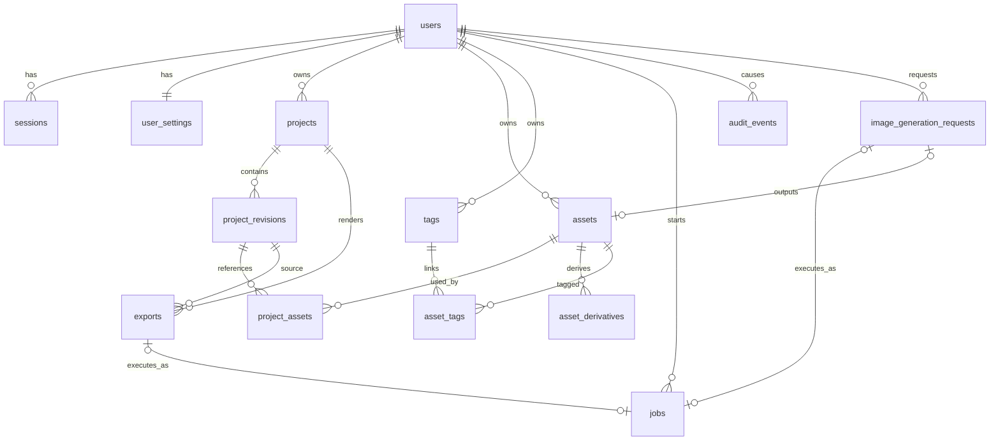

# PostgreSQLテーブル設計書

## 1. 文書情報

| 項目 | 内容 |
| --- | --- |
| 文書状態 | 初版・MVP設計 |
| DBMS | PostgreSQL |
| ORM | SQLAlchemy 2.x形式 |
| マイグレーション | Alembic |
| ID | UUID |
| 日時 | `timestamptz`、UTC保存 |

関連文書:

- [システム設計書](design.md)
- [フォルダ構成設計](folder-structure.md)
- [コーディング規約・品質基準](coding-standards.md)

## 2. 設計方針

### 2.1 ユーザー分離

- ユーザー所有データには`user_id`を持たせる。
- Repositoryの所有データ検索では、主キーだけでなく`user_id`を必ず条件へ含める。
- クライアントから送られた`user_id`を認可判断に使用しない。
- 子テーブルにも検索・監査用の`user_id`を持たせる場合、親レコードと一致することをServiceで検証する。
- 主要インデックスは`user_id`を先頭にする。
- 将来のシステム素材だけは`user_id=NULL`を許可し、`scope=system`と組み合わせる。

MVPではアプリケーション層の認可を必須とする。PostgreSQL Row Level Securityは、接続プール、ワーカー、管理処理を含む運用方式を決定したうえで、公開前の追加防御として検討する。

### 2.2 IDと日時

- UUIDはアプリケーション側で生成する。
- 外部へ連番IDを公開しない。
- `created_at`と`updated_at`は`NOT NULL`とする。
- 日時はUTCで保存し、表示時にUIロケール・タイムゾーンへ変換する。
- 更新日時はServiceまたはSQLAlchemyイベントで一貫して更新する。

### 2.3 状態値

- 状態値は`varchar`と`CHECK`制約で管理する。
- PostgreSQL ENUMは、値追加・削除を伴うmigrationの運用負荷を避けるためMVPでは使用しない。
- Python側ではEnum型を使用し、DB制約と同じ値を定義する。

### 2.4 JSONB

JSONBは次へ限定する。

- プロジェクト本文
- 外部APIの可変メタデータ
- レンダリング設定
- ジョブ入出力の補助情報
- 監査イベントの非機密メタデータ

検索、外部キー、ユニーク制約、状態遷移に使う値は通常カラムとして持つ。JSONBへ秘密情報、パスワード、セッショントークン、APIキーを保存しない。

### 2.5 論理削除

ユーザーが操作する主要データは、オブジェクトストレージとの整合性を保つため、すぐに物理削除しない。

- `projects`、`assets`、`exports`は`deleted_at`を持つ。
- 通常検索は`deleted_at IS NULL`を条件にする。
- 削除操作は論理削除後、クリーンアップジョブがストレージを削除する。
- ストレージ削除と参照確認が成功したあとに物理削除できる。
- セッションや期限切れトークンは定期ジョブで物理削除する。

## 3. 命名規則

### 3.1 テーブル・カラム

- テーブル名は複数形の`snake_case`。
- カラム名は`snake_case`。
- 主キーは`id`。
- 外部キーは`<単数エンティティ>_id`。
- 日時は`*_at`。
- 真偽値は`is_*`または`has_*`。
- ミリ秒は`*_ms`、バイト数は`*_bytes`。

### 3.2 制約・インデックス

SQLAlchemy metadataへ次のnaming conventionを設定する。

| 種別 | 形式 |
| --- | --- |
| Primary Key | `pk_<table>` |
| Foreign Key | `fk_<table>_<column>_<referred_table>` |
| Unique | `uq_<table>_<columns>` |
| Check | `ck_<table>_<purpose>` |
| Index | `ix_<table>_<columns>` |

名前が長すぎる場合も、migrationごとに任意名へ変えず、短い意味名を明示する。

## 4. テーブル一覧

### 4.1 MVP

| テーブル | 用途 |
| --- | --- |
| `users` | アカウント、パスワード、UIロケール |
| `sessions` | ログインセッション |
| `user_settings` | 動画・テロップのユーザー既定値 |
| `projects` | プロジェクトの検索・状態・最新リビジョン |
| `project_revisions` | プロジェクト本文JSONBの版管理 |
| `assets` | 画像・動画・音声の元素材 |
| `tags` | ユーザー専用タグ |
| `asset_tags` | 素材とタグの中間テーブル |
| `asset_derivatives` | サムネイル、プロキシ、波形など |
| `project_assets` | リビジョン内の素材参照インデックス |
| `image_generation_requests` | OpenAI画像生成の業務履歴 |
| `exports` | 完成動画と書き出し履歴 |
| `jobs` | 非同期処理の実行状態 |
| `audit_events` | 認証・削除・権限操作などの監査履歴 |

### 4.2 将来追加

| テーブル | 用途 |
| --- | --- |
| `email_action_tokens` | メール確認・パスワード再設定の一度限りトークン |
| `system_asset_translations` | システム素材名・説明の`ja`/`en`翻訳 |
| `usage_ledger` | 画像生成・レンダリング・容量の利用量記録 |
| `plans` / `subscriptions` | 課金プラン |

## 5. ER図



## 6. 認証・ユーザー

### 6.1 `users`

| カラム | 型 | NULL | 既定値 | 説明 |
| --- | --- | --- | --- | --- |
| `id` | `uuid` | NO | アプリ生成 | 主キー |
| `email` | `varchar(320)` | NO |  | 表示・連絡用メールアドレス |
| `email_normalized` | `varchar(320)` | NO |  | ログイン比較用正規化値 |
| `password_hash` | `varchar(255)` | NO |  | Argon2idハッシュ |
| `preferred_locale` | `varchar(10)` | NO | `'ja'` | UIロケール |
| `role` | `varchar(20)` | NO | `'user'` | `user`、将来の`admin` |
| `status` | `varchar(30)` | NO | `'active'` | `active`、`disabled`、将来の`pending_verification` |
| `email_verified_at` | `timestamptz` | YES |  | MVPではNULL可 |
| `last_login_at` | `timestamptz` | YES |  | 最終ログイン成功日時 |
| `created_at` | `timestamptz` | NO | `now()` | 作成日時 |
| `updated_at` | `timestamptz` | NO | `now()` | 更新日時 |

制約:

- PK: `id`
- UNIQUE: `email_normalized`
- CHECK: `preferred_locale IN ('ja', 'en')`
- CHECK: `role IN ('user', 'admin')`
- CHECK: `status IN ('active', 'disabled', 'pending_verification')`

インデックス:

- `uq_users_email_normalized`
- `ix_users_status_created_at(status, created_at)`：運営用

備考:

- MVPでは登録直後に`status=active`とする。
- メールアドレス変更は、将来、確認トークンと再認証を伴う専用ユースケースにする。
- `email_normalized`の生成規則をコードとテストで固定し、ログイン時と登録時で共通利用する。

### 6.2 `sessions`

| カラム | 型 | NULL | 既定値 | 説明 |
| --- | --- | --- | --- | --- |
| `id` | `uuid` | NO | アプリ生成 | 主キー、内部識別子 |
| `user_id` | `uuid` | NO |  | `users.id` |
| `token_hash` | `char(64)` | NO |  | Cookieの生トークンをSHA-256化した値 |
| `csrf_token_hash` | `char(64)` | YES |  | CSRFトークンを保存する方式の場合に使用 |
| `user_agent` | `varchar(512)` | YES |  | 端末表示・監査用、長さ制限あり |
| `ip_hash` | `char(64)` | YES |  | 必要な場合だけ保存するIPのHMAC等 |
| `expires_at` | `timestamptz` | NO |  | 有効期限 |
| `last_seen_at` | `timestamptz` | NO | `now()` | 最終利用日時 |
| `revoked_at` | `timestamptz` | YES |  | 失効日時 |
| `created_at` | `timestamptz` | NO | `now()` | 作成日時 |

制約:

- FK: `user_id -> users.id ON DELETE CASCADE`
- UNIQUE: `token_hash`

インデックス:

- `ix_sessions_user_id_expires_at(user_id, expires_at)`
- `ix_sessions_expires_at(expires_at)`：期限切れ削除用
- 有効セッション検索用の部分インデックスを必要に応じて追加する。

備考:

- 生のセッショントークンはDB・ログへ保存しない。
- `last_seen_at`を毎リクエスト更新せず、一定間隔で更新して書き込み負荷を抑える。

### 6.3 `user_settings`

| カラム | 型 | NULL | 既定値 | 説明 |
| --- | --- | --- | --- | --- |
| `user_id` | `uuid` | NO |  | PK兼`users.id` |
| `default_content_locale` | `varchar(10)` | NO | `'ja'` | 新規プロジェクト本文言語 |
| `default_video_width` | `integer` | NO | `1920` | 既定幅 |
| `default_video_height` | `integer` | NO | `1080` | 既定高さ |
| `default_video_fps` | `numeric(6,3)` | NO | `30` | 既定FPS |
| `default_caption_settings` | `jsonb` | NO | `'{}'` | テロップ既定値 |
| `created_at` | `timestamptz` | NO | `now()` | 作成日時 |
| `updated_at` | `timestamptz` | NO | `now()` | 更新日時 |

制約:

- PK: `user_id`
- FK: `user_id -> users.id ON DELETE CASCADE`
- CHECK: `default_content_locale IN ('ja', 'en')`
- CHECK: 幅・高さ・FPSが正数

## 7. プロジェクト

### 7.1 `projects`

プロジェクト一覧と更新競合制御に必要な値を保持する。編集本文は`project_revisions`へ保存する。

| カラム | 型 | NULL | 既定値 | 説明 |
| --- | --- | --- | --- | --- |
| `id` | `uuid` | NO | アプリ生成 | 主キー |
| `user_id` | `uuid` | NO |  | 所有ユーザー |
| `name` | `varchar(200)` | NO |  | プロジェクト名 |
| `description` | `text` | YES |  | 説明 |
| `status` | `varchar(30)` | NO | `'draft'` | `draft`、`editing`、`rendered`、`archived` |
| `content_locale` | `varchar(10)` | NO | `'ja'` | 台本・レイアウト言語 |
| `current_revision_number` | `integer` | NO | `0` | 最新確定リビジョン番号 |
| `lock_version` | `integer` | NO | `0` | 楽観ロック用 |
| `estimated_duration_ms` | `bigint` | YES |  | 一覧表示用の推定動画時間 |
| `scene_count` | `integer` | NO | `0` | 一覧表示用の派生値 |
| `thumbnail_asset_id` | `uuid` | YES |  | 代表サムネイル素材 |
| `last_exported_at` | `timestamptz` | YES |  | 最終書き出し成功日時 |
| `created_at` | `timestamptz` | NO | `now()` | 作成日時 |
| `updated_at` | `timestamptz` | NO | `now()` | 更新日時 |
| `deleted_at` | `timestamptz` | YES |  | 論理削除日時 |

制約:

- FK: `user_id -> users.id ON DELETE RESTRICT`
- FK: `thumbnail_asset_id -> assets.id ON DELETE SET NULL`。migration順に注意する。
- CHECK: `status IN ('draft', 'editing', 'rendered', 'archived')`
- CHECK: `content_locale IN ('ja', 'en')`
- CHECK: revision、lock version、時間、scene countが0以上

インデックス:

- `ix_projects_user_id_updated_at(user_id, updated_at DESC)` WHERE `deleted_at IS NULL`
- `ix_projects_user_id_status(user_id, status)` WHERE `deleted_at IS NULL`
- `ix_projects_user_id_name(user_id, name)`。将来全文検索へ変更可能。
- `uq_projects_id_user_id(id, user_id)`：子テーブルの複合参照に利用可能。

### 7.2 `project_revisions`

| カラム | 型 | NULL | 既定値 | 説明 |
| --- | --- | --- | --- | --- |
| `id` | `uuid` | NO | アプリ生成 | 主キー |
| `project_id` | `uuid` | NO |  | 対象プロジェクト |
| `user_id` | `uuid` | NO |  | 所有者検索・防御用 |
| `revision_number` | `integer` | NO |  | プロジェクト内連番 |
| `schema_version` | `integer` | NO |  | Project Document Schema版 |
| `document` | `jsonb` | NO |  | シーン、レイヤー、台本 |
| `document_sha256` | `char(64)` | NO |  | 内容同一性・キャッシュ判定 |
| `change_summary` | `varchar(500)` | YES |  | 保存理由・自動保存等 |
| `created_at` | `timestamptz` | NO | `now()` | 作成日時 |

制約:

- FK: `(project_id, user_id) -> projects(id, user_id) ON DELETE CASCADE`
- UNIQUE: `(project_id, revision_number)`
- UNIQUE: `(id, project_id, user_id)`：子テーブルの所有者整合性FKに利用する。
- CHECK: `revision_number > 0`、`schema_version > 0`

インデックス:

- `uq_project_revisions_project_id_revision_number`
- `ix_project_revisions_user_id_project_id_created_at(user_id, project_id, created_at DESC)`
- `document`のGINインデックスはMVPでは作成しない。実際の検索要件が生じてから追加する。

保存手順:

1. `projects.lock_version`を条件に更新権を確認する。
2. 新しい`project_revisions`をINSERTする。
3. `projects.current_revision_number`と派生値を更新する。
4. `project_assets`を同じトランザクションで再構築する。
5. `projects.lock_version`を加算してcommitする。

## 8. 素材

### 8.1 `assets`

| カラム | 型 | NULL | 既定値 | 説明 |
| --- | --- | --- | --- | --- |
| `id` | `uuid` | NO | アプリ生成 | 主キー |
| `user_id` | `uuid` | YES |  | private素材の所有者。system素材はNULL |
| `scope` | `varchar(20)` | NO | `'private'` | `private`、将来の`system` |
| `kind` | `varchar(20)` | NO |  | `image`、`video`、`audio` |
| `source` | `varchar(20)` | NO |  | `upload`、`generated`、将来の`system` |
| `status` | `varchar(30)` | NO | `'pending'` | `pending`、`processing`、`ready`、`failed` |
| `name` | `varchar(255)` | NO |  | 表示名 |
| `original_filename` | `varchar(255)` | YES |  | アップロード時の名前、パスには不使用 |
| `storage_key` | `varchar(1024)` | YES |  | S3オブジェクトキー。ready時必須 |
| `mime_type` | `varchar(100)` | YES |  | 検証後のMIME |
| `size_bytes` | `bigint` | YES |  | ファイルサイズ |
| `sha256` | `char(64)` | YES |  | ファイルハッシュ |
| `width` | `integer` | YES |  | 画像・動画幅 |
| `height` | `integer` | YES |  | 画像・動画高さ |
| `duration_ms` | `bigint` | YES |  | 動画・音声長 |
| `metadata` | `jsonb` | NO | `'{}'` | コーデック等の可変情報 |
| `created_at` | `timestamptz` | NO | `now()` | 作成日時 |
| `updated_at` | `timestamptz` | NO | `now()` | 更新日時 |
| `deleted_at` | `timestamptz` | YES |  | 論理削除日時 |

制約:

- FK: `user_id -> users.id ON DELETE RESTRICT`
- UNIQUE: `storage_key`。NULLは複数可。
- CHECK: `(scope='private' AND user_id IS NOT NULL) OR (scope='system' AND user_id IS NULL)`
- CHECK: `kind IN ('image', 'video', 'audio')`
- CHECK: `source IN ('upload', 'generated', 'system')`
- CHECK: `status IN ('pending', 'processing', 'ready', 'failed')`
- CHECK: サイズ・解像度・時間がNULLまたは0以上

インデックス:

- `ix_assets_user_id_created_at(user_id, created_at DESC)` WHERE `deleted_at IS NULL`
- `ix_assets_user_id_kind_created_at(user_id, kind, created_at DESC)` WHERE `deleted_at IS NULL`
- `ix_assets_user_id_status(user_id, status)` WHERE `deleted_at IS NULL`
- `ix_assets_user_id_sha256(user_id, sha256)`：重複候補検索。UNIQUEにはしない。
- `ix_assets_scope_created_at(scope, created_at DESC)`：将来のsystem素材用。

### 8.2 `tags`

| カラム | 型 | NULL | 既定値 | 説明 |
| --- | --- | --- | --- | --- |
| `id` | `uuid` | NO | アプリ生成 | 主キー |
| `user_id` | `uuid` | NO |  | 所有ユーザー |
| `name` | `varchar(100)` | NO |  | 表示名 |
| `name_normalized` | `varchar(100)` | NO |  | 重複判定用 |
| `color` | `varchar(20)` | YES |  | UI表示色 |
| `created_at` | `timestamptz` | NO | `now()` | 作成日時 |
| `updated_at` | `timestamptz` | NO | `now()` | 更新日時 |

制約・インデックス:

- FK: `user_id -> users.id ON DELETE CASCADE`
- UNIQUE: `(user_id, name_normalized)`
- INDEX: `(user_id, name)`

### 8.3 `asset_tags`

| カラム | 型 | NULL | 既定値 | 説明 |
| --- | --- | --- | --- | --- |
| `asset_id` | `uuid` | NO |  | 素材 |
| `tag_id` | `uuid` | NO |  | タグ |
| `user_id` | `uuid` | NO |  | 所有者検索・防御用 |
| `created_at` | `timestamptz` | NO | `now()` | 付与日時 |

制約:

- PK: `(asset_id, tag_id)`
- FK: `asset_id -> assets.id ON DELETE CASCADE`
- FK: `tag_id -> tags.id ON DELETE CASCADE`
- FK: `user_id -> users.id ON DELETE CASCADE`
- Serviceでasset、tag、userの所有者一致を検証する。

インデックス:

- `ix_asset_tags_user_id_tag_id(user_id, tag_id)`

### 8.4 `asset_derivatives`

| カラム | 型 | NULL | 既定値 | 説明 |
| --- | --- | --- | --- | --- |
| `id` | `uuid` | NO | アプリ生成 | 主キー |
| `asset_id` | `uuid` | NO |  | 元素材 |
| `user_id` | `uuid` | YES |  | private素材の所有者 |
| `kind` | `varchar(30)` | NO |  | `thumbnail`、`proxy`、`waveform` |
| `status` | `varchar(30)` | NO | `'pending'` | `pending`、`processing`、`ready`、`failed` |
| `parameters_hash` | `char(64)` | NO |  | サイズ等の生成条件ハッシュ |
| `storage_key` | `varchar(1024)` | YES |  | 生成物のオブジェクトキー |
| `mime_type` | `varchar(100)` | YES |  | MIME |
| `size_bytes` | `bigint` | YES |  | サイズ |
| `width` | `integer` | YES |  | 幅 |
| `height` | `integer` | YES |  | 高さ |
| `duration_ms` | `bigint` | YES |  | 長さ |
| `error_code` | `varchar(100)` | YES |  | 失敗コード |
| `created_at` | `timestamptz` | NO | `now()` | 作成日時 |
| `updated_at` | `timestamptz` | NO | `now()` | 更新日時 |

制約・インデックス:

- FK: `asset_id -> assets.id ON DELETE CASCADE`
- UNIQUE: `(asset_id, kind, parameters_hash)`
- UNIQUE: `storage_key`
- INDEX: `(user_id, status)`

### 8.5 `project_assets`

Project Document JSON内の素材参照を展開した、再構築可能なインデックステーブルである。素材削除判定、使用プロジェクト表示、アクセス検証に利用する。

| カラム | 型 | NULL | 既定値 | 説明 |
| --- | --- | --- | --- | --- |
| `id` | `uuid` | NO | アプリ生成 | 主キー |
| `user_id` | `uuid` | NO |  | プロジェクト所有者 |
| `project_id` | `uuid` | NO |  | プロジェクト |
| `project_revision_id` | `uuid` | NO |  | 参照元revision |
| `asset_id` | `uuid` | NO |  | 使用素材 |
| `role` | `varchar(30)` | NO |  | `background`、`layer`、`narration`、`bgm`、`effect`等 |
| `reference_path` | `varchar(500)` | NO |  | Project JSON内のJSON Pointer等 |
| `created_at` | `timestamptz` | NO | `now()` | 作成日時 |

制約:

- FK: `(project_id, user_id) -> projects(id, user_id) ON DELETE CASCADE`
- FK: `(project_revision_id, project_id, user_id) -> project_revisions(id, project_id, user_id) ON DELETE CASCADE`
- FK: `asset_id -> assets.id ON DELETE RESTRICT`
- UNIQUE: `(project_revision_id, reference_path)`

インデックス:

- `ix_project_assets_user_id_project_id(user_id, project_id)`
- `ix_project_assets_asset_id(asset_id)`：素材使用先検索
- `ix_project_assets_project_revision_id(project_revision_id)`

Serviceは、参照素材について次を検証する。

- `scope=private`の場合は`assets.user_id = project_assets.user_id`
- `scope=system`の場合は`assets.user_id IS NULL`
- 論理削除済み素材を新しいrevisionへ追加しない

## 9. 画像生成

### 9.1 `image_generation_requests`

画像生成のユーザー操作・設定・結果を保持する。ワーカー再試行などの実行状態は`jobs`へ分離する。

| カラム | 型 | NULL | 既定値 | 説明 |
| --- | --- | --- | --- | --- |
| `id` | `uuid` | NO | アプリ生成 | 主キー |
| `user_id` | `uuid` | NO |  | 所有ユーザー |
| `job_id` | `uuid` | YES |  | 実行ジョブ |
| `parent_asset_id` | `uuid` | YES |  | Image Edit APIへ渡した編集元Asset。通常生成ではNULL |
| `output_asset_id` | `uuid` | YES |  | 成功時の生成素材 |
| `status` | `varchar(30)` | NO | `'queued'` | `queued`、`running`、`succeeded`、`failed`、`cancelled` |
| `model` | `varchar(100)` | NO |  | 例: `gpt-image-2` |
| `prompt` | `text` | NO |  | 利用者のプロンプト |
| `width` | `integer` | NO |  | 出力幅 |
| `height` | `integer` | NO |  | 出力高さ |
| `quality` | `varchar(20)` | NO |  | `low`、`medium`、`high`、`auto` |
| `output_format` | `varchar(20)` | NO |  | `png`、`jpeg`、`webp` |
| `provider_request_id` | `varchar(255)` | YES |  | OpenAIリクエストID |
| `usage` | `jsonb` | NO | `'{}'` | トークン等。秘密情報を含めない |
| `error_code` | `varchar(100)` | YES |  | 安定した内部エラーコード |
| `error_details` | `jsonb` | NO | `'{}'` | 非機密の運営用詳細 |
| `started_at` | `timestamptz` | YES |  | 開始日時 |
| `completed_at` | `timestamptz` | YES |  | 完了日時 |
| `created_at` | `timestamptz` | NO | `now()` | 作成日時 |
| `updated_at` | `timestamptz` | NO | `now()` | 更新日時 |

制約・インデックス:

- FK: `user_id -> users.id ON DELETE RESTRICT`
- FK: `job_id -> jobs.id ON DELETE SET NULL`。migration順に注意する。
- FK: `parent_asset_id -> assets.id ON DELETE SET NULL`
- FK: `output_asset_id -> assets.id ON DELETE SET NULL`
- UNIQUE: `job_id`。NULLは複数可。
- CHECK: status、quality、output_formatが許可値
- CHECK: 幅・高さが正数
- INDEX: `(user_id, created_at DESC)`
- INDEX: `(user_id, status, created_at)`

プロンプトはユーザーが履歴として再利用するため保存するが、通常ログと監査イベントのmetadataへ複製しない。

## 10. 書き出し

### 10.1 `exports`

| カラム | 型 | NULL | 既定値 | 説明 |
| --- | --- | --- | --- | --- |
| `id` | `uuid` | NO | アプリ生成 | 主キー |
| `user_id` | `uuid` | NO |  | 所有ユーザー |
| `project_id` | `uuid` | NO |  | 元プロジェクト |
| `project_revision_id` | `uuid` | NO |  | 固定した元revision |
| `job_id` | `uuid` | YES |  | レンダリングジョブ |
| `version_number` | `integer` | NO |  | プロジェクト内の書き出し番号 |
| `status` | `varchar(30)` | NO | `'queued'` | `queued`、`rendering`、`succeeded`、`failed`、`cancelled` |
| `progress_percent` | `smallint` | NO | `0` | 0～100 |
| `width` | `integer` | NO |  | 出力幅 |
| `height` | `integer` | NO |  | 出力高さ |
| `fps` | `numeric(6,3)` | NO |  | FPS |
| `video_codec` | `varchar(50)` | NO |  | 例: `h264` |
| `audio_codec` | `varchar(50)` | YES |  | 例: `aac` |
| `container` | `varchar(20)` | NO |  | `mp4`等 |
| `render_settings` | `jsonb` | NO | `'{}'` | 詳細な固定設定 |
| `storage_key` | `varchar(1024)` | YES |  | 成功時のMP4キー |
| `mime_type` | `varchar(100)` | YES |  | 通常`video/mp4` |
| `size_bytes` | `bigint` | YES |  | 完成ファイルサイズ |
| `duration_ms` | `bigint` | YES |  | 完成動画長 |
| `error_code` | `varchar(100)` | YES |  | 失敗コード |
| `error_details` | `jsonb` | NO | `'{}'` | 非機密の運営用詳細 |
| `started_at` | `timestamptz` | YES |  | 開始日時 |
| `completed_at` | `timestamptz` | YES |  | 完了日時 |
| `created_at` | `timestamptz` | NO | `now()` | 作成日時 |
| `updated_at` | `timestamptz` | NO | `now()` | 更新日時 |
| `deleted_at` | `timestamptz` | YES |  | 論理削除日時 |

制約:

- FK: `user_id -> users.id ON DELETE RESTRICT`
- FK: `(project_id, user_id) -> projects(id, user_id) ON DELETE RESTRICT`
- FK: `(project_revision_id, project_id, user_id) -> project_revisions(id, project_id, user_id) ON DELETE RESTRICT`
- FK: `job_id -> jobs.id ON DELETE SET NULL`
- UNIQUE: `(project_id, version_number)`
- UNIQUE: `job_id`、`storage_key`。NULLは複数可。
- CHECK: progressが0～100、version・寸法・FPSが正数

インデックス:

- `ix_exports_user_id_created_at(user_id, created_at DESC)` WHERE `deleted_at IS NULL`
- `ix_exports_user_id_status(user_id, status)` WHERE `deleted_at IS NULL`
- `ix_exports_project_id_version_number(project_id, version_number DESC)`

書き出し開始時に対象`project_revision_id`を固定し、編集中の最新内容が変わってもレンダリング結果の再現元が変わらないようにする。

## 11. 非同期ジョブ

### 11.1 `jobs`

PostgreSQLをジョブ状態の正とし、Redisは配送・待機キューとして使用する。

| カラム | 型 | NULL | 既定値 | 説明 |
| --- | --- | --- | --- | --- |
| `id` | `uuid` | NO | アプリ生成 | 主キー |
| `user_id` | `uuid` | NO |  | 実行ユーザー |
| `type` | `varchar(50)` | NO |  | `render`、`image_generation`、`media_probe`等 |
| `status` | `varchar(30)` | NO | `'queued'` | `queued`、`running`、`retry_wait`、`succeeded`、`failed`、`cancelled` |
| `priority` | `smallint` | NO | `0` | 優先度 |
| `progress_percent` | `smallint` | NO | `0` | 0～100 |
| `attempt_count` | `smallint` | NO | `0` | 試行回数 |
| `max_attempts` | `smallint` | NO | `3` | 最大試行回数 |
| `idempotency_key` | `varchar(255)` | YES |  | 重複要求防止キー |
| `payload` | `jsonb` | NO | `'{}'` | 非機密の入力参照・設定 |
| `result` | `jsonb` | NO | `'{}'` | 非機密の結果概要 |
| `error_code` | `varchar(100)` | YES |  | 最終エラーコード |
| `available_at` | `timestamptz` | NO | `now()` | 実行可能日時 |
| `started_at` | `timestamptz` | YES |  | 最初の開始日時 |
| `heartbeat_at` | `timestamptz` | YES |  | ワーカー生存確認 |
| `finished_at` | `timestamptz` | YES |  | 終了日時 |
| `worker_id` | `varchar(255)` | YES |  | 実行ワーカー識別子 |
| `created_at` | `timestamptz` | NO | `now()` | 作成日時 |
| `updated_at` | `timestamptz` | NO | `now()` | 更新日時 |

制約:

- FK: `user_id -> users.id ON DELETE RESTRICT`
- 部分UNIQUE INDEX: `(user_id, idempotency_key) WHERE idempotency_key IS NOT NULL`
- CHECK: status、progress、attempt、max attemptsが妥当
- `payload`と`result`へAPIキー、署名付きURL、生セッショントークンを保存しない。

インデックス:

- `ix_jobs_status_available_at_priority(status, available_at, priority DESC)`
- `ix_jobs_user_id_created_at(user_id, created_at DESC)`
- `ix_jobs_user_id_status(user_id, status)`
- `ix_jobs_heartbeat_at(heartbeat_at)` WHERE `status='running'`

状態遷移:

```text
queued -> running -> succeeded
                  -> failed
                  -> cancelled
        -> retry_wait -> queued
```

ワーカーは更新時に現在statusをWHERE条件へ含め、二重実行による不正な状態上書きを防ぐ。

## 12. 監査

### 12.1 `audit_events`

| カラム | 型 | NULL | 既定値 | 説明 |
| --- | --- | --- | --- | --- |
| `id` | `uuid` | NO | アプリ生成 | 主キー |
| `user_id` | `uuid` | YES |  | 未認証イベントはNULL可 |
| `action` | `varchar(100)` | NO |  | `auth.login_succeeded`等 |
| `target_type` | `varchar(50)` | YES |  | `project`、`asset`等 |
| `target_id` | `uuid` | YES |  | 対象ID。FKは設定しない |
| `request_id` | `varchar(100)` | YES |  | リクエスト追跡ID |
| `ip_hash` | `char(64)` | YES |  | 必要な場合だけ保存 |
| `metadata` | `jsonb` | NO | `'{}'` | 非機密の追加情報 |
| `created_at` | `timestamptz` | NO | `now()` | 発生日時 |

制約・インデックス:

- FK: `user_id -> users.id ON DELETE SET NULL`
- INDEX: `(user_id, created_at DESC)`
- INDEX: `(action, created_at DESC)`
- INDEX: `(target_type, target_id, created_at DESC)`

監査イベントは原則としてUPDATEしない。パスワード、セッション、APIキー、署名付きURL、画像生成プロンプト全文をmetadataへ保存しない。保持期間と閲覧権限は運用設計で定める。

## 13. 将来テーブル

### 13.1 `email_action_tokens`

メール確認とパスワード再設定で共通利用する。MVPでは作成しない。

主なカラム:

- `id uuid`
- `user_id uuid`
- `type varchar(30)`：`verify_email`、`reset_password`
- `token_hash char(64)`：生トークンは保存しない
- `expires_at timestamptz`
- `used_at timestamptz`
- `created_at timestamptz`

`token_hash`はUNIQUE、一度使用したトークンは再使用不可とする。

### 13.2 `system_asset_translations`

システム素材を実装する際に追加する。

主なカラム:

- `asset_id uuid`
- `locale varchar(10)`：`ja`、`en`
- `name varchar(255)`
- `description text`

PKは`(asset_id, locale)`とする。

## 14. 削除方針

| 親 | 子 | 方針 |
| --- | --- | --- |
| `users` | `sessions`、`user_settings` | `CASCADE` |
| `users` | `projects`、`assets`、`exports` | 即時物理削除せずServiceで論理削除・クリーンアップ |
| `projects` | `project_revisions` | 物理削除時`CASCADE` |
| `project_revisions` | `project_assets` | `CASCADE` |
| `assets` | `asset_derivatives`、`asset_tags` | 物理削除時`CASCADE` |
| `assets` | `project_assets` | `RESTRICT` |
| `projects` / `project_revisions` | `exports` | `RESTRICT`。先にexportを削除 |
| `jobs` | 生成・書き出し履歴 | `SET NULL` |

DBトランザクションとS3削除は原子的に実行できないため、次の順序を採用する。

1. DBで`deleted_at`を設定する。
2. クリーンアップジョブを登録する。
3. ストレージオブジェクトを削除する。
4. 成功記録を残す。
5. 保持期間経過後にDBを物理削除する。

過去の`project_revisions`または`exports`が素材を参照している間は、素材をライブラリ一覧から論理削除しても物理削除しない。履歴の再現性を維持し、参照がなくなった段階でクリーンアップ対象にする。

## 15. インデックス方針

- 実際の一覧・検索APIのWHEREとORDER BYに合わせる。
- ユーザー所有テーブルでは`user_id`を先頭にする。
- 論理削除テーブルは`deleted_at IS NULL`の部分インデックスを優先する。
- FKカラムには、削除・結合で必要なインデックスを明示する。
- 低カーディナリティのstatus単独インデックスを乱立させない。
- JSONBへ無条件にGINインデックスを作らない。
- `EXPLAIN (ANALYZE, BUFFERS)`と実データ量を確認して追加・削除する。
- 未使用インデックスも書き込みコストになるため定期的に確認する。

## 16. トランザクション境界

Service / Unit of Work単位でcommitする。

主なトランザクション:

- ユーザー登録: `users` + `user_settings`
- プロジェクト保存: `project_revisions` + `projects`更新 + `project_assets`再構築
- 画像生成要求: `jobs` + `image_generation_requests`
- 書き出し要求: `jobs` + `exports`
- 素材登録確定: `assets`更新 + `asset_derivatives`ジョブ登録
- 論理削除: 対象の`deleted_at`更新 + クリーンアップ`jobs`

Repositoryはcommitせず、Serviceが成功時commit、例外時rollbackする。外部APIや長時間のFFmpeg処理をDBトランザクション内で実行しない。

## 17. Alembic migration順序

初期migrationは循環参照を避けて分割する。

1. naming convention、共通設定
2. `users`
3. `sessions`、`user_settings`
4. `projects`。`thumbnail_asset_id`はまだ付けない。
5. `project_revisions`
6. `assets`
7. `projects.thumbnail_asset_id`のFK追加
8. `tags`、`asset_tags`、`asset_derivatives`、`project_assets`
9. `jobs`
10. `image_generation_requests`、`exports`
11. `audit_events`
12. インデックス・部分インデックスの確認

初期実装では1つまたは少数のrevisionへまとめてもよいが、FK依存順は維持する。

CIで次を確認する。

- 空DBへ`alembic upgrade head`できる。
- 1つ前のrevisionからheadへ更新できる。
- ORM metadataとの意図しない差分がない。
- 主要CHECK、UNIQUE、FKが実DBで機能する。
- downgradeを提供するmigrationは往復できる。

## 18. SQLAlchemy実装規則

- `Mapped[...]`と`mapped_column()`を使用する。
- `Base`、Timestamp mixin、必要なSoftDelete mixinを`db/`で定義する。
- すべてのテーブルへ無条件にSoftDelete mixinを付けない。
- Relationshipは便利さだけで大量のeager loadを設定しない。
- N+1が発生する一覧APIでは、明示的なload strategyをService・Repositoryで選ぶ。
- APIへORMモデルを直接返さない。
- `AsyncSession`を並行タスク間で共有しない。
- Repository検索はSQLAlchemy 2.x形式の`select()`を使用する。
- DB既定値とPython既定値の責務を明確にする。
- 金額を将来保存する場合は浮動小数点ではなく`numeric`を使用する。

## 19. 未決事項

- SQLAlchemyを同期SessionとAsyncSessionのどちらで統一するか
- ジョブキュー製品とRedis側の再配送仕様
- PostgreSQL Row Level SecurityをMVPまたは公開前のどちらで導入するか
- アカウント削除時の保持期間
- 監査ログの保持期間と運営者閲覧権限
- プロジェクトrevisionの保持数・自動間引き
- 全文検索をPostgreSQLで行うか外部検索へ分離するか
- 利用量・課金テーブルの詳細
