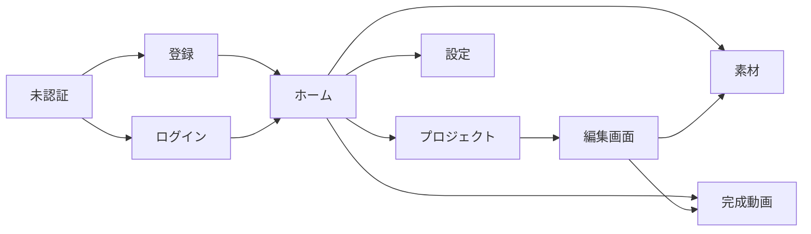

# 機能設計書

## 1. 文書情報

| 項目 | 内容 |
| --- | --- |
| 文書状態 | 初版・MVP設計 |
| 対象 | Webアプリ |
| フロントエンド | React / TypeScript |
| バックエンド | FastAPI / SQLAlchemy |
| 動画処理 | 共通Scene Renderer / FFmpeg |

関連文書:

- [システム設計書](design.md)
- [PostgreSQLテーブル設計書](database-design.md)
- [フォルダ構成設計](folder-structure.md)
- [コーディング規約・品質基準](coding-standards.md)

## 2. 目的・対象範囲

本書は、台本駆動型スライド動画制作ツールの機能、画面、操作、権限、状態遷移、エラー時の振る舞いを定義する。

MVPでは次を達成する。

1. メールアドレスとパスワードでユーザー登録・ログインできる。
2. ユーザーごとにプロジェクト、素材、生成画像、完成動画を分離する。
3. 画像を背景としたシーンを作成できる。
4. 長い台本からテロップを自動改行・自動ページ分割できる。
5. ノベルゲームのようにテロップを順番に自動送りできる。
6. OpenAI APIで画像を生成し、素材として利用できる。
7. 非同期ジョブでMP4を書き出し、履歴を管理できる。
8. UIを日本語・英語で切り替えられる。既定は日本語とする。

## 3. アクター

| アクター | 説明 | MVP |
| --- | --- | --- |
| 未認証ユーザー | 登録、ログイン、言語切り替えを行う | 対象 |
| 認証済みユーザー | 自分のプロジェクト、素材、動画を操作する | 対象 |
| バックグラウンドワーカー | 画像生成、素材解析、レンダリングを行う | 対象 |
| 運営者・管理者 | システム素材、ユーザー管理、障害対応を行う | 将来 |

認証済みユーザーは、他ユーザーのデータを参照・変更できない。IDを直接指定した場合も同様とする。

## 4. 機能一覧

| 機能ID | 機能 | MVP |
| --- | --- | --- |
| `AUTH-001` | ユーザー登録 | 対象 |
| `AUTH-002` | ログイン | 対象 |
| `AUTH-003` | ログアウト・セッション失効 | 対象 |
| `USER-001` | アカウント・既定値設定 | 対象 |
| `I18N-001` | UI言語切り替え | 対象 |
| `PRJ-001` | プロジェクト一覧 | 対象 |
| `PRJ-002` | プロジェクト作成 | 対象 |
| `PRJ-003` | プロジェクト保存・読込 | 対象 |
| `PRJ-004` | 複製・名称変更・削除 | 対象 |
| `SCN-001` | シーン追加・編集・並べ替え | 対象 |
| `LYR-001` | 画像・自由テキスト・図形レイヤー | 対象 |
| `DLG-001` | 台本入力・ダイアログ管理 | 対象 |
| `CAP-001` | テロップ枠・スタイル設定 | 対象 |
| `CAP-002` | 自動改行・ページ分割 | 対象 |
| `CAP-003` | 表示時間・自動送り | 対象 |
| `CAP-004` | 表示効果 | 対象 |
| `AST-001` | 素材アップロード | 対象 |
| `AST-002` | 素材一覧・検索・タグ | 対象 |
| `AST-003` | 素材削除・参照確認 | 対象 |
| `IMG-001` | OpenAI画像生成 | 対象 |
| `IMG-002` | 生成履歴・再利用 | 対象 |
| `AUD-001` | ナレーション・BGM・効果音 | 対象 |
| `PRV-001` | プレビュー再生 | 対象 |
| `EXP-001` | 動画書き出し | 対象 |
| `EXP-002` | 完成動画・書き出し履歴 | 対象 |
| `JOB-001` | 非同期ジョブ状態・キャンセル | 対象 |
| `SAVE-001` | 自動保存・競合検出・復旧 | 対象 |
| `MAIL-001` | メール確認・パスワード再設定 | 将来 |
| `SYSAST-001` | 全ユーザー共通素材 | 将来 |

## 5. 画面一覧・ナビゲーション

### 5.1 画面一覧

| 画面ID | 画面 | 認証 | 主な機能 |
| --- | --- | --- | --- |
| `SCR-AUTH-01` | ユーザー登録 | 不要 | `AUTH-001` |
| `SCR-AUTH-02` | ログイン | 不要 | `AUTH-002` |
| `SCR-HOME-01` | ホーム | 必須 | 最近のプロジェクト、ジョブ、完成動画 |
| `SCR-PRJ-01` | プロジェクト一覧 | 必須 | `PRJ-001`、`PRJ-002`、`PRJ-004` |
| `SCR-EDIT-01` | 動画編集 | 必須 | Scene、Layer、Dialogue、Preview |
| `SCR-AST-01` | 素材ライブラリ | 必須 | `AST-001`～`AST-003`、`IMG-001` |
| `SCR-EXP-01` | 完成動画 | 必須 | `EXP-002` |
| `SCR-SET-01` | 設定 | 必須 | `USER-001`、`I18N-001` |

### 5.2 主要ナビゲーション



### 5.3 編集画面構成

```text
┌──────────────┬─────────────────────────────┬──────────────┐
│ シーン一覧   │ プレビュー・キャンバス      │ プロパティ   │
│              │                             │ 素材・生成   │
├──────────────┴─────────────────────────────┴──────────────┤
│ 台本・ダイアログ・ページ分割                              │
├───────────────────────────────────────────────────────────┤
│ 再生位置・ナレーション・BGM・効果音                       │
└───────────────────────────────────────────────────────────┘
```

## 6. 認証機能

### 6.1 `AUTH-001` ユーザー登録

目的:

メールアドレスとパスワードでアカウントを作成する。

入力:

- メールアドレス
- パスワード
- パスワード確認
- UIロケール。未指定時は`ja`

事前条件:

- 未認証であること。認証済みの場合はホームへ誘導する。

正常フロー:

1. 利用者が登録フォームを開く。
2. クライアントが必須、形式、パスワード一致を検証する。
3. FastAPIが同じ検証を再実行する。
4. `email_normalized`で重複を確認する。
5. パスワードをArgon2idでハッシュ化する。
6. `users`と`user_settings`を同一トランザクションで作成する。
7. セッションを作成する。
8. ホーム画面へ遷移する。

MVP仕様:

- メール確認を行わず、作成直後から`active`とする。
- 仮パスワードをメール送信しない。
- 将来は一度限りの確認リンク方式へ移行する。

異常系:

- 入力不正: 項目単位のエラーを表示する。
- 登録済み: アカウント列挙を避けるため、レスポンス文言を運用方針に合わせて統一する。
- レート制限: 時間を空けて再実行するよう表示する。
- DB失敗: ユーザーと設定の両方をrollbackする。

セキュリティ:

- パスワードをログへ出力しない。
- 登録APIへIP・メール単位のレート制限を設ける。
- セッションCookieへ`HttpOnly`、`Secure`、適切な`SameSite`を設定する。

### 6.2 `AUTH-002` ログイン

正常フロー:

1. メールアドレスとパスワードを入力する。
2. 正規化メールでユーザーを取得する。
3. statusが`active`であることを確認する。
4. Argon2idハッシュを検証する。
5. セッションを作成する。
6. `last_login_at`を更新する。
7. `preferred_locale`でUIを表示する。

異常系:

- メール不存在、パスワード不一致、無効アカウントを同じ一般メッセージで返す。
- 連続失敗にはレート制限を適用する。
- 既存セッション上限を設ける場合は、古いセッションを失効するか選択可能にする。

### 6.3 `AUTH-003` ログアウト・セッション失効

- ログアウト時に現在の`session.revoked_at`を設定する。
- Cookieを削除する。
- 期限切れ・失効済みセッションはAPI認証に使用できない。
- アカウント無効化時は全セッションを失効する。
- 編集中の未送信データがある場合、ログアウト前に警告する。

## 7. ユーザー設定・i18n

### 7.1 `USER-001` アカウント・既定値設定

設定項目:

- UI言語
- 新規プロジェクトの既定コンテンツ言語
- 既定解像度
- 既定FPS
- 既定テロップスタイル

保存:

- UI言語は`users.preferred_locale`へ保存する。
- 動画・テロップ既定値は`user_settings`へ保存する。
- 設定保存後に新規作成するプロジェクトへ適用する。既存プロジェクトは自動変更しない。

### 7.2 `I18N-001` UI言語切り替え

対応言語:

- 日本語`ja`
- 英語`en`

解決順:

1. 認証済みの場合は`users.preferred_locale`
2. 未認証で言語選択済みの場合はブラウザ保存値
3. 上記がない場合は`ja`
4. 翻訳キー欠落時は`ja`

仕様:

- ブラウザ言語による自動変更は行わない。
- 画面再読込なしで切り替える。
- 日時、数値、ファイルサイズ、複数形も切り替える。
- APIは安定した`error_code`とパラメータを返し、画面側で翻訳する。
- ユーザー入力の台本、素材名、プロジェクト名は翻訳しない。
- UI言語とプロジェクトの`content_locale`は独立させる。

## 8. プロジェクト管理

### 8.1 `PRJ-001` プロジェクト一覧

表示項目:

- サムネイル
- プロジェクト名
- 状態
- コンテンツ言語
- 最終更新日時
- シーン数
- 推定動画時間
- 最終書き出し日時

サムネイル選択規則:

1. 先頭から探索して最初に見つかった背景画像を使用する。
2. 背景画像がない場合は、最初に見つかった画像レイヤーを使用する。
3. 画像がない場合は、UI上で既定の16:9プレースホルダーを表示する。
4. 既存データで`thumbnail_asset_id`が未設定の場合は、最新リビジョンから同じ規則で解決する。

操作:

- 開く
- 新規作成
- 名称変更
- 複製
- 削除
- 名前・状態による検索・絞り込み
- 更新日時による並べ替え

認可:

- 認証中ユーザーの`user_id`に属するプロジェクトだけを取得する。
- 存在しないIDと他ユーザーのIDで、機密情報が分かる差を返さない。

### 8.2 `PRJ-002` プロジェクト作成

入力:

- プロジェクト名
- コンテンツ言語`ja`または`en`
- 解像度
- FPS
- テロッププリセット

既定値:

- `user_settings`を使用する。
- 未設定時は日本語、1920x1080、30fpsとする。

正常フロー:

1. `projects`を作成する。
2. 空のProject Documentを作成する。
3. revision 1を`project_revisions`へ保存する。
4. `current_revision_number=1`にする。
5. 編集画面へ遷移する。

### 8.3 `PRJ-003` 保存・読込

- 読込時は最新revisionとProject Document Schemaを検証する。
- 保存時は新しいrevisionを作成する。
- `lock_version`による楽観ロックを使用する。
- 保存成功後にクライアントの基準revisionとlock versionを更新する。
- 保存内容から`project_assets`を再構築する。
- Project Documentの`schema_version`が未対応の場合は編集を開始せず、移行または読取専用を案内する。

### 8.4 `PRJ-004` 複製・名称変更・削除

複製:

- 最新revisionから新しいprojectとrevision 1を作る。
- 素材ファイル自体は複製せず、同じユーザーの素材IDを参照する。
- 書き出し履歴は複製しない。

名称変更:

- Project Document本文を変更せず、`projects.name`を更新する。

削除:

- `deleted_at`を設定する。
- 完成動画・素材参照を確認する。
- 物理削除はクリーンアップジョブへ委譲する。
- MVPではゴミ箱からの復元UIを必須としないが、保持期間内の運営復旧を可能にする。

## 9. シーン・レイヤー編集

### 9.1 `SCN-001` シーン管理

操作:

- 追加
- 複製
- 削除
- 名称変更
- ドラッグによる並べ替え
- 背景色・背景素材設定
- カット・クロスフェード設定

仕様:

- シーンは一意なIDを持つ。
- 同一シーン内で複数ダイアログを順番に表示できる。
- シーン時間はダイアログページ、音声、余白から自動計算する。
- 手動固定時間を指定した場合は、収まらないダイアログを警告する。
- シーン削除時は内部レイヤー・ダイアログを同時に削除する。素材自体は削除しない。

### 9.2 `LYR-001` レイヤー管理

MVP対象:

- 画像
- 自由テキスト
- 長方形・楕円などの基本図形
- 動画

共通操作:

- 追加・削除・複製
- 名前変更（タイムライン上でダブルクリックして編集）
- 移動
- サイズ変更
- 回転
- 透明度
- 前面・背面への移動
- 表示区間

画像の追加方法:

- 素材ライブラリから選択
- キャンバスへのドラッグ＆ドロップ
- OSのクリップボードから`Ctrl+V`または`Cmd+V`で貼り付け
- テキスト入力欄にフォーカスがある場合、画像貼り付け処理は起動しない。

制約:

- 固定テロップ本文は自由テキストレイヤーとして扱わない。
- レイヤー参照素材は同じユーザーのprivate素材、または将来のsystem素材に限る。
- キャンバス外への配置を許可するが、警告またはガイドを表示する。

### 9.3 `TML-001` 動画時間・タイムライン

- 動画時間の初期値と最小値は5秒とする。
- 動画時間は5秒単位で表示・延長し、タイムラインの「+5s」またはキャンバス設定の秒数入力から手動変更できる。
- タイムラインは開閉でき、上端のハンドルを上方向へドラッグして表示領域を拡大できる。
- 秒目盛りと各レコードの縦罫線は同じ時間軸へ揃え、レイヤーバーの移動・伸縮中は開始時刻と終了時刻を表示する。
- レイヤーの表示終了、キーフレーム、テロップ、音声の終了が現在の動画時間を超える場合は、その内容が収まる次の5秒単位まで自動延長する。
- 手動で短くしても、既存コンテンツを切り捨てず、必要時間を下限として扱う。
- 再生位置、プレビューのループ終端、タイムライン目盛り、MP4のフレーム数は同じ動画時間計算を利用する。

## 10. 台本・テロップ

### 10.1 `DLG-001` 台本入力・ダイアログ管理

入力方法:

- 1件ずつ入力
- 複数段落の一括貼り付け
- 空行によるダイアログ分割
- カーソル位置で分割
- 連続ダイアログの結合
- ドラッグによる並べ替え

キーボード操作:

- `Enter`: 次のダイアログ
- `Shift+Enter`: ダイアログ内改行
- `Ctrl+Enter`: 次のシーン
- `Tab` / `Shift+Tab`: 前後のダイアログ

ダイアログ項目:

- 本文
- 話者名。任意。
- 表示効果
- 表示時間モード
- 手動表示時間
- 手動ページ分割位置
- ナレーション素材参照

### 10.2 `CAP-001` テロップ枠・スタイル

テロップ枠はプロジェクト共通スタイルとして設定する。

設定:

- アンカー位置
- X/Yオフセット
- 幅・高さ
- 内側余白
- フォント・ウェイト・サイズ
- 文字色・縁取り・影
- 背景色・背景画像・透明度・角丸
- 行間・文字間隔
- 最大行数
- 話者名表示

動作:

- 設定変更時に全ダイアログのページ分割を再計算する。
- 手動ページ分割がある場合は可能な限り維持する。
- 計算不能またははみ出しがあるページを一覧表示する。

### 10.3 `CAP-002` 自動改行・ページ分割

入力:

- 本文
- `content_locale`
- テロップ枠サイズ
- フォント情報
- 最大行数
- 手動改行・手動ページ分割

日本語:

- 文字単位を基本に折り返す。
- 行頭・行末禁則を適用する。
- 明示改行を維持する。

英語:

- 単語境界を優先して折り返す。
- 長すぎる単語は定義したフォールバック規則で分割または警告する。
- 複数形やUI言語はページ分割に影響させない。

共通:

- 最大行数を超えた時点で次ページへ送る。
- 文字サイズの自動縮小よりページ分割を優先する。
- 同じProject Document、フォント、Rendererバージョンでは同じ結果になること。
- ページは原則として導出データとし、手動分割ヒントだけを保存する。

### 10.4 `CAP-003` 表示時間・自動送り

優先順位:

1. 手動表示時間
2. 関連付けたナレーション時間＋前後余白
3. コンテンツ言語ごとの自動計算

日本語の初期計算:

```text
表示時間 = 文字数 / 10文字毎秒
         + 「、」の個数 × 0.2秒
         + 「。！？」の個数 × 0.5秒
         + 読了後余韻0.8秒
```

- 最低表示時間は2秒とする。
- 英語は単語数を基準とする。初期係数は技術検証で決定する。
- ページを時間順に並べ、シーン時間を算出する。
- 設定変更時に自動時間だけを再計算し、手動時間を維持する。

### 10.5 `CAP-004` 表示効果

| 効果 | 挙動 |
| --- | --- |
| `instant` | ページ全文を即時表示 |
| `fade` | ページ全文を指定時間でフェードイン |
| `typewriter` | 文字を順番に表示 |

タイプライター:

- 文字送り速度とページ全体の表示時間を分ける。
- 最後の文字を表示したあと、読了余白を確保する。
- 改行やページ分割結果を変更しない。
- シーク時は、指定時刻まで文字を即時計算して表示する。

## 11. 素材管理

### 11.1 `AST-001` 素材アップロード

対象:

- 画像
- 動画
- 音声

正常フロー:

1. クライアントがファイル名、容量、種類を事前確認する。
2. FastAPIがアップロード要求を認可する。
3. 署名付きアップロードURLと一時asset IDを返す。
4. ブラウザがオブジェクトストレージへ直接アップロードする。
5. 完了APIを呼び出す。
6. ワーカーが実体形式、ハッシュ、解像度、時間、コーデックを検証する。
7. サムネイル・プロキシ生成ジョブを登録する。
8. `assets.status=ready`にする。

異常系:

- 容量超過
- 未対応形式
- 拡張子と実体不一致
- アップロード中断
- メディア解析失敗
- ユーザー利用量上限

失敗素材は通常一覧へ表示せず、再試行・削除可能な状態として扱う。

### 11.2 `AST-002` 一覧・検索・タグ

一覧表示:

- サムネイル
- 素材名
- 種類
- サイズ・解像度・時間
- 出所
- タグ
- 登録日時
- 処理状態

絞り込み:

- 画像・動画・音声
- アップロード・AI生成
- タグ
- 使用中・未使用。`project_assets`を利用。

検索:

- 素材名
- タグ
- 画像生成プロンプト

### 11.3 `AST-003` 素材削除・参照確認

1. `project_assets`で使用先を取得する。
2. 使用中の場合はプロジェクト名と使用箇所を表示する。
3. MVPでは使用中素材の物理削除を禁止する。
4. ライブラリから削除する場合は`deleted_at`を設定する。
5. 過去revisionやexportが参照する間はストレージを保持する。
6. 参照がなく、保持期間を過ぎた素材をクリーンアップする。

## 12. AI画像生成

### 12.1 `IMG-001` 画像生成

入力:

- プロンプト
- サイズ
- 品質
- 出力形式
- 任意の参照画像

既定:

- モデル: `gpt-image-2`
- 16:9: 2048x1152
- 下書き: low
- 通常: medium
- 最終: high

正常フロー:

1. ユーザーの生成上限を確認する。
2. `jobs`と`image_generation_requests`を作成する。
3. ワーカーがOpenAI APIを呼び出す。
4. 成功結果をオブジェクトストレージへ保存する。
5. `assets`を生成素材として作成する。
6. 生成履歴へoutput assetを関連付ける。
7. UIへ成功を通知する。

再試行:

- 429、5xx、ネットワーク一時失敗だけを上限付きで再試行する。
- 認証エラー、入力不正、moderation blockは自動再試行しない。

セキュリティ・費用:

- OpenAI APIキーをブラウザへ送らない。
- ユーザー単位の回数、同時実行数、利用量を制限する。
- プロンプトを通常ログへ記録しない。

### 12.2 `IMG-002` 生成履歴・再利用

- 過去のプロンプト、モデル、サイズ、品質、結果を表示する。
- 同じ設定で再生成できる。
- プロンプトを編集して新しい要求を作成できる。
- 既存生成画像を編集元・参照画像として選択できる。
- 再生成結果は既存素材を上書きせず、新しい素材として保存する。

## 13. 音声

### 13.1 `AUD-001` ナレーション・BGM・効果音

ナレーション:

- ダイアログまたはシーンへ関連付ける。
- 関連付けた音声時間をテロップ表示時間へ反映する。
- 音量と前後余白を設定する。

BGM:

- プロジェクト全体または指定区間へ配置する。
- 音量、開始位置、ループ、フェードイン・アウトを設定する。
- ナレーション中に簡易ダッキングできる。

効果音:

- シーン内の指定時刻へ配置する。
- 音量を設定する。

MVP対象外:

- 波形の高度な編集
- ノイズ除去
- 音声認識
- 音声合成

## 14. プレビュー

### 14.1 `PRV-001` プレビュー再生

操作:

- 再生・一時停止
- シーク
- 前後シーン移動
- 現在ページ表示
- 全画面表示

仕様:

- Project Documentと現在時刻から描画状態を決定する。
- ブラウザとサーバー書き出しで共通Scene Rendererを使用する。
- typewriterは現在時刻までの表示文字数を計算する。
- 編集中の未保存内容をプレビューできる。
- 重い動画素材はプロキシを利用できる。
- プレビュー性能が不足する場合は解像度を下げるが、レイアウト座標系は変更しない。

## 15. 動画書き出し・完成動画

### 15.1 `EXP-001` 動画書き出し

入力:

- 対象プロジェクトrevision
- 解像度
- FPS
- 映像・音声コーデック
- コンテナ

既定:

- 1920x1080
- 30fps
- H.264
- AAC
- MP4

正常フロー:

1. 未保存変更があれば保存を求める。
2. 対象revisionと全素材へのアクセスを再検証する。
3. `jobs`と`exports`を同一トランザクションで作成する。
4. ワーカーがProject Documentと素材を取得する。
5. Scene Rendererでフレームを生成する。
6. FFmpegで映像・音声を合成する。
7. 一時ファイルをffprobe等で検証する。
8. 完成ファイルをユーザー領域へ確定保存する。
9. exportを成功状態に更新する。
10. ユーザーへ完了通知する。

失敗:

- 素材不足
- Project Schema不正
- フォント不足
- Renderer失敗
- FFmpeg失敗
- 容量・時間上限
- ワーカー停止

失敗しても既存の完成動画とproject revisionを変更しない。

### 15.2 `EXP-002` 完成動画・履歴

表示:

- プロジェクト名
- バージョン番号
- 状態・進捗
- 作成日時
- 解像度・FPS
- 動画時間
- ファイルサイズ
- エラー概要

操作:

- ブラウザ再生
- ダウンロード
- 同じ設定で再書き出し
- 設定を変更して再書き出し
- 削除
- 元プロジェクトを開く

ダウンロードは認可後に短時間だけ有効な署名付きURLを発行する。

## 16. 非同期ジョブ

### 16.1 `JOB-001` 状態表示・キャンセル

対象:

- 画像生成
- メディア解析
- サムネイル・プロキシ生成
- 動画レンダリング
- クリーンアップ

状態:

```text
queued -> running -> succeeded
                  -> failed
                  -> cancelled
        -> retry_wait -> queued
```

UI:

- ホームと対象画面へ状態を表示する。
- 待機中、実行中、進捗、失敗理由を表示する。
- キャンセル可能な状態でキャンセル操作を表示する。
- 通知方式は初期実装でポーリングを使用できる。将来SSEまたはWebSocketを検討する。

キャンセル:

- queuedはキューから除外し、cancelledにする。
- runningはキャンセル要求を記録し、ワーカーが安全な地点で停止する。
- 完了済みジョブはキャンセルできない。
- 外部APIが既に処理済みの場合、費用が発生する可能性をUIで考慮する。

## 17. 自動保存・競合・復旧

### 17.1 `SAVE-001` 自動保存

契機:

- 操作停止後のdebounce
- 一定時間間隔
- シーン切り替え
- 書き出し開始前
- 画面離脱前

正常フロー:

1. クライアントが変更を検出する。
2. 現在revisionと`lock_version`を付けて保存する。
3. サーバーが競合を確認する。
4. 新revisionを保存する。
5. クライアントへ新revisionとlock versionを返す。

競合:

- サーバー側が更新されている場合は409相当のアプリケーションエラーを返す。
- 自動で上書きしない。
- ローカル変更を保持したまま、再読込、複製保存、差分確認を選べるようにする。
- MVPでは高度な共同編集・自動マージを行わない。

通信失敗:

- 未送信変更をブラウザの一時領域へ保存する。
- 再接続後に再送する。
- 保存状態を「保存済み」「保存中」「未保存」「失敗」で表示する。

## 18. エラー・通知

### 18.1 APIエラー形式

概念形式:

```json
{
  "error": {
    "code": "project.version_conflict",
    "params": {
      "project_id": "..."
    },
    "request_id": "..."
  }
}
```

- `code`は安定した機械可読値とする。
- `params`へ秘密情報を含めない。
- Reactが`errors.json`の翻訳キーへ対応させる。
- 未知のcodeは共通エラーへフォールバックする。
- 本番レスポンスへスタックトレース、SQL、内部パスを含めない。

### 18.2 通知種別

| 種別 | 例 | 表示 |
| --- | --- | --- |
| 成功 | 保存、生成完了 | Toastまたは状態表示 |
| 情報 | ジョブ開始 | Toast＋ジョブ一覧 |
| 警告 | 未保存、文字はみ出し | 画面内警告 |
| エラー | API失敗、レンダリング失敗 | 画面内＋再試行導線 |
| 確認 | 削除、ログアウト | Dialog |

成功Toastだけに依存せず、保存・ジョブなど継続状態は画面内へ残す。

## 19. API機能対応案

APIパスは実装時にOpenAPIで確定する。ControllerはHTTP変換だけを担当する。

### 19.1 認証・設定

| Method | Path | 機能 |
| --- | --- | --- |
| POST | `/api/auth/register` | `AUTH-001` |
| POST | `/api/auth/login` | `AUTH-002` |
| POST | `/api/auth/logout` | `AUTH-003` |
| GET | `/api/auth/me` | 現在ユーザー |
| GET | `/api/settings` | `USER-001`取得 |
| PATCH | `/api/settings` | `USER-001`更新 |

### 19.2 プロジェクト

| Method | Path | 機能 |
| --- | --- | --- |
| GET | `/api/projects` | 一覧・検索 |
| POST | `/api/projects` | 新規作成 |
| GET | `/api/projects/{project_id}` | 最新project・revision取得 |
| PATCH | `/api/projects/{project_id}` | 名称・状態更新 |
| POST | `/api/projects/{project_id}/revisions` | 保存 |
| POST | `/api/projects/{project_id}/duplicate` | 複製 |
| DELETE | `/api/projects/{project_id}` | 論理削除 |

### 19.3 素材・画像生成

| Method | Path | 機能 |
| --- | --- | --- |
| GET | `/api/assets` | 一覧・検索 |
| POST | `/api/assets/uploads` | アップロード開始 |
| POST | `/api/assets/{asset_id}/complete` | アップロード完了 |
| PATCH | `/api/assets/{asset_id}` | 名前・タグ更新 |
| DELETE | `/api/assets/{asset_id}` | 論理削除 |
| GET | `/api/assets/{asset_id}/usages` | 使用先取得 |
| POST | `/api/image-generations` | 画像生成要求 |
| GET | `/api/image-generations` | 生成履歴 |

### 19.4 書き出し・ジョブ

| Method | Path | 機能 |
| --- | --- | --- |
| POST | `/api/projects/{project_id}/exports` | 書き出し開始 |
| GET | `/api/exports` | 完成動画一覧 |
| GET | `/api/exports/{export_id}` | 詳細・進捗 |
| POST | `/api/exports/{export_id}/download` | 署名付きURL発行 |
| DELETE | `/api/exports/{export_id}` | 論理削除 |
| GET | `/api/jobs` | ジョブ一覧 |
| GET | `/api/jobs/{job_id}` | ジョブ状態 |
| POST | `/api/jobs/{job_id}/cancel` | キャンセル |

## 20. 権限マトリクス

| 操作 | 未認証 | 所有ユーザー | 他ユーザー | ワーカー |
| --- | --- | --- | --- | --- |
| 登録・ログイン | 可 | 不要 | 不要 | 不可 |
| 自分の設定 | 不可 | 読取・更新可 | 不可 | 原則不可 |
| プロジェクト | 不可 | 読取・更新・削除可 | 不可 | ジョブ対象のみ読取 |
| private素材 | 不可 | 読取・更新・削除可 | 不可 | ジョブ対象のみ読取 |
| system素材 | 不可 | 将来読取可 | 将来読取可 | 読取可 |
| 画像生成履歴 | 不可 | 読取・作成可 | 不可 | 状態更新可 |
| export | 不可 | 読取・作成・削除可 | 不可 | 状態・ファイル更新可 |
| job | 不可 | 自分のjob読取・取消可 | 不可 | 実行・状態更新可 |

ワーカーは一般ユーザーのセッションを使用せず、ジョブに含まれるユーザーIDと対象データの所有権を再検証する。

## 21. 主要状態遷移

### 21.1 素材

```text
pending -> processing -> ready
                      -> failed
ready -> deleted（deleted_at）
failed -> processing（再試行）
```

### 21.2 画像生成

```text
queued -> running -> succeeded
                  -> failed
                  -> cancelled
```

### 21.3 書き出し

```text
queued -> rendering -> succeeded
                    -> failed
                    -> cancelled
succeeded -> deleted（deleted_at）
```

## 22. 受け入れシナリオ

### 22.1 登録・データ分離

1. ユーザーAとBを登録できる。
2. Aでプロジェクトと素材を作成できる。
3. Bの一覧にAのデータが表示されない。
4. BがAのIDをAPIへ指定しても取得・変更・ダウンロードできない。

### 22.2 台本から自動送り動画

1. 背景画像をアップロードする。
2. シーンへ背景を設定する。
3. 複数段落の日本語台本を貼り付ける。
4. ダイアログとページが自動生成される。
5. 表示時間が自動計算される。
6. 背景を維持したままページが順番に表示される。
7. プレビューと完成動画で改行・ページ分割が一致する。

### 22.3 i18n

1. 初回表示が日本語になる。
2. 英語へ切り替えると固定UI、エラー、日時・数値表示が英語になる。
3. 再ログイン後も英語設定が保持される。
4. UIを英語、Project content localeを日本語として独立利用できる。
5. 翻訳キーが欠落した場合、日本語へフォールバックする。

### 22.4 AI画像生成

1. プロンプトから生成要求を作成できる。
2. 生成中にUIが操作不能にならない。
3. 成功画像が自分の素材へ登録される。
4. 他ユーザーから参照できない。
5. 失敗時に再試行可能かどうかが表示される。

### 22.5 書き出し

1. revisionを固定して書き出し要求を作成できる。
2. 進捗を確認できる。
3. 編集を続けても実行中exportの元revisionが変わらない。
4. 成功したMP4を再生・ダウンロードできる。
5. 失敗しても既存動画とプロジェクトを失わない。

## 23. MVP対象外・将来機能

- メール確認リンク
- パスワード再設定メール
- OAuth、ソーシャルログイン、MFA
- 全ユーザー共通素材
- 管理者画面
- 課金・プラン
- 音声認識、自動字幕
- 音声合成
- 複数ユーザー共同編集
- コメント・共有リンク
- 素材のお気に入り
- YouTube等への直接投稿
- 高度な動画カット編集
- 高度なキーフレームアニメーション
- 翻訳・台本自動翻訳

## 24. 未決事項

- 英語コンテンツの自動表示時間係数
- タイムラインUIの詳細操作
- 動画レイヤー音声を自動採用するか
- プレビューの最大解像度とキャッシュ戦略
- ジョブ通知をポーリング、SSE、WebSocketのどれにするか
- ユーザー別の画像生成・レンダリング上限
- 書き出しキャンセル時の一時ファイル保持時間
- プロジェクトrevisionの保持・間引き方針
- ゴミ箱・復元UIをMVPへ含めるか
