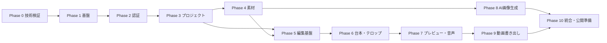

# 実装計画書

## 1. 文書情報

| 項目 | 内容 |
| --- | --- |
| 文書状態 | 初版 |
| 対象 | MVP実装から限定公開まで |
| 想定体制 | 1人開発を基本とし、分担可能な単位で記載 |
| 管理方法 | Git / 機能単位の小さなコミット |

関連文書:

- [システム設計書](design.md)
- [機能設計書](functional-design.md)
- [PostgreSQLテーブル設計書](database-design.md)
- [フォルダ構成設計](folder-structure.md)
- [コーディング規約・品質基準](coding-standards.md)

## 2. 実装目標

MVPの完成状態を次のように定義する。

1. ユーザーがメールアドレスとパスワードで登録・ログインできる。
2. ユーザーごとにプロジェクト、素材、生成画像、完成動画が分離される。
3. 画像を背景にした複数シーンを編集できる。
4. 長い台本を日本語・英語の規則で自動改行・ページ分割できる。
5. テロップをノベルゲームのように自動送りできる。
6. OpenAI APIで画像を生成し、素材として利用できる。
7. 共通RendererとFFmpegでMP4を書き出せる。
8. UIを日本語・英語で切り替えられる。既定・フォールバックは日本語とする。
9. 自動テスト、migration、セキュリティチェックを通過する。

## 3. 開発戦略

### 3.1 縦方向の機能単位

DBだけ、APIだけ、UIだけを長期間作り続けない。各フェーズで、必要な範囲のDB、Service、Controller、UI、テストをつなぎ、利用可能な機能として完成させる。

例:

```text
ユーザー登録
  migration
  -> SQLAlchemy model
  -> Repository
  -> Service
  -> Controller
  -> React画面
  -> Unit / Integration / E2E
```

### 3.2 技術リスクを先に検証

本プロジェクトで特に不確実性が高いのは次の項目である。

- ブラウザプレビューとサーバー出力の一致
- 日本語・英語のテロップ分割
- ヘッドレスChromiumからFFmpegへのフレーム供給性能
- 音声と映像の同期
- 長時間レンダリングの安定性

これらを本格実装前のSpikeで確認する。検証コードは、製品コードへ昇格させるか削除し、未管理の実験コードを残さない。

### 3.3 フェーズ完了主義

同時に多くのフェーズへ着手しない。各フェーズの完了条件を満たしてから次へ進む。ただし、OpenAI画像生成のようにクリティカルパス外の機能は、素材基盤完成後に独立して進められる。

### 3.4 品質を後回しにしない

各フェーズで次を実施する。

- Lint・format
- 型検査
- Unit test
- 必要なIntegration test
- migration test
- 認可拒否テスト
- 日英翻訳キー検査
- 変更箇所のリファクタリング確認

## 4. 規模表記

本書の規模はカレンダー日数ではなく、相対的な複雑さを示す。

| 規模 | 意味 |
| --- | --- |
| `S` | 小さい。依存が少なく、単独で完結しやすい |
| `M` | 中程度。複数層またはテスト環境を含む |
| `L` | 大きい。技術検証、複数システム、性能確認を含む |

日程は、技術選定、開発可能時間、OpenAI API・インフラ準備後に別途設定する。

## 5. 実装前の意思決定

実装開始前またはPhase 0で、次をADRとして記録する。

| ADR | 決定事項 | 決定期限 |
| --- | --- | --- |
| `ADR-001` | Node.js package managerとworkspace方式 | Phase 1開始前 |
| `ADR-002` | Python package・仮想環境管理方式 | Phase 1開始前 |
| `ADR-003` | SQLAlchemyの同期Session / AsyncSession | Phase 1のDB基盤着手前 |
| `ADR-004` | Redis job queueライブラリ | Phase 4開始前 |
| `ADR-005` | React canvas実装方式 | Phase 0完了前 |
| `ADR-006` | Scene RendererとHeadless Browserの連携方式 | Phase 0完了前 |
| `ADR-007` | FFmpegビルド・Docker image・ライセンス構成 | Phase 0完了前 |
| `ADR-008` | 初期デプロイ先とS3互換ストレージ | Phase 10開始前 |
| `ADR-009` | セッション保存先とCSRF方式 | Phase 2開始前 |

ADRは`docs/adr/NNNN-title.md`へ作成し、選択肢、決定、理由、影響を記載する。

## 6. 全体依存関係



クリティカルパス:

```text
技術検証
-> 開発基盤
-> 認証・ユーザー分離
-> プロジェクト保存
-> 素材管理
-> Scene Editor
-> 台本・テロップ
-> プレビュー・音声
-> 動画書き出し
-> 公開準備
```

## 7. Phase 0: 技術検証・ADR

目的:

後半で設計変更を引き起こしやすい技術リスクを、小さな検証で先に確認する。

### 7.1 タスク

| ID | タスク | 規模 | 成果物 |
| --- | --- | --- | --- |
| `P0-001` | ADRテンプレート作成 | S | `docs/adr/`、テンプレート |
| `P0-002` | Project Document最小Schema作成 | M | `project-schema` v1草案 |
| `P0-003` | React上で固定シーンとテロップを描画 | M | Browser renderer spike |
| `P0-004` | 同じ描画をHeadless ChromiumでPNG化 | M | Render harness spike |
| `P0-005` | 連続フレームをFFmpegでMP4化 | M | 5～10秒の検証MP4 |
| `P0-006` | 日本語禁則・英語単語折返し検証 | L | Layout比較、制約一覧 |
| `P0-007` | typewriterの時刻指定描画 | M | 任意時刻の決定的描画 |
| `P0-008` | FFmpeg build configuration確認 | M | `ADR-007`草案 |
| `P0-009` | 1080p/30fps短尺レンダリング計測 | M | CPU・時間・メモリ記録 |

### 7.2 検証条件

- ブラウザとHeadless Chromiumの指定フレームが視覚的に一致する。
- 日本語2行、英語2行のページ分割結果を固定テストにできる。
- 同じ入力と時刻から同じtypewriter表示結果になる。
- 10秒程度のMP4がFFmpegで生成できる。
- 使用するFFmpegのライセンス構成を説明できる。

### 7.3 完了条件

- `ADR-005`～`ADR-007`の方向性が決まっている。
- 不成立だった方式と理由が記録されている。
- 採用する検証コードに最低限のテストがある。
- 不要なspikeコードが削除されている。

## 8. Phase 1: リポジトリ・開発基盤

目的:

React、FastAPI、PostgreSQL、Redis、S3互換ストレージをローカルとCIで再現可能にする。

### 8.1 タスク

| ID | タスク | 依存 | 規模 |
| --- | --- | --- | --- |
| `P1-001` | `apps/web`、`apps/backend`、`packages`をscaffold | ADR-001/002 | M |
| `P1-002` | React、TypeScript、Router、基本Layout | P1-001 | M |
| `P1-003` | FastAPI起動、health endpoint | P1-001 | S |
| `P1-004` | PostgreSQL、Redis、S3互換ストレージのcompose | P1-001 | M |
| `P1-005` | SQLAlchemy Engine・Session・Unit of Work基盤 | ADR-003 | M |
| `P1-006` | Alembic初期化・naming convention | P1-005 | M |
| `P1-007` | 設定読込・`.env.example`・Secret境界 | P1-003 | M |
| `P1-008` | react-i18next、`ja`/`en`、fallback `ja` | P1-002 | M |
| `P1-009` | APIエラー形式、request ID、ログ基盤 | P1-003 | M |
| `P1-010` | Python/TypeScript Lint・format・型検査 | P1-001 | M |
| `P1-011` | Unit test基盤、PostgreSQL integration fixture | P1-004 | M |
| `P1-012` | CI構築 | P1-006～011 | L |

### 8.2 CI必須チェック

- Ruff
- Python型検査
- pytest
- ESLint
- Prettier check
- TypeScript型検査
- Vitest
- 日英翻訳キー一致
- 空DBへの`alembic upgrade head`
- 依存関係の脆弱性監査
- 秘密情報パターン検査

### 8.3 完了条件

- 1コマンドで開発サービスを起動できる。
- ReactからFastAPI health endpointを確認できる。
- PostgreSQL、Redis、S3互換ストレージへ接続できる。
- 空DBにmigrationを適用できる。
- CIがmainブランチで成功する。
- 日本語が既定表示され、英語へ切り替えられる。

## 9. Phase 2: ユーザー登録・認証・データ分離

対象機能:

- `AUTH-001`～`AUTH-003`
- `USER-001`
- `I18N-001`

### 9.1 タスク

| ID | タスク | 規模 |
| --- | --- | --- |
| `P2-001` | `users`、`sessions`、`user_settings` migration | M |
| `P2-002` | SQLAlchemy model・Repository | M |
| `P2-003` | Argon2id password service | M |
| `P2-004` | Session発行・検証・失効 | L |
| `P2-005` | CSRF・Cookie security設定 | M |
| `P2-006` | Register/Login/Logout Service | L |
| `P2-007` | FastAPI Controller・Schema | M |
| `P2-008` | React登録・ログイン画面 | M |
| `P2-009` | Account・locale・default設定画面 | M |
| `P2-010` | 認証レート制限 | M |
| `P2-011` | 認証Unit/Controller/Integration test | L |
| `P2-012` | Playwright登録・ログインE2E | M |

### 9.2 セキュリティテスト

- パスワードが平文保存されない。
- Cookieに必要な属性が付く。
- 失効・期限切れセッションを使用できない。
- メール不存在とパスワード不一致で情報差が出ない。
- CSRFなしの状態変更要求を拒否する。
- ログへパスワード、Cookie、tokenが出ない。

### 9.3 完了条件

- 登録、ログイン、ログアウトがUIから動作する。
- localeが保存され、再ログイン後も維持される。
- 認証必須APIを未認証で利用できない。
- ControllerがSessionやORM modelを直接操作していない。
- 認証関連テストがCIで成功する。

## 10. Phase 3: プロジェクト・Revision・自動保存

対象機能:

- `PRJ-001`～`PRJ-004`
- `SAVE-001`

### 10.1 タスク

| ID | タスク | 規模 |
| --- | --- | --- |
| `P3-001` | Project Document Schema v1確定 | L |
| `P3-002` | `projects`、`project_revisions` migration | M |
| `P3-003` | Project Repository・Revision Repository | M |
| `P3-004` | 作成・一覧・取得・名称変更Service | L |
| `P3-005` | Revision保存・楽観ロックService | L |
| `P3-006` | 複製・論理削除Service | M |
| `P3-007` | Project Controller・OpenAPI | M |
| `P3-008` | OpenAPIからTypeScript client生成 | M |
| `P3-009` | プロジェクト一覧・作成画面 | L |
| `P3-010` | Editor shell・Project読込 | M |
| `P3-011` | debounce自動保存・保存状態表示 | L |
| `P3-012` | 409競合・ローカル復旧UI | L |
| `P3-013` | Unit/Repository/Controller/E2E test | L |

### 10.2 完了条件

- ユーザーごとにproject一覧が分離される。
- Project作成時にrevision 1が生成される。
- 保存ごとにrevisionが増える。
- 古い`lock_version`による上書きを拒否する。
- 複製にexport履歴が含まれない。
- 論理削除後に通常一覧へ表示されない。
- 未送信変更を通信復旧後に再保存できる。

## 11. Phase 4: 素材管理・メディア解析

対象機能:

- `AST-001`～`AST-003`
- `JOB-001`の基盤部分

### 11.1 タスク

| ID | タスク | 規模 |
| --- | --- | --- |
| `P4-001` | `assets`、`tags`、`asset_tags`、`asset_derivatives` migration | M |
| `P4-002` | Asset/Tag Repository・Service | L |
| `P4-003` | 署名付きupload開始・完了API | L |
| `P4-004` | ファイル形式・容量・実体検証 | L |
| `P4-005` | Job基盤・Redis配送・DB状態同期 | L |
| `P4-006` | FFprobeメディア解析worker | L |
| `P4-007` | thumbnail・proxy生成worker | L |
| `P4-008` | 素材一覧・検索・絞り込みUI | L |
| `P4-009` | upload進捗・失敗・再試行UI | M |
| `P4-010` | タグ編集UI | M |
| `P4-011` | 素材削除・使用先確認 | M |
| `P4-012` | 不正ファイル・tenant isolation test | L |

### 11.2 完了条件

- 画像・動画・音声をuploadできる。
- uploadファイルがユーザー領域へ保存される。
- 実体検証後だけ`ready`になる。
- サムネイル、解像度、長さを表示できる。
- 他ユーザーのassetを取得・変更・削除できない。
- 使用中素材の物理削除を防止できる。
- APIプロセスで重いメディア処理を行っていない。

## 12. Phase 5: Scene Editor・共通Renderer

対象機能:

- `SCN-001`
- `LYR-001`
- 共通Scene Renderer

### 12.1 タスク

| ID | タスク | 規模 |
| --- | --- | --- |
| `P5-001` | Scene/Layer Project Schema確定 | L |
| `P5-002` | `scene-renderer` package基盤 | L |
| `P5-003` | 座標系・拡大縮小・safe area | M |
| `P5-004` | 背景画像・背景色Renderer | M |
| `P5-005` | 画像Layer | M |
| `P5-006` | 自由テキストLayer | M |
| `P5-007` | 基本図形Layer | M |
| `P5-008` | 動画Layer最小対応 | L |
| `P5-009` | Scene一覧・追加・複製・削除・並べ替え | L |
| `P5-010` | Layer選択・移動・サイズ・回転・重なり順 | L |
| `P5-011` | Asset pickerとEditor連携 | M |
| `P5-012` | Undo/Redo command基盤 | L |
| `P5-013` | Scene/Layer serialization test | M |
| `P5-014` | Renderer screenshot regression test | L |
| `P5-015` | タイムライン任意区間の選択削除・後続クリップ詰め | M |
| `P5-016` | タイムライン途中への空き区画挿入・後続クリップ移動 | M |

### 12.2 完了条件

- 複数Sceneを作成・並べ替えできる。
- 素材を背景・画像Layerとして配置できる。
- 自由テキストと図形を配置できる。
- 保存・再読込後に同じ配置になる。
- Undo/Redoできる。
- 任意の時間区間を削除し、全トラックの後続クリップを同じ時間だけ前へ詰められる。
- 任意位置へ指定時間の空き区画を追加し、全トラックの後続クリップを同じ時間だけ後ろへ移動できる。
- 代表fixtureの描画差分テストがある。

## 13. Phase 6: 台本・テロップ・自動送り

対象機能:

- `DLG-001`
- `CAP-001`～`CAP-004`

### 13.1 タスク

| ID | タスク | 規模 |
| --- | --- | --- |
| `P6-001` | Dialogue・Caption Style Schema | M |
| `P6-002` | 日本語自動改行・禁則処理 | L |
| `P6-003` | 英語単語境界・長単語処理 | L |
| `P6-004` | 最大行数によるページ分割 | L |
| `P6-005` | 手動改行・手動ページ分割 | M |
| `P6-006` | 日本語表示時間計算 | M |
| `P6-007` | 英語表示時間係数の検証・実装 | M |
| `P6-008` | instant/fade/typewriter | L |
| `P6-009` | 台本一覧・一括貼付・分割・結合UI | L |
| `P6-010` | テロップ枠・Style編集UI | L |
| `P6-011` | はみ出し・未解決ページ警告 | M |
| `P6-012` | Layout/Timing Unit test | L |
| `P6-013` | ja/en screenshot regression | L |

### 13.2 完了条件

- 長い日本語台本が自動ページ分割される。
- 英語台本が単語境界で分割される。
- Style変更でページを再計算する。
- 手動表示時間と手動分割を不用意に失わない。
- 同じ入力・フォント・Rendererで同じページ結果になる。
- typewriterを任意時刻で正しく描画できる。

## 14. Phase 7: プレビュー・音声

対象機能:

- `PRV-001`
- `AUD-001`

### 14.1 タスク

| ID | タスク | 規模 |
| --- | --- | --- |
| `P7-001` | Project timeline resolver | L |
| `P7-002` | 再生Clock・play/pause/seek | L |
| `P7-003` | Scene/page時間マッピング | L |
| `P7-004` | ナレーション関連付け | M |
| `P7-005` | BGM配置・loop・fade | L |
| `P7-006` | 効果音配置 | M |
| `P7-007` | 簡易ducking設定 | M |
| `P7-008` | 音声時間を表示時間へ反映 | M |
| `P7-009` | シーク・同期・境界Unit test | L |
| `P7-010` | 長尺プレビュー性能確認 | M |
| `P7-011` | AivisSpeech Engineクライアント・遅延起動 | M |
| `P7-012` | 生成音声の素材登録・ナレーション配置UI | L |
| `P7-013` | Aivis異常応答・認可・ユーザー分離テスト | M |
| `P7-014` | Aivis分割合成・実測キューによるテロップ同期 | L |
| `P7-015` | ナレーション・テロップ同期検証ツール | M |

### 14.2 完了条件

- SceneとDialogue pageを時間どおりに再生できる。
- シーク後のtypewriter状態が正しい。
- ナレーション時間がテロップ時間へ反映される。
- Aivis生成ナレーションのテロップ本文と各表示区間を実測キューで検証できる。
- BGM、効果音、ナレーションを同時再生できる。
- 編集プレビューが実用的な応答時間で動作する。

## 15. Phase 8: OpenAI画像生成

対象機能:

- `IMG-001`
- `IMG-002`

Phase 4完了後に着手可能であり、Phase 5～7と独立して進められる。

### 15.1 タスク

| ID | タスク | 規模 |
| --- | --- | --- |
| `P8-001` | `image_generation_requests` migration | M |
| `P8-002` | OpenAI adapter・Secret取得 | M |
| `P8-003` | 生成Service・Job登録 | L |
| `P8-004` | 生成worker・結果保存・Asset登録 | L |
| `P8-005` | Retry・moderation・error mapping | M |
| `P8-006` | ユーザー別rate/usage limit | L |
| `P8-007` | 生成フォーム・進捗UI | L |
| `P8-008` | 生成履歴・再生成UI | M |
| `P8-009` | 参照画像・親子関係 | M |
| `P8-010` | Adapter fakeによるUnit/Integration test | L |

### 15.2 完了条件

- APIキーがブラウザ・DB・ログに露出しない。
- 生成処理が非同期で実行される。
- 成功画像がユーザーのAssetになる。
- 失敗種別に応じて再試行可否が変わる。
- ユーザー間で生成履歴・画像が分離される。
- 利用上限を超えた生成を拒否できる。

## 16. Phase 9: サーバー動画書き出し・完成動画管理

対象機能:

- `EXP-001`
- `EXP-002`
- `JOB-001`完成形

### 16.1 タスク

| ID | タスク | 規模 |
| --- | --- | --- |
| `P9-001` | `exports` migration | M |
| `P9-002` | Export Service・revision固定 | M |
| `P9-003` | 全Asset所有権・存在検証 | M |
| `P9-004` | Headless render harness本実装 | L |
| `P9-005` | Frame供給・FFmpeg encode pipeline | L |
| `P9-006` | 音声mix・ducking・同期 | L |
| `P9-007` | 一時ファイル・ffprobe検証・S3確定 | L |
| `P9-008` | Progress・heartbeat・stale job回収 | L |
| `P9-009` | 安全なキャンセル・一時物削除 | M |
| `P9-010` | 完成動画一覧・再生・download | L |
| `P9-011` | 再書き出し・削除 | M |
| `P9-012` | Worker resource limit・timeout | L |
| `P9-013` | 30秒/数分の統合レンダリングtest | L |
| `P9-014` | FFmpeg version/buildconf記録 | S |
| `P9-015` | 縦横解像度追従・フレーム進捗・レンダラー異常終了ログ | M |
| `P9-016` | 長尺向け画像素材の遅延配信・Base64一括注入廃止 | M |

### 16.2 完了条件

- 固定revisionから1920x1080/30fps MP4を生成できる。
- プレビューと主要フレームが一致する。
- 音声同期が許容範囲内である。
- 編集を続けても実行中exportの入力が変わらない。
- 失敗・キャンセルで既存動画を失わない。
- 他ユーザーが完成動画を再生・downloadできない。
- ワーカー停止後にjobを回収・失敗確定できる。
- FFmpeg buildとライセンス情報が記録されている。
- 16:9・9:16の出力解像度がProject Documentと一致し、処理中の進捗と異常終了時の終了コードを確認できる。

## 17. Phase 10: 統合・セキュリティ・限定公開準備

目的:

機能単体ではなく、公開サービスとしての安全性、運用性、復旧性を確認する。

### 17.1 タスク

| ID | タスク | 規模 |
| --- | --- | --- |
| `P10-001` | 全受け入れシナリオE2E | L |
| `P10-002` | tenant isolation横断test | L |
| `P10-003` | Threat modeling更新 | M |
| `P10-004` | File upload/FFmpeg隔離確認 | M |
| `P10-005` | Dependency・Container脆弱性監査 | M |
| `P10-006` | API rate limit・quota確認 | M |
| `P10-007` | i18n欠落・英語layout確認 | M |
| `P10-008` | Accessibility基本確認 | M |
| `P10-009` | DB backup・restore訓練 | L |
| `P10-010` | S3 lifecycle・orphan cleanup | M |
| `P10-011` | Logging・metrics・alert | L |
| `P10-012` | Production migration手順 | M |
| `P10-013` | Privacy・利用規約・FFmpeg/codec法務確認 | L |
| `P10-014` | 負荷試験・同時render制御 | L |
| `P10-015` | Release checklist・rollback手順 | M |
| `P10-016` | AIアシスタントREST APIのPAT認証・スコープ分離・クライアント | M |

### 17.2 限定公開条件

- すべてのMVP受け入れシナリオが成功する。
- 重大・高severityの既知脆弱性が未対応で残っていない。
- tenant isolation testが成功する。
- DB backupから復旧できる。
- Worker障害時のjob復旧手順がある。
- 生成・レンダリング費用の上限を設定できる。
- 外部クライアントが専用スコープ付きPersonal API Tokenで編集画面と同じAIアシスタントを利用できる。
- プライバシー情報と外部API送信内容を説明できる。
- FFmpegとコーデックの利用方針を確認済みである。

公開登録を広く受け付ける前に、将来機能としているメール確認リンクを実装することを推奨する。MVPのメール未確認登録は、開発環境または招待制の限定公開までとする。

## 18. Phase 11以降: 将来機能

優先候補:

1. メール確認・パスワード再設定
2. 全ユーザー共通のシステム素材
3. 利用量台帳、プラン、課金
4. 音声認識・自動字幕
5. 動画テンプレート
6. 翻訳・多言語台本支援
7. 共有リンク・共同編集
8. 外部投稿

将来機能はMVPの途中へ混在させず、MVP完了後に優先順位を再評価する。

## 19. テスト計画

### 19.1 Unit test

- Serviceの正常・異常・認可
- Caption LayoutとTiming
- Project Schema validation
- Job状態遷移
- Retry判定
- FFmpeg引数生成
- i18n locale解決

### 19.2 Integration test

- SQLAlchemy RepositoryとPostgreSQL制約
- Alembic upgrade
- S3互換upload/download
- Redis job配送
- OpenAI adapter fake
- FFprobe/FFmpegの限定的実行

### 19.3 E2E

- 登録・ログイン
- Project作成・保存・競合
- Asset upload
- 台本入力・自動ページ分割
- AI画像生成要求
- Export要求・進捗・download
- 日英切り替え
- 他ユーザーIDによるアクセス拒否

### 19.4 Regression

- 固定Project Documentのページ分割
- 固定時刻のRenderer screenshot
- 固定短尺動画のduration・解像度・codec
- 過去migrationからheadへのupgrade

## 20. セキュリティ実装チェックポイント

| フェーズ | 重点項目 |
| --- | --- |
| Phase 1 | Secret管理、ログ、CORS、環境分離 |
| Phase 2 | Password、Session、CSRF、rate limit |
| Phase 3 | Project所有権、競合、不正Schema |
| Phase 4 | Upload検証、署名付きURL、path traversal、resource limit |
| Phase 5～7 | XSS、font/renderer入力、Project validation |
| Phase 8 | OpenAI key、quota、prompt privacy、retry abuse |
| Phase 9 | Command injection、FFmpeg sandbox、DoS、download認可 |
| Phase 10 | 横断的tenant isolation、監査、backup、incident対応 |

## 21. リファクタリング計画

専用の確認を次の時点で実施する。

- Phase 3完了: 認証・Projectの層分離とRepository設計
- Phase 4完了: Job・Storage adapterの共通化
- Phase 6完了: Editor・Renderer・Caption責務の整理
- Phase 9完了: Worker・Render pipeline・エラー処理の整理
- Phase 10前: 未使用コード・暫定実装・feature flagの除去

確認内容:

- 400行超ファイル
- 50行超関数
- 重複ロジック
- `utils`、`manager`への責務集中
- Controllerからの業務ロジック漏れ
- Service間の循環依存
- Integration adapterのSDK型漏れ
- テストが実装詳細へ過度に依存していないか

リファクタリングは既存挙動を固定するテストを追加してから行う。

## 22. コミット・ブランチ方針

- `main`を常に動作可能に保つ。
- 機能またはタスク単位の短いブランチを使用する。
- 1コミットへ無関係な変更を混在させない。
- migrationと対応model変更は同じ変更単位で管理する。
- 自動生成コードは生成元変更と同じ変更単位に含める。
- 大規模format変更と機能変更を分ける。

コミット例:

```text
feat(auth): add email and password registration
feat(projects): add revision-based autosave
feat(editor): add scene reordering
feat(captions): add Japanese page splitting
fix(exports): prevent cross-user download
refactor(assets): split upload and metadata services
test(auth): cover revoked sessions
docs: update implementation plan
```

## 23. Definition of Ready

タスク着手前に確認する。

- [ ] 対象機能IDが明確
- [ ] 正常系・異常系・認可条件が明確
- [ ] 必要なSchema・migrationが分かる
- [ ] 外部API・Secret・費用の影響が分かる
- [ ] テスト方法が決まっている
- [ ] 未決ADRがブロッカーになっていない
- [ ] 1変更として大きすぎない

## 24. Definition of Done

各タスク・フェーズは[コーディング規約](coding-standards.md)のDefinition of Doneに加え、次を満たす。

- [ ] 機能設計の正常系・異常系を満たす
- [ ] 所有データの許可・拒否をテストした
- [ ] 新規ロジックにUnit testがある
- [ ] DB変更にAlembic migrationがある
- [ ] `ja`と`en`の翻訳が揃っている
- [ ] Lint・format・型検査・テストが成功する
- [ ] ログへ秘密情報・個人情報を出していない
- [ ] 依存関係とフォルダ構成を守っている
- [ ] 肥大化シグナルを確認した
- [ ] 関連文書を更新した

## 25. 最初の実装バッチ

Phase 0～1の最初の着手順を具体化する。

1. `docs/adr/`とADRテンプレートを作成する。
2. Node・Pythonのpackage管理方式を決める。
3. `apps/web`と`apps/backend`をscaffoldする。
4. `packages/project-schema`を作成する。
5. `packages/scene-renderer`で固定Sceneを描画する。
6. Headless Chromiumから固定フレームを取得する。
7. FFmpegで短尺MP4を生成する。
8. 採用方式をADRへ記録する。
9. PostgreSQL、Redis、S3互換ストレージのcomposeを作成する。
10. FastAPI health endpointとReact shellを接続する。
11. SQLAlchemy・Alembic基盤を作成する。
12. i18n `ja`/`en`基盤を作成する。
13. CIの最小チェックを作成する。
14. Phase 2の認証実装へ進む。

このバッチ完了までは、素材管理やEditor機能へ先行着手しない。

## 26. 未決・計画更新ルール

- 未決事項は暗黙に仮定せず、ADRまたは本書へ記録する。
- 技術検証で前提が崩れた場合、実装より先に設計書と本計画を更新する。
- 各Phase終了時に、次Phaseのタスク・規模・依存関係を再見積もりする。
- 追加要望はMVP必須、MVP後、対象外に分類する。
- 計画変更の理由をGit履歴へ残す。
