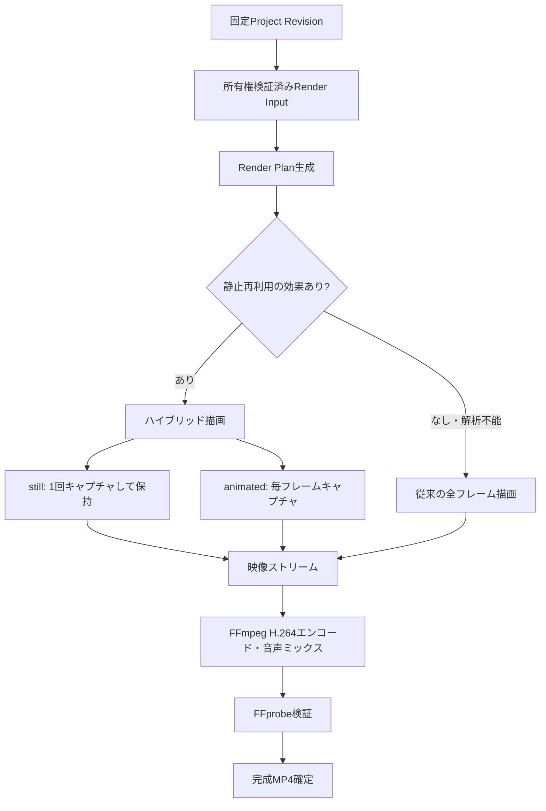

# 静止区間再利用型レンダリング設計

## 1. 文書情報

| 項目 | 内容 |
| --- | --- |
| 文書状態 | 実装前確定仕様 |
| 作成日 | 2026-07-20 |
| 対象 | MP4書き出し・範囲プレビュー書き出し |
| 関連ADR | [ADR-0010](adr/0010-static-segment-rendering.md) |

関連文書:

- [システム設計書](design.md)
- [機能設計書](functional-design.md)
- [動画レンダリングパイプライン](rendering-pipeline.md)
- [ADR-0005: ReactとSVGのScene Renderer](adr/0005-svg-scene-renderer.md)
- [ADR-0006: Playwright render harness](adr/0006-playwright-render-harness.md)

## 2. 背景

現行の書き出し処理は、出力する全フレームについて次の処理を行う。

1. Headless Chromiumへシーン番号と時刻を設定する。
2. ReactとSVGのScene Rendererを更新する。
3. PlaywrightでSVGをPNGとしてキャプチャする。
4. PNGをFFmpegの`image2pipe`へ送る。
5. FFmpegがPNGを展開し、H.264へエンコードする。

この方式はプレビューと書き出しの一致性が高い一方、同じ静止画面が数秒続く場合も毎フレーム同じ描画とPNG圧縮を繰り返す。10fpsの5秒間で50回、10分間では最大6,000回のブラウザキャプチャが必要になる。

Dougaは静止画像、図形、テロップを主体とするため、画面が変化しない区間を1回だけ描画し、その結果を必要フレーム数だけ保持することで大幅な短縮が期待できる。

## 3. 決定事項

書き出し処理を、次のハイブリッド方式へ変更する。

- Project Documentから出力フレーム列を先に作る。
- 視覚状態が時間によって変化しないことを証明できる区間を`still`区間とする。
- `still`区間は先頭フレームを1回だけChromiumで描画する。
- アニメーション、フェード、文字送りなどを含む区間は`animated`区間とし、従来どおり毎フレーム描画する。
- 判定できない新しい機能や不正な値は、安全側に倒して`animated`として扱う。
- 音声は映像区間へ分割せず、映像生成後に従来どおり1回だけミックスする。
- 100枚単位のバッファリングや複数Chromiumによる並列化は、本設計の対象外とする。

初期実装では、静止フレームのPNGバッファを現在の`image2pipe`へ必要回数再送できるようにする。これにより、FFmpegの入力契約を変えずにChromium描画とPNG生成を省略できる。

FFconcatによる「PNGを1回だけ入力して指定フレーム数保持する方式」は第2段階とし、フレーム数・音声同期・Windowsパスの検証を通過した場合だけ既定化する。

## 4. 目標

### 4.1 機能目標

- 完成動画の映像、テロップ、音声タイミングを現行方式から変えない。
- 16:9、9:16、全体書き出し、範囲書き出しへ同じ方式を適用する。
- 静止区間とアニメーション区間を1本のMP4へ連続して出力する。
- 未対応の描画機能が追加されても、誤って静止扱いしない。
- 最適化を無効化すれば、現行の全フレーム描画へ戻せる。

### 4.2 性能目標

- 静止画主体の代表プロジェクトで、Chromiumキャプチャ回数を出力フレーム数の30%以下にする。
- 90%以上が静止区間である代表プロジェクトでは、現行方式に対して書き出し時間を50%以上短縮する。
- 全区間がアニメーションの場合は現行方式を選択し、計画生成による追加時間を全体の5%以内にする。
- 1ジョブのメモリ使用量を出力フレーム数に比例させない。

### 4.3 対象外

- Scene RendererをFFmpegフィルターへ全面移植すること
- Canvas、WebCodecs、Remotionへの置き換え
- 複数ブラウザによる並列レンダリング
- 画像品質、FPS、コーデックの自動変更
- 音声・テロップ同期仕様そのものの変更

## 5. 全体構成



Render Planは`@douga/scene-renderer`内の純粋関数で生成する。Node.jsのrender harnessは、Project Documentのアニメーション意味を独自実装せず、Render Planに従って指定時刻を描画する。

## 6. 時刻とフレームの基準

### 6.1 フレーム列

最適化前後の出力を一致させるため、初期実装は現行レンダラーと同じフレーム列生成規則を使用する。

各出力フレームは次を保持する。

```ts
interface RenderFrame {
  outputFrameIndex: number;
  sceneIndex: number;
  sceneTimeMs: number;
  globalTimeMs: number;
}
```

- `outputFrameIndex`は完成動画内で0から始まる連番とする。
- `sceneTimeMs`はScene Rendererへ渡すシーン内時刻とする。
- `globalTimeMs`は範囲書き出し判定と診断に使用する。
- 出力時間は`totalFrames / fps`で決定する。
- 区間の長さをミリ秒の加算で管理せず、必ず整数の`frameCount`で管理する。

これにより、静止区間をまとめても累積丸め誤差を発生させない。

### 6.2 範囲書き出し

- 現行方式と同じフレーム時刻を列挙し、`range_start_ms <= globalTimeMs < range_end_ms`のフレームだけを採用する。
- 映像の先頭PTSは0とする。
- 音声のトリムと開始位置補正は現行の`range_start_ms`基準を維持する。
- 最適化によって新しい音声オフセットを追加しない。
- 映像と音声の差は現行と同じく最大1出力フレーム以内とする。

## 7. Render Plan

### 7.1 データ構造

```ts
interface RenderPlan {
  version: 1;
  fps: number;
  totalFrames: number;
  captureFrames: number;
  reusedFrames: number;
  spans: RenderSpan[];
  fallbackReasons: string[];
}

type RenderSpan = StillSpan | AnimatedSpan;

interface StillSpan {
  kind: "still";
  firstFrame: RenderFrame;
  frameCount: number;
  stateFingerprint: string;
}

interface AnimatedSpan {
  kind: "animated";
  frames: RenderFrame[];
  reason: string;
}
```

`AnimatedSpan.frames`は実装上、遅延イテレーターまたは開始・終了インデックスとして保持してよい。長尺動画の全フレームオブジェクトをメモリへ保持しないことを優先する。

### 7.2 不変条件

- 全Spanの`frameCount`合計が`totalFrames`と一致する。
- Spanは出力フレーム順で、重複と欠落がない。
- `still`の代表フレームは必ずそのSpanの最初の出力フレームである。
- Scene境界をまたいで`still`を結合しない。
- `captureFrames = stillSpan数 + animated内のフレーム数`とする。
- `reusedFrames = totalFrames - captureFrames`とする。

## 8. 静止判定

### 8.1 原則

静止判定は画像比較ではなく、Project DocumentとScene Rendererの時間依存規則を解析して行う。毎フレームを画像比較するとChromiumキャプチャ回数を削減できないため採用しない。

静止として扱う条件は「区間内の任意の出力フレームで、Scene Rendererへ渡される視覚状態が同一であることを構造的に証明できること」とする。

### 8.2 境界候補

次の時刻をフレーム境界へ変換し、Spanの分割候補とする。

- 書き出し開始・終了
- シーン開始・終了
- レイヤーの`start_ms`と`end_ms`
- レイヤーキーフレームの`time_ms`
- テロップページの開始・終了
- テロップのフェード終了時刻
- テロップの文字送り完了時刻
- テキストレイヤーの文字送り完了時刻
- カメラエフェクトの`start_ms`と`end_ms`
- 将来追加するトランジション・動画レイヤーの開始・終了

境界時刻が出力フレーム間にある場合は、実際の`RenderFrame`時刻を基準に、状態が変化する最初のフレームから次Spanへ分ける。

### 8.3 機能別判定

| 対象 | 静止扱い | 動的扱い |
| --- | --- | --- |
| 背景色・背景画像 | シーン内で常に静止 | 将来、動画背景を追加した場合 |
| 画像・図形レイヤー | キーフレームがなく表示中 | 動画素材、未対応effect |
| レイヤー表示区間 | `start_ms`と`end_ms`の間 | 境界フレームはSpan分割 |
| 同値キーフレーム | 補間対象の全値が同一 | 1項目でも変化する補間区間 |
| `step`キーフレーム | 次のキーフレーム直前まで静止 | 値が切り替わる境界でSpan分割 |
| linear/ease/bounce | 前後値が全て同じ場合だけ静止 | 前後値が異なる補間区間全体 |
| 自由テキスト`instant` | 表示中は静止 | なし |
| 自由テキスト`typewriter` | 全文表示完了後 | 表示開始から全文表示完了まで |
| テロップ`instant` | ページ内で静止 | ページ切替境界 |
| テロップ`fade` | opacityが1になった後 | ページ開始から350msまたはページ終了まで |
| テロップ`typewriter` | 全文表示完了後 | ページ開始から全文表示完了まで |
| カメラエフェクト | 対象外、または`intensity=0` | 有効区間全体 |
| 音声 | 視覚判定へ影響しない | なし |
| 未知の型・未知の効果 | なし | 影響する可能性がある区間全体 |

複数の対象が重なる場合、1つでも動的であれば区間全体を`animated`とする。

### 8.4 キーフレーム

判定対象はScene Rendererが補間する次の値とする。

- `x`、`y`
- `width`、`height`
- `rotation`、`opacity`
- `font_size`
- `flip_x`、`flip_y`
- `fill`、`color`

`step`以外の補間で前後値が異なる場合、実際の差が小さくても動的とする。ピクセル単位の差を無視する最適化は画質差を生むため実施しない。

### 8.5 文字送り

文字送り完了時刻は、Scene Rendererと同じ文字数・速度計算から求める。

```text
reveal_end_ms = start_ms + ceil(text_length / characters_per_second * 1000)
```

実装時は独自の文字数計算を作らず、Scene Rendererの文字解決関数と共通化する。現行の文字列単位を変更せず、Unicode grapheme対応は別仕様とする。

### 8.6 状態Fingerprint

隣接する静止候補を結合できるか確認するため、解決済み視覚状態を正規化してSHA-256を計算する。

Fingerprintへ含める値:

- Project Schema versionとRenderer plan version
- 出力幅・高さ
- scene ID、背景色、背景asset ID
- 表示中レイヤーの順序、型、asset ID、本文、スタイル、解決済みtransform
- 解決済みテロップ本文、opacity、Caption Style
- 解決済みカメラtransform

ローカルファイルパス、署名付きURL、ユーザーIDは含めない。浮動小数はScene Rendererが実際に使用する値を安定したJSON形式へ正規化する。

Fingerprintは静止の証明そのものには使用せず、構造判定済みSpanの結合と診断にだけ使用する。

## 9. 描画実行

### 9.1 事前準備

1. Vite render harnessとChromiumを起動する。
2. 所有権検証済みの素材URLだけを登録する。
3. ページを読み込み、全画像のdecode完了を待つ。
4. `document.fonts.ready`を1回だけ待つ。
5. Render Planを取得・検証する。

`document.fonts.ready`をフレームごとに待たない。

### 9.2 同期フレーム更新

render harnessは次の単一APIを公開する。

```ts
setRenderFrame(sceneIndex: number, sceneTimeMs: number): void
```

- Sceneと時刻を1回の呼び出しで更新する。
- Reactの`flushSync`を使用して、呼び出し完了時にSVG更新が反映済みであることを保証する。
- フレームごとの`requestAnimationFrame`待機を廃止する。
- 編集画面の通常再生は従来の非同期state更新を維持し、render modeだけに適用する。

### 9.3 `still`区間

1. `firstFrame`を`setRenderFrame`で描画する。
2. SVGをPNGとして1回だけキャプチャする。
3. PNGを`frameCount`分の映像時間へ割り当てる。
4. 次のSpanへ進むまで同じPNGを再キャプチャしない。

### 9.4 `animated`区間

区間内の全RenderFrameについて、同期更新とPNGキャプチャを行う。現在の品質を維持するため、フレームスキップや補間生成は行わない。

## 10. FFmpegへの供給

### 10.1 第1段階: PNGバッファ再送

初期実装は現在の`image2pipe`を維持する。

- `still`は1回取得したPNGバッファを`frameCount`回送る。
- `animated`は取得した各PNGを1回ずつ送る。
- 各書き込みでbackpressureを待ち、複数Spanをメモリへ蓄積しない。
- メモリ上には原則として現在のPNGバッファ1枚だけを保持する。

この段階でも、Chromium描画、SVGラスタライズ、PNG圧縮、Playwright通信は静止区間につき1回になる。

### 10.2 第2段階: FFconcat duration manifest

次の技術検証を通過した場合、静止PNGを1回だけFFmpegへ読ませる方式を追加する。

```text
ffconcat version 1.0
file 'frames/frame-000001.png'
duration 3.500000000
file 'frames/frame-000002.png'
duration 0.100000000
file 'frames/frame-000002.png'
```

- `duration`は`frameCount / fps`から生成する。
- 最終画像を再掲し、`-frames:v totalFrames`で出力フレーム数を固定する。
- `-r fps`とCFR出力を明示する。
- manifest内はジョブディレクトリ配下の生成済み相対パスだけを使用する。
- 利用者入力をmanifestのパスやFFmpegオプションへ使用しない。
- 完成後、成功・失敗・キャンセルの全経路で一時PNGとmanifestを削除する。

次を満たさなければ第2段階を既定化しない。

- WindowsとLinuxで同じフレーム数になる。
- 静止・動的混在時にフレーム欠落や余分な最終フレームがない。
- 音声開始位置と動画尺が第1段階と1フレーム以内で一致する。
- 一時ディスク使用量の上限とクリーンアップを検証できる。

## 11. 音声合成

- ナレーション、BGM、効果音の入力生成は変更しない。
- `start_ms`、`duration_ms`、`trim_start_ms`、音量、ループ、フェードを従来どおりFFmpeg filterへ渡す。
- 静止Spanごとに音声を分割しない。
- 映像ストリームのPTSは0から連続させる。
- 最終映像フレーム数を`totalFrames`へ固定する。
- 完成動画尺は`totalFrames / fps`とし、音声はその尺で切り詰める。
- ffprobeでFPS、総フレーム数、映像尺、音声尺を検証する。

## 12. 最適化の選択とフォールバック

### 12.1 実行モード

| モード | 用途 |
| --- | --- |
| `legacy_per_frame` | 最適化無効、計画不成立、全区間動的 |
| `hybrid_repeated_stream` | 初期既定。静止PNGを再利用して既存pipeへ送る |
| `hybrid_concat_manifest` | 検証後に追加。静止PNGのFFmpeg再入力も省略 |

### 12.2 選択規則

- Render Planが不変条件を満たさない場合はジョブを開始せず、内部エラーとして扱う。誤った計画で動画を生成しない。
- `reusedFrames=0`の場合は`legacy_per_frame`を選択する。
- 未知の効果は該当区間を`animated`にするだけで、プロジェクト全体を失敗させない。
- 最適化を環境設定で無効化できるようにする。
- 同一ジョブ内で最適化失敗後に長時間の全再描画を自動実行しない。二重負荷を避け、明示的な再試行でlegacy modeを選べるようにする。

## 13. 進捗・キャンセル・一時ファイル

### 13.1 進捗

| 範囲 | 処理 |
| ---: | --- |
| 0～5% | 入力検証、ブラウザ起動、素材・フォント読込 |
| 5～10% | Render Plan生成 |
| 10～75% | 必要フレームのキャプチャ |
| 75～95% | FFmpeg映像エンコード・音声合成 |
| 95～100% | ffprobe検証、保存確定、クリーンアップ |

キャプチャ進捗は`captureFrames`を分母にする。FFmpeg進捗は可能な場合、`-progress`の出力フレーム数または時刻を使用する。5秒以上同じ進捗でもheartbeatを更新する。

### 13.2 キャンセル

- Span境界だけでなく、各キャプチャと各pipe書き込みの間でキャンセルを確認する。
- キャンセル時はChromium、Vite、FFmpegを停止する。
- 部分MP4、manifest、一時PNGを削除する。
- 既存exportとProject Revisionは変更しない。

### 13.3 リソース上限

- ChromiumとFFmpegの既存タイムアウトを維持する。
- concat方式では一時ファイル数と一時ディスク容量に上限を設ける。
- 上限到達前にconcat方式を選択しないか、安全なエラーとして停止する。
- 一時ファイルをリポジトリやユーザー素材領域へ保存しない。

## 14. モジュール配置

```text
packages/scene-renderer/src/
├─ renderPlan.ts                 # 純粋なフレーム列・静止判定
├─ renderState.ts                # 解決済み視覚状態とFingerprint
├─ animation.ts                  # 既存補間。判定側から共通利用
├─ layout.ts                     # 既存テロップ時間計算
└─ text.ts                       # 既存文字送り計算

apps/web/src/features/editor/components/
└─ RendererSpike.tsx             # render mode API公開、flushSync更新

packages/scene-renderer/render-harness/
├─ render-project.mjs            # Node orchestration
├─ frame-transport.mjs           # repeated stream / concat
└─ ffmpeg-args.mjs               # 検証済み引数配列

scripts/
└─ render-project.mjs            # 互換用の薄いentrypoint
```

- Project Documentの時間意味は`scene-renderer`へ置く。
- root `scripts`へ静止判定ロジックを重複実装しない。
- FastAPI ControllerとServiceのAPI契約は変更しない。
- バックエンドはレンダラーの終了結果と進捗を処理するだけとする。
- DB migrationは不要とする。

## 15. 終了結果・可観測性

render harnessは秘密情報を含まない次の結果を返す。

```json
{
  "duration_ms": 120000,
  "frame_count": 1200,
  "captured_frame_count": 84,
  "reused_frame_count": 1116,
  "still_span_count": 42,
  "animated_span_count": 5,
  "render_mode": "hybrid_repeated_stream"
}
```

構造化ログへ次を記録する。

- job ID、export ID
- Render Plan version、render mode
- total/captured/reused frame数
- still/animated Span数
- 計画、キャプチャ、エンコード、検証の所要時間
- fallback理由とエラーコード

素材パス、署名付きURL、Authorizationヘッダー、台本全文をログへ出さない。

## 16. エラー

| 内部コード | 条件 | 対応 |
| --- | --- | --- |
| `RENDER_PLAN_INVALID` | Spanの重複・欠落・合計不一致 | 書き出し失敗、内部ログ |
| `RENDER_FRAME_CAPTURE_FAILED` | Chromiumキャプチャ失敗 | 子プロセス停止、失敗 |
| `RENDER_FRAME_TRANSPORT_FAILED` | pipeまたはmanifest処理失敗 | FFmpeg停止、失敗 |
| `RENDER_TEMP_LIMIT_EXCEEDED` | 一時容量上限超過 | concatを開始せず停止 |
| `RENDER_OUTPUT_MISMATCH` | ffprobeの尺・FPS・フレーム数不一致 | 完成物を確定しない |

利用者向けには既存の一般的な書き出し失敗メッセージを使用し、内部詳細は例外ログへ保存する。

## 17. テスト

### 17.1 Render Plan単体テスト

1. 5秒・10fpsの完全静止シーンが`1 capture / 50 frames`になる。
2. 画像切替境界で別の`still` Spanになる。
3. レイヤーの表示開始・終了でSpanが分かれる。
4. linearキーフレーム区間が`animated`になる。
5. 同値キーフレーム区間が`still`になる。
6. `step`キーフレームが切替境界以外で`still`になる。
7. カメラエフェクト有効区間が`animated`になる。
8. テロップ`instant`がページ単位の`still`になる。
9. テロップ`fade`の先頭350msだけが`animated`になる。
10. テロップ`typewriter`が全文表示後に`still`になる。
11. 自由テキストの文字送りも同じ判定になる。
12. 未知の効果が安全に`animated`になる。
13. 全Spanの合計が常に`totalFrames`になる。
14. 範囲書き出しでも欠落・重複がない。

### 17.2 transport単体テスト

- 同じPNGバッファを指定回数pipeへ送る。
- backpressureを待ち、メモリへ全フレームを保持しない。
- stream終了とFFmpeg異常終了を区別する。
- concat manifestの相対パスを検証する。
- manifestのduration合計と`totalFrames / fps`が一致する。
- キャンセル時に一時物を削除する。

### 17.3 レンダリング回帰テスト

- 同一Project Revisionをlegacyとhybridで書き出す。
- シーン境界、画像切替、テロップ切替、フェード中、文字送り中、キーフレーム中、カメラ中の代表フレームを比較する。
- ピクセル差が既存スクリーンショットテストの許容値以内であることを確認する。
- ffprobeで幅、高さ、FPS、総フレーム数、動画尺、音声尺を確認する。
- 16:9、9:16、全体、範囲書き出しを含める。
- ナレーションとテロップの開始・終了差がlegacyから1フレームを超えて変化しないことを確認する。

### 17.4 性能テスト

代表fixtureを固定する。

- 10分、10fps、全静止
- 10分、10fps、90%静止・10%アニメーション
- 1分、10fps、全アニメーション
- 9:16、画像・テロップ・ナレーション主体

各fixtureで次を記録する。

- 総フレーム数とキャプチャ数
- Render Plan生成時間
- Chromiumキャプチャ時間
- FFmpeg時間
- 全体時間
- 最大RSSと一時ディスク量

## 18. 受け入れ条件

1. 完全静止5秒・10fpsでChromiumキャプチャが1回になる。
2. legacyとhybridで総フレーム数、FPS、動画尺が一致する。
3. 境界フレームに暗転、前フレーム残留、1フレーム欠落がない。
4. テロップ、ナレーション、BGMの開始位置がlegacyから1フレームを超えてずれない。
5. キーフレーム、カメラ、フェード、文字送りは従来どおり毎フレーム描画される。
6. 未知の描画機能を静止として誤判定しない。
7. キャンセル・失敗後にChromium、Vite、FFmpeg、一時ファイルが残らない。
8. 静止画主体の代表fixtureでキャプチャ数30%以下、全体時間50%以上短縮を達成する。
9. 最適化を無効化してlegacy modeで書き出せる。
10. Node、TypeScript、Pythonの関連テスト・型検査・Lintが成功する。

## 19. 実装順序

### Step 1: 計測基盤

- 現行方式の工程別時間とキャプチャ数を記録する。
- 固定性能fixtureを作る。

### Step 2: Render Plan

- `scene-renderer`へフレーム列、静止判定、Fingerprintを追加する。
- 単体テストで境界と動的区間を固定する。

### Step 3: 同期描画API

- Sceneと時刻の更新を1回へまとめる。
- fontsと画像を事前ロードする。
- `requestAnimationFrame`のフレーム単位待機を除去する。

### Step 4: repeated stream

- `still` PNGを1回だけキャプチャし、既存pipeへ再送する。
- legacy/hybrid比較テストと性能計測を行う。
- ここまでを最初のリリース範囲とする。

### Step 5: concat manifest検証

- 第1段階でFFmpegのPNG再展開が支配的な場合だけ実施する。
- 正確なフレーム数、音声同期、一時容量を確認後に段階導入する。

## 20. 将来拡張時の規則

新しい視覚機能を追加する場合、実装完了条件へ次を含める。

1. 時間依存の有無をRender Planへ登録する。
2. 静止・動的判定の単体テストを追加する。
3. 未登録の間は`animated`として扱う。
4. legacy/hybridの代表フレームを比較する。

この規則により、最適化が新機能の表示を壊すことを防ぐ。
