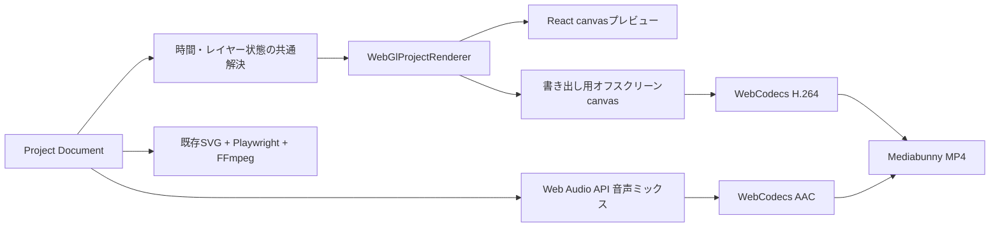

# WebGL / WebCodecs共通レンダリング設計

## 1. 目的

編集プレビューとMP4書き出しに同一の描画実装を使用し、従来の「SVGを更新、PNGへキャプチャ、FFmpegへ転送」というフレーム単位のオーバーヘッドを削減する。

本機能は試験導入とし、従来のサーバーFFmpeg書き出しを互換性と障害時のフォールバックとして残す。

関連文書:

- [システム設計書](design.md)
- [動画レンダリングパイプライン](rendering-pipeline.md)
- [ADR-0011](adr/0011-webgl-webcodecs-rendering.md)
- [静止区間再利用型レンダリング設計](static-segment-rendering-design.md)

## 2. 構成

## 3. 共通化の境界

共通化するもの:

- Project Documentの解釈
- 指定時刻のレイヤー可視性
- キーフレーム補間
- カメラエフェクト
- 画像のcover表示、回転、反転、透明度
- 図形、テキスト、テロップの描画
- プレビューと書き出しが呼ぶ`renderFrame(project, sceneIndex, timeMs)`

共通化しないもの:

- 編集用の選択枠、ハンドル、ロックアイコン
- MP4コンテナ処理
- サーバー側の認可、一時ファイル、ジョブ管理
- 従来FFmpeg経路の音声フィルター

## 4. 映像描画

`WebGlProjectRenderer`はWebGL2コンテキストを所有する。Project Documentの論理解像度と出力canvasの物理解像度を分離し、同じ座標をプレビューと任意解像度の書き出しへ適用する。

画像素材は認証Cookie付き`fetch`で取得し、`ImageBitmap`からGPUテクスチャを作成する。Project JSONへBase64を埋め込まない。テキストとテロップはCanvas 2Dへラスタライズした後、WebGLテクスチャとして合成する。

初期対応:

- 背景色・背景画像
- 画像レイヤー
- 矩形・楕円
- 横書き・縦書きテキスト
- 通常文字・ネオン文字
- 文字送り
- テロップ背景とテキスト
- レイヤーの位置、サイズ、回転、反転、透明度
- キーフレームとカメラ効果

選択枠などの編集UIはcanvasの外側で扱い、出力フレームへ描画しない。

## 5. 映像エンコード

書き出し用canvasをDOM外へ作成し、出力FPSに従って時刻を進める。各時刻で共通描画器を同期描画した直後に`CanvasSource`へフレームを渡す。

- 映像コーデック: H.264/AVC
- コンテナ: MP4
- フレーム時刻: `outputFrameIndex / fps`
- フレーム長: `1 / fps`
- バックプレッシャー: フレーム追加Promiseを毎回待つ
- 対応確認: 書き出し開始前にWebCodecsと要求解像度のエンコード可否を確認する
- 対応環境ではFile System Access APIと`StreamTarget`を使用し、MP4を選択されたファイルへ逐次書き込む
- MP4のFast Startを無効にし、全メディアチャンクをメモリへ保持しない

## 6. 音声ミックス

音声素材はWeb Audio APIでデコードし、5秒単位の`OfflineAudioContext`へ配置する。各チャンクで再生される素材だけを取得・デコードし、デコード済み音声キャッシュは96MiBを上限として古い素材から解放する。チャンクは順にAACエンコーダーへ渡すため、完成PCM全体と全音声素材を同時に保持しない。

対応する編集値:

- 開始時刻
- トリム開始位置
- 長さ
- 音量
- ループ
- フェードイン、フェードアウト
- ナレーション中のBGMダッキング

映像と音声はともに0秒を基準とし、最終的に同じMP4へ格納する。

## 7. UI

プロジェクトの書き出しダイアログには次の2経路を表示する。

- `このPCで書き出す（試験版）`: WebGL + WebCodecs
- `書き出し開始`: 従来のサーバーFFmpegジョブ

試験版では進捗率とキャンセル操作を表示する。File System Access API対応環境では開始時に保存先を選び、MP4をそのファイルへ逐次書き込む。非対応環境では完了時にMP4をダウンロードする。実行中はダイアログを閉じない。利用中のブラウザで必要機能を確認できない場合は試験版ボタンを表示しない。

## 8. エラーとフォールバック

- WebGL2がない: 編集プレビューはSVGへ戻す。
- WebCodecsがない: 試験版書き出しを表示しない。
- H.264/AAC構成が非対応: 開始前にエラーとし、サーバー書き出しを案内する。
- 素材取得・音声デコード・エンコード失敗: 試験版処理を中止し、サーバー書き出しは利用可能なままにする。
- キャンセル: エンコーダーと出力をキャンセルし、生成途中のファイルはダウンロードしない。

## 9. 制約

初期実装には次の制約がある。

- File System Access API非対応環境では完成MP4を`BufferTarget`に保持するため、長尺・高解像度ではメモリ使用量が増える。
- 1本の音声素材だけで96MiBを超える場合、その素材のデコード中はキャッシュ上限を超える。
- ブラウザ、OS、GPUドライバーによりH.264/AACの対応と性能が異なる。
- Canvas 2Dの文字組みはSVGと完全に同一ではないため、フォント、縦書き、ネオン、改行位置の画像回帰が必要である。

将来はWorker/OffscreenCanvas、音声のストリーミングデコード、WebGPUバックエンドを検討する。WebGPUは初期必須条件にせず、WebGL2を互換性の基準とする。

## 10. 検証

単体検証:

- coverクロップ座標
- 回転・反転・カメラ変換
- 時刻ごとの可視性とキーフレーム
- ブラウザ機能判定
- エラー・キャンセル

実ブラウザ検証:

- WebGLキャンバスが指定解像度で描画される
- 映像のみMP4がH.264として生成される
- 音声付きMP4がH.264 + AACとして生成される
- 16:9と9:16、10/30fps
- 代表時刻でSVGとWebGLの画像差分を比較する
- ナレーション、テロップ、画像切替の開始時刻を比較する

## 11. 段階導入

1. WebGLプレビューとブラウザ内書き出しを試験版として提供する。
2. 代表プロジェクトでSVGとの画像差分と音声同期を計測する。
3. 長尺時のメモリと速度を計測し、ストリーミング出力へ移行する。
4. 対応率と品質が基準を満たした後に既定経路の変更を判断する。
